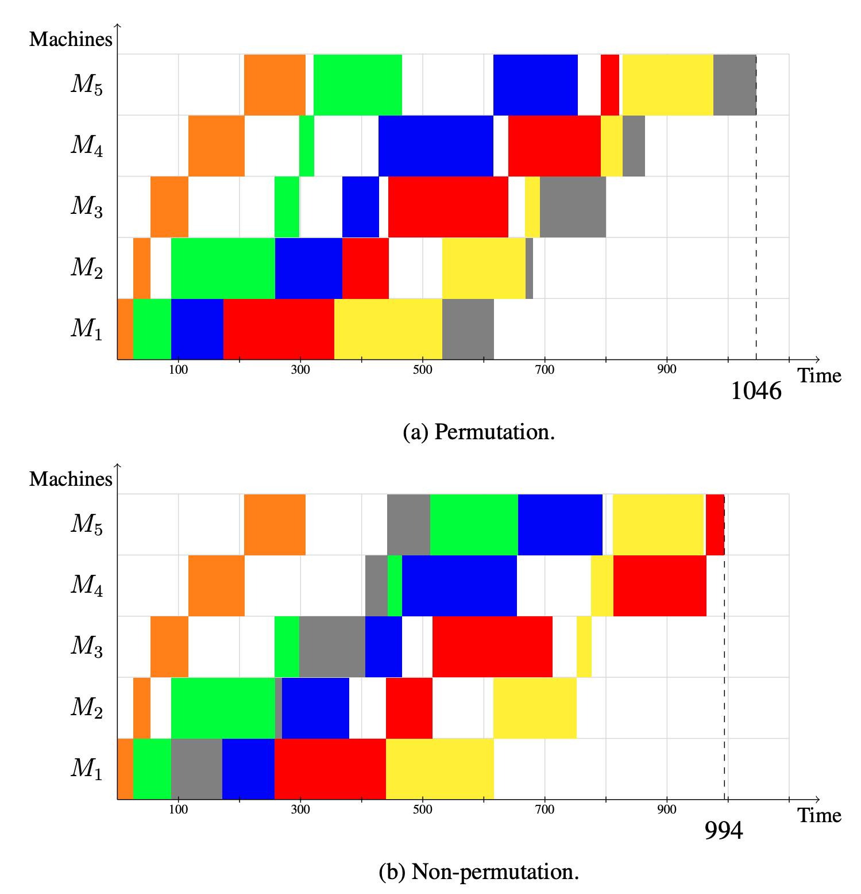

# The Jobshop problem and benchmark

## Table of Contents

- [Jobshop instances](#jobshop-benchmark-instances)
    - [Overview of the jobshop benchmark](#overview-of-the-benchmark)
    - [Classification of the jobshop instances](#classification-of-the-jobshop-instances)
    - [Formats](#formats)
    - [Publications](#publications)
- [Jobshop and variants using the standard format](#jobshop-variants)
    - [Jobshop](#jobshop)
    - [No buffer jobshop (blocking)](#no-buffer-jobshop-blocking-jobshop)
    - [No wait jobshop](#no-wait-jobshop)
    - [Cumulative jobshop](#cumulative-jobshop)
    - [Jobshop with operators](#jobshop-with-operators)
    - [Flowshop](#flow-shop)
    - [Permutation flow shop](#permutation-flow-shop)
    - [Non permutation flow shop](#non-permutation-flow-shop)
    - [Open shop](#open-shop)
- [Jobshop variants that require extra data](#other-jobshop-variants)
    - [Jobshop with arbitrary precedences](#jobshop-with-arbitrary-precedences)
    - [Jobshop with setup times](#jobshop-with-setup-times)
    - [Flexible jobshop](#flexible-jobshop)
- [Jobshop benchmark - JSPLib](#jobshop-benchmark---jsplib)
    - [Methodology](#methodology)
    - [Best known solutions](#best-known-results-on-the-jsplib)
    - [Publications](#publications-1)
- [Test instances](#test-instances)

<br/>

# Jobshop benchmark instances

## Overview of the jobshop benchmark

All instances in the benchmark follow the standard jobshop format, regardless of the problem they were originally meant for. The DaColTeppan instances use a conservative extension of the existing jobshop format. Cumulative jobshop have the capacity per machine in the filename, which may or may not be used.

Jobshop instances (332)
- 3 instances of jobshop `ft` from Fischer and Thompson 1963 
- 40 instances of jobshop `la` from Lawrence 1984
- 5 instances of jobshop `abz` from Adams, Balas and Zawack 1988
- 10 instances of jobshop `orb` from Applegate and Cook 1991
- 20 instances of jobshop `swv` from Storer, Wu and Vaccari 1992
- 4 instances of jobshop `yn` from Yamada and Nakano 1992
- 80 instances of jobshop `tajs` from Taillard 1993
- 80 instances of jobshop `dmu` from Demirkol, Mehta and Uzsoy 1998
- 90 instances of jobshop `tai` from Da Col and Teppan 2022

Reentrant jobshop instances (24)
- 12 instances of jobshop `long-js` from Da Col and Teppan 2022
- 12 instances of jobshop `short-js` from Da Col and Teppan 2022


## Classification of the jobshop instances

We use the following ***engines*** as reference engines the benchmark
- [**IBM ILOG CP Optimizer**](https://www.ibm.com/products/ilog-cplex-optimization-studio/cplex-cp-optimizer) : representative of the CP-scheduling family of engines
- [**Google CP-SAT**](https://developers.google.com/optimization) : representative of the lazy clause generation family of engines
- [**OptalCP**](https://optalcp.com) : representative of the CP-scheduling family of engines

***Linear programming engines like Cplex were so behind in performance that we dropped them as reference engines**

Instances are divided into
- **easy** : solved to optimality (with proof) in 1 minute by at least 1 reference engine
- **medium** : solved to optimality (with proof) in 1 hour by at least 1 reference engine
- **hard** : solved to optimality (with proof) in > 1h by at least 1 reference engine
- **presumed closed** : allegedly solved by someone in a paper. Most of the time the optimal solution is known because 2 different methods were used to find upper and lower bounds.
- **open** : no proof of optimality

Currently the instances divide as follows
- `ft` : 3 easy
- `la` : 39 easy, 1 medium
- `abz` : 2 easy, 2 medium, 1 hard
- `orb` : 10 easy
- `swv` : 7 easy, 4 medium, 6 hard, 3 open
- `yn` : 4 hard
- `tajs` : 40 easy, 21 medium, 7 hard, 12 open
- `dmu` : 17 easy, 13 medium, 5 hard, 45 open
- `tai` : 50 easy, 40 open

Previous versions of these results had `presumed closed` instances which we proceed to solve with OptalCP running for longer times.

## Formats

There are three main formats, the ***standard***, the ***DaColTeppan*** and the ***taillard***


### Standard format

```
#n #m
((machine duration ){m}\n){n}
```


<small>Image from Da Col & Teppan</small>


For instance `l01` on standard format is
```
10	5	
1	21	0	53	4	95	3	55	2	34
0	21	3	52	4	16	2	26	1	71
3	39	4	98	1	42	2	31	0	12
1	77	0	55	4	79	2	66	3	77
0	83	3	34	2	64	1	19	4	37
1	54	2	43	4	79	0	92	3	62
3	69	4	77	1	87	2	87	0	93
2	38	0	60	1	41	3	24	4	83
3	17	1	49	4	25	0	44	2	98
4	77	3	79	2	43	1	75	0	96
```

<br/>


### Da Col Teppan format

```
#n #m
((machine duration )+ -1 -1\n){n}
```


<small>Image from Da Col & Teppan</small>


In the DaColTeppan format
- there can be any number of tasks per job
- there can be various tasks in a job running on the same machine (reentrance)
- the jobs end in a -1 -1


The DaColTeppan format is actually a format for the reentrant jobshop problem which
is a generalization of the jobshop, common in some industrial environments like semiconductors


For instance
```
10	5	
1	21	0	53	-1  -1
0	21	3	52	 4	16	2	26	1	71   4	95	3	55	 2	34 -1 -1
3	39	4	98	 1	42	2	31	0	12  79	 2	66	3	77  -1 -1
1	77	0	55	 4  -1 -1
0	83	-1 -1
1	54	2	43	4	79	0	92	3	62   3	34	 2	64	 1	19	4	37 -1 -1
3	69	4	77	1	87	2	87	0	93  41	 3	24	 4	83  -1 -1
2	38	0	60	1	-1 -1
3	17	1	49	4	25	0	44	2	98 -1 -1
4	77	3	79	2	43	1	75	0	96 -1 -1
```

To be totally conservative, the format should remove the last two -1 -1 and consider
the end of line is the separator between jobs. It is not hard to do a parser that 
accepts both.

<br/>


### Taillard format

The taillard format first lists the machines, then the durations

```
#n #m
((machine ){m}\n){n}
((duration ){m}\n){n}
```

For instance `l01` in taillard format is
```
10	5	
1	0	4	3	2
0	3	4	2	1
3	4	1	2	0
1	0	4	2	3
0	3	2	1	4
1	2	4	0	3
3	4	1	2	0
2	0	1	3	4
3	1	4	0	2
4	3	2	1	0
21	53	95	55	34
21	52	16	26	71
39	98	42	31	12
77	55	79	66	77
83	34	64	19	37
54	43	79	92	62
69	77	87	87	93
38	60	41	24	83
17	49	25	44	98
77	79	43	75	96
```


<br/>

## Publications

The instances come from the following publications

- **H. Fisher, G.L. Thompson** (1963), Probabilistic learning combinations of local job-shop scheduling rules, J.F. Muth, G.L. Thompson (eds.), Industrial Scheduling,  Prentice Hall, Englewood Cliffs, New Jersey, 225-251.

- **Lawrence, S.** (1984). Resource constrained project scheduling: An experimental investigation of heuristic scheduling techniques (Supplement). Graduate School of Industrial Administration, Carnegie-Mellon University.

- **Adams, J., Balas, E., & Zawack, D.** (1988). The shifting bottleneck procedure for job shop scheduling. Management science, 34(3), 391-401.

- **Applagate, D., & Cook, W.** (1991). A computational study of the job-shop scheduling instance. ORSA J. Comput, 3, 49-51.

- **Storer, R. H., Wu, S. D., & Vaccari, R.** (1992). New search spaces for sequencing instances with application to job shop 38 (1992) 1495–1509 Manage. Sci, 38, 1495-1509.

- **T. Yamada, R. Nakano** (1992),A genetic algorithm applicable to large-scale job-shop instances, R. Manner, B. Manderick (eds.),Parallel instance solving from nature 2,North-Holland, Amsterdam,  281-290

- **Taillard, E.** (1993). Benchmarks for basic scheduling problems. european journal of operational research, 64(2), 278-285.

- **Demirkol, E., Mehta, S., & Uzsoy, R.** (1998). Benchmarks for shop scheduling problems. European Journal of Operational Research, 109(1), 137-141.

- **Da Col, G., & Teppan, E. C.** (2022). Industrial-size job shop scheduling with constraint programming. Operations Research Perspectives, 9, 100249.

<br/>


# Jobshop variants

Many variants of the jobshop problem can be solved with the same data
or simple addition of parameters

<br/>

## Jobshop

The classical jobshop problem has 2 constraints

- intrajob precedences 

$$\forall j \in \mathrm{jobs}, \forall r \in \mathrm{ranks} \quad \mathrm{start}_j^r + \mathrm{Duration}_j^r \leq \mathrm{start}_j^{r+1}$$

- no overlap per machine 

$$
\forall m \in \mathrm{machines}, \forall j_1,j_2 \in \mathrm{jobs} \quad
\left( \mathrm{start}\_{j_1}^m + \mathrm{Duration}\_{j_1}^m \leq \mathrm{start}\_{j_2}^m \right) \vee \left( \mathrm{start}\_{j_2}^m + \mathrm{Duration}\_{j_2}^m \leq \mathrm{start}\_{j_1}^m \right )
$$

For commodity the later constraint can be written

$$\forall m \in \mathrm{machines} \quad \mathrm{noOverlap} \ \lbrace \ [ \mathrm{start}_j^m \dots \ \mathrm{start}_j^m + \mathrm{Duration}_j^m ] \mid j \in \mathrm{jobs} \ \rbrace$$

<br/>

## No buffer jobshop (blocking jobshop)

In the classic jobshop there is implicitly a buffer area in front of each machine where tasks can wait to be processed. In the non-buffer jobshop, also called blocking jobshop this area doesn't exist, as a result a job `(j,r)`processed on machine `m` blocks this machine until `(j,r+1)` starts being processed on the next machine.


From this problem we introduce a new variable $\mathrm{end}_j^m$

- the tasks are variable length with a minimum length of $\mathrm{Duration}_j^m$

$$\forall j \in \mathrm{jobs}, \forall r \in \mathrm{machines} \quad \mathrm{start}_j^m + \mathrm{Duration}_j^m \leq \mathrm{end}_j^m$$

- for each job, the task of rank $r+1$ starts as soon as the task of rank $r$ ends

$$\forall j \in \mathrm{jobs}, \forall r \in \mathrm{ranks} \quad \mathrm{end}_j^r = \mathrm{start}_j^{r+1}$$

- no overlap per machine 

$$
\forall m \in \mathrm{machines}, \forall j_1,j_2 \in \mathrm{jobs}\quad \left( \mathrm{end}\_{j_1}^m \leq \mathrm{start}\_{j_2}^m \right) \vee \left( \mathrm{end}\_{j_2}^m \leq \mathrm{start}\_{j_1}^m \right )
$$

or

$$\forall m \in \mathrm{machines} \quad \mathrm{noOverlap} \ \lbrace \ [ \mathrm{start}_j^m \dots \ \mathrm{end}_j^m ] \mid j \in \mathrm{jobs} \ \rbrace$$

<br/>

The extra variables $\mathrm{end}$ can be pre-processed out of the equations

<br/>

## No-wait jobshop

In the no-wait jobshop variant, once the processing of a job has started, it has to go through all machines without interruption.


The equations are reminiscent of the blocking jobshop but without the variable length activities

- for each job, the task of rank $r+1$ starts as soon as the task of rank $r$ ends

$$\forall j \in \mathrm{jobs}, \forall r \in \mathrm{ranks} \quad \mathrm{end}_j^r = \mathrm{start}_j^{r+1}$$

- no overlap per machine 

$$
\forall m \in \mathrm{machines}, \forall j_1,j_2 \in \mathrm{jobs}\quad \left( \mathrm{end}\_{j_1}^m \leq \mathrm{start}\_{j_2}^m \right) \vee \left( \mathrm{end}\_{j_2}^m \leq \mathrm{start}\_{j_1}^m \right )
$$

or

$$\forall m \in \mathrm{machines} \quad \mathrm{noOverlap} \ \lbrace \ [ \mathrm{start}_j^m \dots \ \mathrm{end}_j^m ] \mid j \in \mathrm{jobs} \ \rbrace$$

<br/>

## Cumulative jobshop

In the cumulative jobshop, the capacity of the capacity of the machines is not unitary anymore. In other words there is a limit $C_m$ on the number of tasks that can be simultaneously processed by machine $m$

The constraints of the problem are

- intrajob precedences 

$$\forall j \in \mathrm{jobs}, \forall r \in \mathrm{ranks} \quad \mathrm{start}_j^r + \mathrm{Duration}_j^r \leq \mathrm{start}_j^{r+1}$$

- capacity per machine 

$$\forall m \in \mathrm{machines}, \forall t \in \mathrm{time} \quad \sum_j \left( \mathrm{start}^m_j \leq t \lt \mathrm{start}^m_j + \mathrm{Duration}^m_j \right) \leq C_m$$

It is advisable to avoid having an unlimited number of equations, in this case
because of the explicit dependency on time, even if it just for notation. We therefore introduce the functional notation for cumulative constraints

$$
\forall m \in \mathrm{machines}\quad \mathrm{cumul}_m(t) = \sum_j \mathrm{step}(\mathrm{start}_j^m) - \mathrm{step}(\mathrm{start}_j^m + \mathrm{Duration}_j^m)
$$

Here $\mathrm{step}(t)$ is the function that has value 1 at time $t$ and 0 otherwise, as a result $\mathrm{cumul}$ is a function of time. Each configuration of $\mathrm{start}_j^m$ values defines a different cumulative function.


The constraints of the problem become

- intrajob precedences 

$$\forall j \in \mathrm{jobs}, \forall r \in \mathrm{ranks} \quad \mathrm{start}_j^r + \mathrm{Duration}_j^r \leq \mathrm{start}_j^{r+1}$$

- capacity per machine 

$$
\forall m \in \mathrm{machines}\quad \sum_j \mathrm{step}(\mathrm{start}_j^m) - \mathrm{step}(\mathrm{start}_j^m + \mathrm{Duration}_j^m) \leq C_m
$$

<br/>

## Jobshop with operators

The jobshop with operators limits the overall number of simultaneous tasks.
If each task requires an operator to be processed on a machine, the total number
of simultaneous tasks is limited by the total number of operators (assuming all 
operators can handle all machines)


The constraints of the problem become

- intrajob precedences 

$$\forall j \in \mathrm{jobs}, \forall r \in \mathrm{ranks} \quad \mathrm{start}_j^r + \mathrm{Duration}_j^r \leq \mathrm{start}_j^{r+1}$$

- no overlap per machine 

$$\forall m \in \mathrm{machines} \quad \mathrm{noOverlap} \ \lbrace \ [ \mathrm{start}_j^m \dots \ \mathrm{start}_j^m + \mathrm{Duration}_j^m ] \mid j \in \mathrm{jobs} \ \rbrace$$

- maximum number of simultaneous tasks

$$\sum_m \sum_j \mathrm{step}(\mathrm{start}_j^m) - \mathrm{step}(\mathrm{start}_j^m + \mathrm{Duration}_j^m) \leq \mathrm{Op}$$

<br/>


## Flow shop

***Be aware that some authors say flowshop to mean permutation flowshop***

The flowshop is a variant of the jobshop problem in which the order of the machines within each job is always 0, 1, ..., m - 1

For instance `car1` from Carlier 1978 is

```
11 5
 0 375 1  12 2 142 3 245 4 412
 0 632 1 452 2 758 3 278 4 398
 0  12 1 876 2 124 3 534 4 765
 0 460 1 542 2 523 3 120 4 499
 0 528 1 101 2 789 3 124 4 999
 0 796 1 245 2 632 3 375 4 123
 0 532 1 230 2 543 3 896 4 452
 0  14 1 124 2 214 3 543 4 785
 0 257 1 527 2 753 3 210 4 463
 0 896 1 896 2 214 3 258 4 259
 0 532 1 302 2 501 3 765 4 988
 ```

Data for the open-shop problem can also be used for flow-shop problems as the column
for the machines can be implicitly added in the model. For instance `tai_4x4_1`

```
4 4
34  2 54 61
15 89 70  9
38 19 28 87
95  7 34 29
```

can be transformed at parsing time into
```
4 4
0 34 1  2 2 54 3 61
0 15 1 89 2 70 3  9
0 38 1 19 2 28 3 87
0 95 1  7 2 34 3 29
```

The constraints are the same as the jobshop but can be slightly simplified as the rank and machine indices are now merged. Each task is uniquely identified by the indices `(m,j)`

- intrajob precedences 

$$\forall j \in \mathrm{jobs}, \forall m \in \mathrm{machines} \quad \mathrm{start}_j^m + \mathrm{Duration}_j^m \leq \mathrm{start}_j^{m+1}$$

- no overlap per machine 

$$
\forall m \in \mathrm{machines}, \forall j_1,j_2 \in \mathrm{jobs} \quad \left( \mathrm{start}\_{j_1}^m + \mathrm{Duration}\_{j_1}^m \leq \mathrm{start}\_{j_2}^m \right) \vee \left( \mathrm{start}\_{j_2}^m + \mathrm{Duration}\_{j_2}^m \leq \mathrm{start}\_{j_1}^m \right )
$$

or

$$\forall m \in \mathrm{machines} \quad \mathrm{noOverlap} \ \lbrace \ [ \mathrm{start}_j^m \dots \ \mathrm{start}_j^m + \mathrm{Duration}_j^m ] \mid j \in \mathrm{jobs} \ \rbrace$$

<br/>

## Permutation flow shop

***Be aware that some authors say flowshop to mean permutation flowshop***

In any jobshop-like problem, the order in which a machine schedules the different jobs is unknown. Once that order is fixed, the problem is fully solved : the minimum makespan can
be computed from the order of the jobs on each machine by pure propagation in polynomial time.

In the permutation flow shop variant, the order in which the jobs are processed on the different machines is free, but it needs to be the same for all machines.


<small>Image from Artur Ferreira Brum, Automatic Algorithm Configuration for
Flow Shop Scheduling Problems (2020)</small>


We introduce the variable $\mathrm{rank}_j$ (common to all machines)

- the ranks are a permutation

$$\forall j_1, j_2 \in \mathrm{jobs} \quad \mathrm{rank}\_{j_1} \neq \mathrm{rank}\_{j_2}$$

- the jobs on the machines ordered according to their rank

$$\forall m \in \mathrm{machines}, \forall j_1, j_2 \in \mathrm{jobs} \quad \mathrm{rank}\_{j_1} < \mathrm{rank}\_{j_2} \Leftrightarrow \mathrm{start}\_{j_1}^m + \mathrm{Duration}\_{j_1}^m \leq \mathrm{start}\_{j_2}^m$$

These two constraints completely define the flowshop problem as the second constraint implies `noOverlap` on each machine (actually that constraint is the ***definition*** of noOverlap using ranks).

<br/>

## Non-permutation flow shop

The non-permutation flow shop is just another name for the flow shop

***Be aware that some authors say flowshop to mean permutation flowshop***

<br/>

## Open shop

In the open-shop variant, the order in which a job is processed on the different machines is relaxed. The inter-job precedence constraint thereafter becomes a `noOverlap`

$$\forall j \in \mathrm{jobs} \quad \mathrm{noOverlap} \ \lbrace \ [ \mathrm{start}_j^m \dots \ \mathrm{start}_j^m + \mathrm{Duration}_j^m ] \mid m \in \mathrm{machines} \ \rbrace$$

$$\forall m \in \mathrm{machines} \quad \mathrm{noOverlap} \ \lbrace \ [ \mathrm{start}_j^m \dots \ \mathrm{start}_j^m + \mathrm{Duration}_j^m ] \mid j \in \mathrm{jobs} \ \rbrace$$


<br/>

Just like the jobshop, opens shops can have the buffers, machine capacities, operators, etc.

<br/>

***Please refer to the open-shop section of this benchmark for more information about open-shop problems***

<br/>


# Other jobshop variants

Because these Jobshop variants require extra data, we cannot run them
over the standard benchmark

## Jobshop with arbitrary precedences

Instead of having precedences only within the tasks of a job, there is a more general precedence graph


## Jobshop with setup times

There are setup times in the machines to switch from one job to another

Notice that this variant is only interesting if the setup times are sequence-dependent. Otherwise it is equivalent to increase each task by the length of the setup time and to solve an usual jobshop

## Flexible jobshop - JSPLib

The tasks of a job can be processed by any machine in a predefined group of similar machines.

***Please refer to the flexible-jobshop section of this benchmark for more information***

<br/>

# Jobshop benchmark - JSPLib

The JSPLib is an informal group of instances that have been used to investigate solution methods for the jobshop problem. 

In this section we keep track of the best known solutions and ***classify*** the JSPLib instances into `easy`, `medium`, `hard`, `presumed closed   ` and `open`.

## Methodology

We have based our work on the ***outstanding*** work of Naderi, Ruiz and Roshanaei *Mixed-Integer Programming versus Constraint Programming for shop scheduling problems : New Results and Outlook* [**NRR2022**] which compares CPO, Cplex and Gurobi on a benchmark of 6623 instances over 17 benchmarks with a timeout of 1h. They have made all the [raw results available](http://soa.iti.es/problem-instances)

The websites used as references for existing best known bounds are
- http://mistic.heig-vd.ch/taillard/problemes.dir/ordonnancement.dir/ordonnancement.html
- https://github.com/thomasWeise/jsspInstancesAndResults
- http://jobshop.jjvh.nl/
- https://optimizizer.com/jobshop.php

And the upper bounds from NRR2022

An instance is considered
- `easy` if it is solved to optimality by a reference engine in < 1 minute
- `medium` if it is solved to optimality by a reference engine in < 1h
- `hard` if it is solved to optimality by a reference engine in > 1h
- `presumed closed` if the combination of upper and lower bounds found in the literature allows concluding the value of the optimal solution is known
- `open` otherwise

The publications that reported a best known bound are cited. We always consider that a bound of same value found by a reference engine (CPO, OptalCP, CP-SAT) is superior to the one reported in a publication, as it is easier to reproduce by just running the corresponding engine.

## Best known solutions on the JSPLib

Find here the best reported results on the JSPlib instances. For the same result, we always prioritize results reported by engines than published documents (because of reproducibility of the results).

### Fisher and Thompson (1963)

<table>
<tr><th>Instance</th><th>Size</th><th>Problem</th><th>LB</th><th>UB</th><th>Type</th><th>Solved by</th></tr>
<tr><td>ft06</td><td>6x6</td><td>jobshop</td><td>55</td><td>55</td><td style="background-color:green">easy</td><td>CPO in < 1 min</td></tr>
<tr><td>ft10</td><td>10x10</td><td>jobshop</td><td>930</td><td>930</td><td style="background-color:green">easy</td><td>CPO in < 1 min</td></tr>
<tr><td>ft20</td><td>20x5</td><td>jobshop</td><td>1165</td><td>1165</td><td style="background-color:green">easy</td><td>CPO in < 1 min</td></tr>
</table>

### Lawrence (1984)

<table>
<tr><th>Instance</th><th>Size</th><th>Problem</th><th>LB</th><th>UB</th><th>Type</th><th>Solved by</th></tr>
<tr><td>la01</td><td>10x5</td><td>jobshop</td><td>666</td><td>666</td><td style="background-color:green">easy</td><td>CPO in < 1 min</td></tr>
<tr><td>la02</td><td>10x5</td><td>jobshop</td><td>655</td><td>655</td><td style="background-color:green">easy</td><td>CPO in < 1 min</td></tr>
<tr><td>la03</td><td>10x5</td><td>jobshop</td><td>597</td><td>597</td><td style="background-color:green">easy</td><td>CPO in < 1 min</td></tr>
<tr><td>la04</td><td>10x5</td><td>jobshop</td><td>590</td><td>590</td><td style="background-color:green">easy</td><td>CPO in < 1 min</td></tr>
<tr><td>la05</td><td>10x5</td><td>jobshop</td><td>593</td><td>593</td><td style="background-color:green">easy</td><td>CPO in < 1 min</td></tr>
<tr><td>la06</td><td>15x5</td><td>jobshop</td><td>926</td><td>926</td><td style="background-color:green">easy</td><td>CPO in < 1 min</td></tr>
<tr><td>la07</td><td>15x5</td><td>jobshop</td><td>890</td><td>890</td><td style="background-color:green">easy</td><td>CPO in < 1 min</td></tr>
<tr><td>la08</td><td>15x5</td><td>jobshop</td><td>863</td><td>863</td><td style="background-color:green">easy</td><td>CPO in < 1 min</td></tr>
<tr><td>la09</td><td>15x5</td><td>jobshop</td><td>951</td><td>951</td><td style="background-color:green">easy</td><td>CPO in < 1 min</td></tr>
<tr><td>la10</td><td>15x5</td><td>jobshop</td><td>958</td><td>958</td><td style="background-color:green">easy</td><td>CPO in < 1 min</td></tr>
<tr><td>la11</td><td>20x5</td><td>jobshop</td><td>1222</td><td>1222</td><td style="background-color:green">easy</td><td>CPO in < 1 min</td></tr>
<tr><td>la12</td><td>20x5</td><td>jobshop</td><td>1039</td><td>1039</td><td style="background-color:green">easy</td><td>CPO in < 1 min</td></tr>
<tr><td>la13</td><td>20x5</td><td>jobshop</td><td>1150</td><td>1150</td><td style="background-color:green">easy</td><td>CPO in < 1 min</td></tr>
<tr><td>la14</td><td>20x5</td><td>jobshop</td><td>1292</td><td>1292</td><td style="background-color:green">easy</td><td>CPO in < 1 min</td></tr>
<tr><td>la15</td><td>20x5</td><td>jobshop</td><td>1207</td><td>1207</td><td style="background-color:green">easy</td><td>CPO in < 1 min</td></tr>
<tr><td>la16</td><td>10x10</td><td>jobshop</td><td>945</td><td>945</td><td style="background-color:green">easy</td><td>CPO in < 1 min</td></tr>
<tr><td>la17</td><td>10x10</td><td>jobshop</td><td>784</td><td>784</td><td style="background-color:green">easy</td><td>CPO in < 1 min</td></tr>
<tr><td>la18</td><td>10x10</td><td>jobshop</td><td>848</td><td>848</td><td style="background-color:green">easy</td><td>CPO in < 1 min</td></tr>
<tr><td>la19</td><td>10x10</td><td>jobshop</td><td>842</td><td>842</td><td style="background-color:green">easy</td><td>CPO in < 1 min</td></tr>
<tr><td>la20</td><td>10x10</td><td>jobshop</td><td>902</td><td>902</td><td style="background-color:green">easy</td><td>CPO in < 1 min</td></tr>
<tr><td>la21</td><td>15x10</td><td>jobshop</td><td>1046</td><td>1046</td><td style="background-color:green">easy</td><td>OptalCP in < 1 min</td></tr>
<tr><td>la22</td><td>15x10</td><td>jobshop</td><td>927</td><td>927</td><td style="background-color:green">easy</td><td>CPO in < 1 min</td></tr>
<tr><td>la23</td><td>15x10</td><td>jobshop</td><td>1032</td><td>1032</td><td style="background-color:green">easy</td><td>CPO in < 1 min</td></tr>
<tr><td>la24</td><td>15x10</td><td>jobshop</td><td>935</td><td>935</td><td style="background-color:green">easy</td><td>CPO in < 1 min</td></tr>
<tr><td>la25</td><td>15x10</td><td>jobshop</td><td>977</td><td>977</td><td style="background-color:green">easy</td><td>CPO in < 1 min</td></tr>
<tr><td>la26</td><td>20x10</td><td>jobshop</td><td>1218</td><td>1218</td><td style="background-color:green">easy</td><td>CPO in < 1 min</td></tr>
<tr><td>la27</td><td>20x10</td><td>jobshop</td><td>1235</td><td>1235</td><td style="background-color:green">easy</td><td>OptalCP in < 1 min</td></tr>
<tr><td>la28</td><td>20x10</td><td>jobshop</td><td>1216</td><td>1216</td><td style="background-color:green">easy</td><td>CPO in < 1 min</td></tr>
<tr><td>la29</td><td>20x10</td><td>jobshop</td><td>1152</td><td>1152</td><td style="background-color:orange">medium</td><td>OptalCP in 5 min</td></tr>
<tr><td>la30</td><td>20x10</td><td>jobshop</td><td>1355</td><td>1355</td><td style="background-color:green">easy</td><td>CPO in < 1 min</td></tr>
<tr><td>la31</td><td>30x10</td><td>jobshop</td><td>1784</td><td>1784</td><td style="background-color:green">easy</td><td>CPO in < 1 min</td></tr>
<tr><td>la32</td><td>30x10</td><td>jobshop</td><td>1850</td><td>1850</td><td style="background-color:green">easy</td><td>CPO in < 1 min</td></tr>
<tr><td>la33</td><td>30x10</td><td>jobshop</td><td>1719</td><td>1719</td><td style="background-color:green">easy</td><td>CPO in < 1 min</td></tr>
<tr><td>la34</td><td>30x10</td><td>jobshop</td><td>1721</td><td>1721</td><td style="background-color:green">easy</td><td>CPO in < 1 min</td></tr>
<tr><td>la35</td><td>30x10</td><td>jobshop</td><td>1888</td><td>1888</td><td style="background-color:green">easy</td><td>CPO in < 1 min</td></tr>
<tr><td>la36</td><td>15x15</td><td>jobshop</td><td>1268</td><td>1268</td><td style="background-color:green">easy</td><td>CPO in < 1 min</td></tr>
<tr><td>la37</td><td>15x15</td><td>jobshop</td><td>1397</td><td>1397</td><td style="background-color:green">easy</td><td>CPO in < 1 min</td></tr>
<tr><td>la38</td><td>15x15</td><td>jobshop</td><td>1196</td><td>1196</td><td style="background-color:green">easy</td><td>OptalCP in < 1 min</td></tr>
<tr><td>la39</td><td>15x15</td><td>jobshop</td><td>1233</td><td>1233</td><td style="background-color:green">easy</td><td>CPO in < 1 min</td></tr>
<tr><td>la40</td><td>15x15</td><td>jobshop</td><td>1222</td><td>1222</td><td style="background-color:green">easy</td><td>OptalCP in < 1 min</td></tr>
</table>

### Adams, Balas and Zawack (1988)

<table>
<tr><th>Instance</th><th>Size</th><th>Problem</th><th>LB</th><th>UB</th><th>Type</th><th>Solved by</th></tr>
<tr><td>abz5</td><td>10x10</td><td>jobshop</td><td>1234</td><td>1234</td><td style="background-color:green">easy</td><td>CPO in < 1 min</td></tr>
<tr><td>abz6</td><td>10x10</td><td>jobshop</td><td>943</td><td>943</td><td style="background-color:green">easy</td><td>CPO in < 1 min</td></tr>
<tr><td>abz7</td><td>20x15</td><td>jobshop</td><td>656</td><td>656</td><td style="background-color:orange">medium</td><td>OptalCP in < 1h</td></tr>
<tr><td>abz8</td><td>20x15</td><td>jobshop</td><td>667</td><td>667</td><td style="background-color:red">hard</td><td>OptalCP in 10h</td></tr>
<tr><td>abz9</td><td>20x15</td><td>jobshop</td><td>678</td><td>678</td><td style="background-color:orange">medium</td><td>OptalCP in < 1h</td></tr>
</table>

<br>

***Various places report that "Henning A (2002). Praktische Job-Shop Scheduling-Probleme. Ph.D. thesis, Friedrich-Schiller-Universität Jena, Jena, Germany" as having found a solution of 665 for abz8, but the original document says their solution is 667 and 665 is a "solution from the literature". We believe it is just a typing mistake in the sources they used. In any case OptalCP proves a lower bound of 667.***

### Applegate and Cook (1991)

<table>
<tr><th>Instance</th><th>Size</th><th>Problem</th><th>LB</th><th>UB</th><th>Type</th><th>Solved by</th></tr>
<tr><td>orb01</td><td>10x10</td><td>jobshop</td><td>1059</td><td>1059</td><td style="background-color:green">easy</td><td>CPO in < 1 min</td></tr>
<tr><td>orb02</td><td>10x10</td><td>jobshop</td><td>888</td><td>888</td><td style="background-color:green">easy</td><td>CPO in < 1 min</td></tr>
<tr><td>orb03</td><td>10x10</td><td>jobshop</td><td>1005</td><td>1005</td><td style="background-color:green">easy</td><td>CPO in < 1 min</td></tr>
<tr><td>orb04</td><td>10x10</td><td>jobshop</td><td>1005</td><td>1005</td><td style="background-color:green">easy</td><td>CPO in < 1 min</td></tr>
<tr><td>orb05</td><td>10x10</td><td>jobshop</td><td>887</td><td>887</td><td style="background-color:green">easy</td><td>CPO in < 1 min</td></tr>
<tr><td>orb06</td><td>10x10</td><td>jobshop</td><td>1010</td><td>1010</td><td style="background-color:green">easy</td><td>CPO in < 1 min</td></tr>
<tr><td>orb07</td><td>10x10</td><td>jobshop</td><td>397</td><td>397</td><td style="background-color:green">easy</td><td>CPO in < 1 min</td></tr>
<tr><td>orb08</td><td>10x10</td><td>jobshop</td><td>899</td><td>899</td><td style="background-color:green">easy</td><td>CPO in < 1 min</td></tr>
<tr><td>orb09</td><td>10x10</td><td>jobshop</td><td>934</td><td>934</td><td style="background-color:green">easy</td><td>CPO in < 1 min</td></tr>
<tr><td>orb10</td><td>10x10</td><td>jobshop</td><td>944</td><td>944</td><td style="background-color:green">easy</td><td>CPO in < 1 min</td></tr>
</table>

### Storer, Wu and Vaccari (1992)

<table>
<tr><th>Instance</th><th>Size</th><th>Problem</th><th>LB</th><th>UB</th><th>Type</th><th>Solved by</th></tr>
<tr><td>swv01</td><td>20x10</td><td>jobshop</td><td>1407</td><td>1407</td><td style="background-color:green">easy</td><td>OptalCP in < 1 min</td></tr>
<tr><td>swv02</td><td>20x10</td><td>jobshop</td><td>1475</td><td>1475</td><td style="background-color:green">easy</td><td>OptalCP in < 1 min</td></tr>
<tr><td>swv03</td><td>20x10</td><td>jobshop</td><td>1398</td><td>1398</td><td style="background-color:orange">medium</td><td>CPO in < 1h</td></tr>
<tr><td>swv04</td><td>20x10</td><td>jobshop</td><td>1464</td><td>1464</td><td style="background-color:orange">medium</td><td>OptalCP in < 1h</td></tr>
<tr><td>swv05</td><td>20x10</td><td>jobshop</td><td>1424</td><td>1424</td><td style="background-color:orange">medium</td><td>OptalCP in < 1h</td></tr>
<tr><td>swv06</td><td>20x15</td><td>jobshop</td><td>1667</td><td>1667</td><td style="background-color:red">hard</td><td>OptalCP in 40h</td></tr>
<tr><td>swv07</td><td>20x15</td><td>jobshop</td><td>1541</td><td>1594</td><td style="background-color:grey">open</td><td>lb OptalCP / ub GR2014</td></tr>
<tr><td>swv08</td><td>20x15</td><td>jobshop</td><td>1694</td><td>1751</td><td style="background-color:grey">open</td><td>lb OptalCP / ub Mu2015</td></tr>
<tr><td>swv09</td><td>20x15</td><td>jobshop</td><td>1655</td><td>1655</td><td style="background-color:red">hard</td><td>OptalCP in 15h</td></tr>
<tr><td>swv10</td><td>20x15</td><td>jobshop</td><td>1692</td><td>1743</td><td style="background-color:grey">open</td><td>lb OptalCP / ub SS2018</td></tr>
<tr><td>swv11</td><td>50x10</td><td>jobshop</td><td>2983</td><td>2983</td><td style="background-color:orange">medium</td><td>OptalCP in < 1h</td></tr>
<tr><td>swv12</td><td>50x10</td><td>jobshop</td><td>2972</td><td>2972</td><td style="background-color:orange">medium</td><td>OptalCP in < 1h</td></tr>
<tr><td>swv13</td><td>50x10</td><td>jobshop</td><td>3104</td><td>3104</td><td style="background-color:orange">medium</td><td>OptalCP in < 1h</td></tr>
<tr><td>swv14</td><td>50x10</td><td>jobshop</td><td>2968</td><td>2968</td><td style="background-color:orange">medium</td><td>CPO in < 1h</td></tr>
<tr><td>swv15</td><td>50x10</td><td>jobshop</td><td>2885</td><td>2885</td><td style="background-color:red">hard</td><td>OptalCP in 9h</td></tr>
<tr><td>swv16</td><td>50x10</td><td>jobshop</td><td>2924</td><td>2924</td><td style="background-color:green">easy</td><td>CPO in < 1 min</td></tr>
<tr><td>swv17</td><td>50x10</td><td>jobshop</td><td>2794</td><td>2794</td><td style="background-color:green">easy</td><td>CPO in < 1 min</td></tr>
<tr><td>swv18</td><td>50x10</td><td>jobshop</td><td>2852</td><td>2852</td><td style="background-color:green">easy</td><td>CPO in < 1 min</td></tr>
<tr><td>swv19</td><td>50x10</td><td>jobshop</td><td>2843</td><td>2843</td><td style="background-color:green">easy</td><td>CPO in < 1 min</td></tr>
<tr><td>swv20</td><td>50x10</td><td>jobshop</td><td>2823</td><td>2823</td><td style="background-color:green">easy</td><td>CPO in < 1 min</td></tr>
</table>

### Yamada Nakano (1992)

<table>
<tr><th>Instance</th><th>Size</th><th>Problem</th><th>LB</th><th>UB</th><th>Type</th><th>Solved by</th></tr>
<tr><td>yn1</td><td>20x20</td><td>jobshop</td><td>884</td><td>884</td><td style="background-color:red">hard</td><td>OptalCP in 6h</td></tr>
<tr><td>yn2</td><td>20x20</td><td>jobshop</td><td>904</td><td>904</td><td style="background-color:red">hard</td><td>OptalCP in 40h</td></tr>
<tr><td>yn3</td><td>20x20</td><td>jobshop</td><td>892</td><td>892</td><td style="background-color:red">hard</td><td>OptalCP in 40h</td></tr>
<tr><td>yn4</td><td>20x20</td><td>jobshop</td><td>967</td><td>967</td><td style="background-color:red">hard</td><td>OptalCP in 16h</td></tr>
</table>

### Taillard (1993)

<table>
<tr><th>Instance</th><th>Size</th><th>Problem</th><th>LB</th><th>UB</th><th>Type</th><th>Solved by</th></tr>
<tr><td>ta01js</td><td>15x15</td><td>jobshop</td><td>1231</td><td>1231</td><td style="background-color:green">easy</td><td>CPO in < 1 min</td></tr>
<tr><td>ta02js</td><td>15x15</td><td>jobshop</td><td>1244</td><td>1244</td><td style="background-color:green">easy</td><td>OptalCP in < 1 min</td></tr>
<tr><td>ta03js</td><td>15x15</td><td>jobshop</td><td>1218</td><td>1218</td><td style="background-color:green">easy</td><td>OptalCP in < 1 min</td></tr>
<tr><td>ta04js</td><td>15x15</td><td>jobshop</td><td>1175</td><td>1175</td><td style="background-color:green">easy</td><td>OptalCP in < 1 min</td></tr>
<tr><td>ta05js</td><td>15x15</td><td>jobshop</td><td>1224</td><td>1224</td><td style="background-color:green">easy</td><td>OptalCP in < 1 min</td></tr>
<tr><td>ta06js</td><td>15x15</td><td>jobshop</td><td>1238</td><td>1238</td><td style="background-color:green">easy</td><td>OptalCP in < 1 min</td></tr>
<tr><td>ta07js</td><td>15x15</td><td>jobshop</td><td>1227</td><td>1227</td><td style="background-color:green">easy</td><td>OptalCP in < 1 min</td></tr>
<tr><td>ta08js</td><td>15x15</td><td>jobshop</td><td>1217</td><td>1217</td><td style="background-color:green">easy</td><td>OptalCP in < 1 min</td></tr>
<tr><td>ta09js</td><td>15x15</td><td>jobshop</td><td>1274</td><td>1274</td><td style="background-color:green">easy</td><td>OptalCP in < 1 min</td></tr>
<tr><td>ta10js</td><td>15x15</td><td>jobshop</td><td>1241</td><td>1241</td><td style="background-color:green">easy</td><td>OptalCP in < 1 min</td></tr>
<tr><td>ta11js</td><td>20x15</td><td>jobshop</td><td>1357</td><td>1357</td><td style="background-color:orange">medium</td><td>OptalCP in < 1h</td></tr>
<tr><td>ta12js</td><td>20x15</td><td>jobshop</td><td>1367</td><td>1367</td><td style="background-color:orange">medium</td><td>OptalCP in < 1h</td></tr>
<tr><td>ta13js</td><td>20x15</td><td>jobshop</td><td>1342</td><td>1342</td><td style="background-color:orange">medium</td><td>OptalCP in < 1h</td></tr>
<tr><td>ta14js</td><td>20x15</td><td>jobshop</td><td>1345</td><td>1345</td><td style="background-color:green">easy</td><td>CPO in < 1 min</td></tr>
<tr><td>ta15js</td><td>20x15</td><td>jobshop</td><td>1339</td><td>1339</td><td style="background-color:orange">medium</td><td>OptalCP in < 1h</td></tr>
<tr><td>ta16js</td><td>20x15</td><td>jobshop</td><td>1360</td><td>1360</td><td style="background-color:orange">medium</td><td>OptalCP in < 1h</td></tr>
<tr><td>ta17js</td><td>20x15</td><td>jobshop</td><td>1462</td><td>1462</td><td style="background-color:green">easy</td><td>OptalCP in < 1 min</td></tr>
<tr><td>ta18js</td><td>20x15</td><td>jobshop</td><td>1396</td><td>1396</td><td style="background-color:orange">medium</td><td>OptalCP in < 1h</td></tr>
<tr><td>ta19js</td><td>20x15</td><td>jobshop</td><td>1332</td><td>1332</td><td style="background-color:orange">medium</td><td>OptalCP in < 1h</td></tr>
<tr><td>ta20js</td><td>20x15</td><td>jobshop</td><td>1348</td><td>1348</td><td style="background-color:orange">medium</td><td>OptalCP in < 1h</td></tr>
<tr><td>ta21js</td><td>20x20</td><td>jobshop</td><td>1642</td><td>1642</td><td style="background-color:orange">medium</td><td>OptalCP < 1h</td></tr>
<tr><td>ta22js</td><td>20x20</td><td>jobshop</td><td>1600</td><td>1600</td><td style="background-color:red">hard</td><td>OptalCP in 2h</td></tr>
<tr><td>ta23js</td><td>20x20</td><td>jobshop</td><td>1557</td><td>1557</td><td style="background-color:red">hard</td><td>OptalCP in 2h</td></tr>
<tr><td>ta24js</td><td>20x20</td><td>jobshop</td><td>1644</td><td>1644</td><td style="background-color:orange">medium</td><td>OptalCP in < 1h</td></tr>
<tr><td>ta25js</td><td>20x20</td><td>jobshop</td><td>1595</td><td>1595</td><td style="background-color:orange">medium</td><td>OptalCP in < 1h</td></tr>
<tr><td>ta26js</td><td>20x20</td><td>jobshop</td><td>1643</td><td>1643</td><td style="background-color:orange">medium</td><td>OptalCP in 7h</td></tr>
<tr><td>ta27js</td><td>20x20</td><td>jobshop</td><td>1680</td><td>1680</td><td style="background-color:orange">medium</td><td>OptalCP in < 1h</td></tr>
<tr><td>ta28js</td><td>20x20</td><td>jobshop</td><td>1603</td><td>1603</td><td style="background-color:orange">medium</td><td>OptalCP in < 1h</td></tr>
<tr><td>ta29js</td><td>20x20</td><td>jobshop</td><td>1625</td><td>1625</td><td style="background-color:red">hard</td><td>OptalCP in 2h</td></tr>
<tr><td>ta30js</td><td>20x20</td><td>jobshop</td><td>1562</td><td>1584</td><td style="background-color:grey">open</td><td>lb OptalCP / ub NS2002</td></tr>
<tr><td>ta31js</td><td>30x15</td><td>jobshop</td><td>1764</td><td>1764</td><td style="background-color:orange">medium</td><td>CPO in < 1h</td></tr>
<tr><td>ta32js</td><td>30x15</td><td>jobshop</td><td>1774</td><td>1784</td><td style="background-color:grey">open</td><td>lb CPO2015 / ub PSV2010</td></tr>
<tr><td>ta33js</td><td>30x15</td><td>jobshop</td><td>1791</td><td>1791</td><td style="background-color:red">hard</td><td>OptalCP in 10h</td></tr>
<tr><td>ta34js</td><td>30x15</td><td>jobshop</td><td>1828</td><td>1828</td><td style="background-color:orange">medium</td><td>OptalCP in < 1h</td></tr>
<tr><td>ta35js</td><td>30x15</td><td>jobshop</td><td>2007</td><td>2007</td><td style="background-color:green">easy</td><td>OptalCP in < 1 min</td></tr>
<tr><td>ta36js</td><td>30x15</td><td>jobshop</td><td>1819</td><td>1819</td><td style="background-color:orange">medium</td><td>OptalCP in < 1h</td></tr>
<tr><td>ta37js</td><td>30x15</td><td>jobshop</td><td>1771</td><td>1771</td><td style="background-color:red">hard</td><td>OptalCP in 2h</td></tr>
<tr><td>ta38js</td><td>30x15</td><td>jobshop</td><td>1673</td><td>1673</td><td style="background-color:red">hard</td><td>OptalCP in 7h</td></tr>
<tr><td>ta39js</td><td>30x15</td><td>jobshop</td><td>1795</td><td>1795</td><td style="background-color:green">easy</td><td>OptalCP in < 1 min</td></tr>
<tr><td>ta40js</td><td>30x15</td><td>jobshop</td><td>1658</td><td>1669</td><td style="background-color:grey">open</td><td>lb OptalCP / ub GR2014</td></tr>
<tr><td>ta41js</td><td>30x20</td><td>jobshop</td><td>1926</td><td>2005</td><td style="background-color:grey">open</td><td>lb OptalCP / ub CPO2015</td></tr>
<tr><td>ta42js</td><td>30x20</td><td>jobshop</td><td>1900</td><td>1937</td><td style="background-color:grey">open</td><td>lb OptalCP / ub GR2014</td></tr>
<tr><td>ta43js</td><td>30x20</td><td>jobshop</td><td>1809</td><td>1846</td><td style="background-color:grey">open</td><td>lb CPO2015 / ub PLC2015</td></tr>
<tr><td>ta44js</td><td>30x20</td><td>jobshop</td><td>1961</td><td>1979</td><td style="background-color:grey">open</td><td>lb OptalCP / ub CS2022</td></tr>
<tr><td>ta45js</td><td>30x20</td><td>jobshop</td><td>1997</td><td>1997</td><td style="background-color:orange">medium</td><td>OptalCP in < 1h</td></tr>
<tr><td>ta46js</td><td>30x20</td><td>jobshop</td><td>1976</td><td>2004</td><td style="background-color:grey">open</td><td>lb OptalCP / ub GR2014</td></tr>
<tr><td>ta47js</td><td>30x20</td><td>jobshop</td><td>1827</td><td>1889</td><td style="background-color:grey">open</td><td>lb OptalCP / ub PLC2015</td></tr>
<tr><td>ta48js</td><td>30x20</td><td>jobshop</td><td>1921</td><td>1937</td><td style="background-color:grey">open</td><td>lb OptalCP / ub SS2018</td></tr>
<tr><td>ta49js</td><td>30x20</td><td>jobshop</td><td>1938</td><td>1960</td><td style="background-color:grey">open</td><td>lb OptalCP / ub LHW2024</td></tr>
<tr><td>ta50js</td><td>30x20</td><td>jobshop</td><td>1848</td><td>1923</td><td style="background-color:grey">open</td><td>lb OptalCP / ub PLC2015</td></tr>
<tr><td>ta51js</td><td>50x15</td><td>jobshop</td><td>2760</td><td>2760</td><td style="background-color:green">easy</td><td>CPO in < 1 min</td></tr>
<tr><td>ta52js</td><td>50x15</td><td>jobshop</td><td>2756</td><td>2756</td><td style="background-color:green">easy</td><td>OptalCP in < 1 min</td></tr>
<tr><td>ta53js</td><td>50x15</td><td>jobshop</td><td>2717</td><td>2717</td><td style="background-color:green">easy</td><td>OptalCP in < 1 min</td></tr>
<tr><td>ta54js</td><td>50x15</td><td>jobshop</td><td>2839</td><td>2839</td><td style="background-color:green">easy</td><td>CPO in < 1 min</td></tr>
<tr><td>ta55js</td><td>50x15</td><td>jobshop</td><td>2679</td><td>2679</td><td style="background-color:green">easy</td><td>OptalCP in < 1 min</td></tr>
<tr><td>ta56js</td><td>50x15</td><td>jobshop</td><td>2781</td><td>2781</td><td style="background-color:green">easy</td><td>OptalCP in < 1 min</td></tr>
<tr><td>ta57js</td><td>50x15</td><td>jobshop</td><td>2943</td><td>2943</td><td style="background-color:green">easy</td><td>CPO in < 1 min</td></tr>
<tr><td>ta58js</td><td>50x15</td><td>jobshop</td><td>2885</td><td>2885</td><td style="background-color:green">easy</td><td>CPO in < 1 min</td></tr>
<tr><td>ta59js</td><td>50x15</td><td>jobshop</td><td>2655</td><td>2655</td><td style="background-color:green">easy</td><td>OptalCP in < 1 min</td></tr>
<tr><td>ta60js</td><td>50x15</td><td>jobshop</td><td>2723</td><td>2723</td><td style="background-color:green">easy</td><td>OptalCP in < 1 min</td></tr>
<tr><td>ta61js</td><td>50x20</td><td>jobshop</td><td>2868</td><td>2868</td><td style="background-color:green">easy</td><td>OptalCP in < 1 min</td></tr>
<tr><td>ta62js</td><td>50x20</td><td>jobshop</td><td>2869</td><td>2869</td><td style="background-color:orange">medium</td><td>OptalCP in < 1h</td></tr>
<tr><td>ta63js</td><td>50x20</td><td>jobshop</td><td>2755</td><td>2755</td><td style="background-color:green">easy</td><td>OptalCP in < 1 min</td></tr>
<tr><td>ta64js</td><td>50x20</td><td>jobshop</td><td>2702</td><td>2702</td><td style="background-color:green">easy</td><td>OptalCP in < 1 min</td></tr>
<tr><td>ta65js</td><td>50x20</td><td>jobshop</td><td>2725</td><td>2725</td><td style="background-color:green">easy</td><td>OptalCP in < 1 min</td></tr>
<tr><td>ta66js</td><td>50x20</td><td>jobshop</td><td>2845</td><td>2845</td><td style="background-color:green">easy</td><td>OptalCP in < 1 min</td></tr>
<tr><td>ta67js</td><td>50x20</td><td>jobshop</td><td>2825</td><td>2825</td><td style="background-color:red">hard</td><td>OptalCP in 4h</td></tr>
<tr><td>ta68js</td><td>50x20</td><td>jobshop</td><td>2784</td><td>2784</td><td style="background-color:green">easy</td><td>OptalCP in < 1 min</td></tr>
<tr><td>ta69js</td><td>50x20</td><td>jobshop</td><td>3071</td><td>3071</td><td style="background-color:green">easy</td><td>OptalCP in < 1 min</td></tr>
<tr><td>ta70js</td><td>50x20</td><td>jobshop</td><td>2995</td><td>2995</td><td style="background-color:orange">medium</td><td>CPO in < 1h</td></tr>
<tr><td>ta71js</td><td>100x20</td><td>jobshop</td><td>5464</td><td>5464</td><td style="background-color:green">easy</td><td>OptalCP in < 1 min</td></tr>
<tr><td>ta72js</td><td>100x20</td><td>jobshop</td><td>5181</td><td>5181</td><td style="background-color:green">easy</td><td>OptalCP in < 1 min</td></tr>
<tr><td>ta73js</td><td>100x20</td><td>jobshop</td><td>5568</td><td>5568</td><td style="background-color:green">easy</td><td>OptalCP in < 1 min</td></tr>
<tr><td>ta74js</td><td>100x20</td><td>jobshop</td><td>5339</td><td>5339</td><td style="background-color:green">easy</td><td>OptalCP in < 1 min</td></tr>
<tr><td>ta75js</td><td>100x20</td><td>jobshop</td><td>5392</td><td>5392</td><td style="background-color:orange">medium</td><td>CPO in < 1h</td></tr>
<tr><td>ta76js</td><td>100x20</td><td>jobshop</td><td>5342</td><td>5342</td><td style="background-color:green">easy</td><td>OptalCP in < 1 min</td></tr>
<tr><td>ta77js</td><td>100x20</td><td>jobshop</td><td>5436</td><td>5436</td><td style="background-color:green">easy</td><td>OptalCP in < 1 min</td></tr>
<tr><td>ta78js</td><td>100x20</td><td>jobshop</td><td>5394</td><td>5394</td><td style="background-color:green">easy</td><td>OptalCP in < 1 min</td></tr>
<tr><td>ta79js</td><td>100x20</td><td>jobshop</td><td>5358</td><td>5358</td><td style="background-color:green">easy</td><td>OptalCP in < 1 min</td></tr>
<tr><td>ta80js</td><td>100x20</td><td>jobshop</td><td>5183</td><td>5183</td><td style="background-color:green">easy</td><td>OptalCP in < 1 min</td></tr>
</table>

### Demikol, Mehta and Uzsoy (1998)

<table>
<tr><th>Instance</th><th>Size</th><th>Problem</th><th>LB</th><th>UB</th><th>Type</th><th>Solved by</th></tr>
<tr><td>dmu01</td><td>20x15</td><td>jobshop</td><td>2563</td><td>2563</td><td style="background-color:orange">medium</td><td>OptalCP in < 1h</td></tr>
<tr><td>dmu02</td><td>20x15</td><td>jobshop</td><td>2706</td><td>2706</td><td style="background-color:orange">medium</td><td>OptalCP in < 1h</td></tr>
<tr><td>dmu03</td><td>20x15</td><td>jobshop</td><td>2731</td><td>2731</td><td style="background-color:orange">medium</td><td>CPO in < 1h</td></tr>
<tr><td>dmu04</td><td>20x15</td><td>jobshop</td><td>2669</td><td>2669</td><td style="background-color:orange">medium</td><td>OptalCP in < 1h</td></tr>
<tr><td>dmu05</td><td>20x15</td><td>jobshop</td><td>2749</td><td>2749</td><td style="background-color:orange">medium</td><td>OptalCP in < 1h</td></tr>
<tr><td>dmu06</td><td>20x20</td><td>jobshop</td><td>3244</td><td>3244</td><td style="background-color:red">hard</td><td>OptalCP in 2h</td></tr>
<tr><td>dmu07</td><td>20x20</td><td>jobshop</td><td>3046</td><td>3046</td><td style="background-color:red">hard</td><td>OptalCP in 3h</td></tr>
<tr><td>dmu08</td><td>20x20</td><td>jobshop</td><td>3188</td><td>3188</td><td style="background-color:orange">medium</td><td>OptalCP in < 1h</td></tr>
<tr><td>dmu09</td><td>20x20</td><td>jobshop</td><td>3092</td><td>3092</td><td style="background-color:orange">medium</td><td>OptalCP in < 1h</td></tr>
<tr><td>dmu10</td><td>20x20</td><td>jobshop</td><td>2984</td><td>2984</td><td style="background-color:orange">medium</td><td>OptalCP in < 1h</td></tr>
<tr><td>dmu11</td><td>30x15</td><td>jobshop</td><td>3402</td><td>3430</td><td style="background-color:grey">open</td><td>lb OptalCP / ub PLC2015</td></tr>
<tr><td>dmu12</td><td>30x15</td><td>jobshop</td><td>3481</td><td>3492</td><td style="background-color:grey">open</td><td>lb OptalCP / ub SS2018</td></tr>
<tr><td>dmu13</td><td>30x15</td><td>jobshop</td><td>3681</td><td>3681</td><td style="background-color:red">hard</td><td>OptalCP in 3h</td></tr>
<tr><td>dmu14</td><td>30x15</td><td>jobshop</td><td>3394</td><td>3394</td><td style="background-color:green">easy</td><td>OptalCP in < 1 min</td></tr>
<tr><td>dmu15</td><td>30x15</td><td>jobshop</td><td>3343</td><td>3343</td><td style="background-color:green">easy</td><td>OptalCP in < 1 min</td></tr>
<tr><td>dmu16</td><td>30x20</td><td>jobshop</td><td>3734</td><td>3750</td><td style="background-color:grey">open</td><td>lb CPO2015 / ub LHW2024</td></tr>
<tr><td>dmu17</td><td>30x20</td><td>jobshop</td><td>3733</td><td>3812</td><td style="background-color:grey">open</td><td>lb OptalCP / ub LHW2024</td></tr>
<tr><td>dmu18</td><td>30x20</td><td>jobshop</td><td>3844</td><td>3844</td><td style="background-color:red">hard</td><td>OptalCP in 10h</td></tr>
<tr><td>dmu19</td><td>30x20</td><td>jobshop</td><td>3707</td><td>3764</td><td style="background-color:grey">open</td><td>lb OptalCP / ub CS2022</td></tr>
<tr><td>dmu20</td><td>30x20</td><td>jobshop</td><td>3632</td><td>3699</td><td style="background-color:grey">open</td><td>lb OptalCP / ub LHW2024</td></tr>
<tr><td>dmu21</td><td>40x15</td><td>jobshop</td><td>4380</td><td>4380</td><td style="background-color:green">easy</td><td>OptalCP in < 1 min</td></tr>
<tr><td>dmu22</td><td>40x15</td><td>jobshop</td><td>4725</td><td>4725</td><td style="background-color:green">easy</td><td>CPO in < 1 min</td></tr>
<tr><td>dmu23</td><td>40x15</td><td>jobshop</td><td>4668</td><td>4668</td><td style="background-color:green">easy</td><td>CPO in < 1 min</td></tr>
<tr><td>dmu24</td><td>40x15</td><td>jobshop</td><td>4648</td><td>4648</td><td style="background-color:green">easy</td><td>CPO in < 1 min</td></tr>
<tr><td>dmu25</td><td>40x15</td><td>jobshop</td><td>4164</td><td>4164</td><td style="background-color:green">easy</td><td>CPO in < 1 min</td></tr>
<tr><td>dmu26</td><td>40x20</td><td>jobshop</td><td>4647</td><td>4647</td><td style="background-color:orange">medium</td><td>OptalCP < 1h</td></tr>
<tr><td>dmu27</td><td>40x20</td><td>jobshop</td><td>4848</td><td>4848</td><td style="background-color:orange">medium</td><td>OptalCP in < 1h</td></tr>
<tr><td>dmu28</td><td>40x20</td><td>jobshop</td><td>4692</td><td>4692</td><td style="background-color:green">easy</td><td>OptalCP in < 1 min</td></tr>
<tr><td>dmu29</td><td>40x20</td><td>jobshop</td><td>4691</td><td>4691</td><td style="background-color:green">easy</td><td>OptalCP in < 1 min</td></tr>
<tr><td>dmu30</td><td>40x20</td><td>jobshop</td><td>4732</td><td>4732</td><td style="background-color:orange">medium</td><td>OptalCP < 1h</td></tr>
<tr><td>dmu31</td><td>50x15</td><td>jobshop</td><td>5640</td><td>5640</td><td style="background-color:green">easy</td><td>CPO in < 1 min</td></tr>
<tr><td>dmu32</td><td>50x15</td><td>jobshop</td><td>5927</td><td>5927</td><td style="background-color:green">easy</td><td>CPO in < 1 min</td></tr>
<tr><td>dmu33</td><td>50x15</td><td>jobshop</td><td>5728</td><td>5728</td><td style="background-color:green">easy</td><td>CPO in < 1 min</td></tr>
<tr><td>dmu34</td><td>50x15</td><td>jobshop</td><td>5385</td><td>5385</td><td style="background-color:green">easy</td><td>CPO in < 1 min</td></tr>
<tr><td>dmu35</td><td>50x15</td><td>jobshop</td><td>5635</td><td>5635</td><td style="background-color:green">easy</td><td>CPO in < 1 min</td></tr>
<tr><td>dmu36</td><td>50x20</td><td>jobshop</td><td>5621</td><td>5621</td><td style="background-color:green">easy</td><td>OptalCP in < 1 min</td></tr>
<tr><td>dmu37</td><td>50x20</td><td>jobshop</td><td>5851</td><td>5851</td><td style="background-color:orange">medium</td><td>CPO in < 1h</td></tr>
<tr><td>dmu38</td><td>50x20</td><td>jobshop</td><td>5713</td><td>5713</td><td style="background-color:orange">medium</td><td>OptalCP in < 1h</td></tr>
<tr><td>dmu39</td><td>50x20</td><td>jobshop</td><td>5747</td><td>5747</td><td style="background-color:green">easy</td><td>OptalCP in < 1 min</td></tr>
<tr><td>dmu40</td><td>50x20</td><td>jobshop</td><td>5577</td><td>5577</td><td style="background-color:green">easy</td><td>OptalCP in < 1 min</td></tr>
<tr><td>dmu41</td><td>20x15</td><td>jobshop</td><td>3176</td><td>3248</td><td style="background-color:grey">open</td><td>lb OptalCP / ub PLC2015</td></tr>
<tr><td>dmu42</td><td>20x15</td><td>jobshop</td><td>3339</td><td>3390</td><td style="background-color:grey">open</td><td>lb OptalCP / ub SS2018</td></tr>
<tr><td>dmu43</td><td>20x15</td><td>jobshop</td><td>3441</td><td>3441</td><td style="background-color:red">hard</td><td>OptalCP in 8h</td></tr>
<tr><td>dmu44</td><td>20x15</td><td>jobshop</td><td>3414</td><td>3475</td><td style="background-color:grey">open</td><td>lb OptalCP / ub SS2018</td></tr>
<tr><td>dmu45</td><td>20x15</td><td>jobshop</td><td>3217</td><td>3266</td><td style="background-color:grey">open</td><td>lb OptalCP / ub CS2022</td></tr>
<tr><td>dmu46</td><td>20x20</td><td>jobshop</td><td>3780</td><td>4035</td><td style="background-color:grey">open</td><td>lb OptalCP / ub GR2014</td></tr>
<tr><td>dmu47</td><td>20x20</td><td>jobshop</td><td>3714</td><td>3939</td><td style="background-color:grey">open</td><td>lb OptalCP / ub GR2014</td></tr>
<tr><td>dmu48</td><td>20x20</td><td>jobshop</td><td>3628</td><td>3763</td><td style="background-color:grey">open</td><td>lb OptalCP / ub SS2018</td></tr>
<tr><td>dmu49</td><td>20x20</td><td>jobshop</td><td>3543</td><td>3706</td><td style="background-color:grey">open</td><td>lb OptalCP / ub LHW2024</td></tr>
<tr><td>dmu50</td><td>20x20</td><td>jobshop</td><td>3618</td><td>3729</td><td style="background-color:grey">open</td><td>lb OptalCP / ub PLC2015</td></tr>
<tr><td>dmu51</td><td>30x15</td><td>jobshop</td><td>4070</td><td>4156</td><td style="background-color:grey">open</td><td>lb OptalCP / ub SS2018</td></tr>
<tr><td>dmu52</td><td>30x15</td><td>jobshop</td><td>4203</td><td>4297</td><td style="background-color:grey">open</td><td>lb OptalCP / ub LHW2024</td></tr>
<tr><td>dmu53</td><td>30x15</td><td>jobshop</td><td>4248</td><td>4378</td><td style="background-color:grey">open</td><td>lb OptalCP / ub CS2022</td></tr>
<tr><td>dmu54</td><td>30x15</td><td>jobshop</td><td>4277</td><td>4361</td><td style="background-color:grey">open</td><td>lb OptalCP / ub CS2022</td></tr>
<tr><td>dmu55</td><td>30x15</td><td>jobshop</td><td>4191</td><td>4258</td><td style="background-color:grey">open</td><td>lb OptalCP / ub LHW2024</td></tr>
<tr><td>dmu56</td><td>30x20</td><td>jobshop</td><td>4755</td><td>4939</td><td style="background-color:grey">open</td><td>lb OptalCP / ub XLGG2022</td></tr>
<tr><td>dmu57</td><td>30x20</td><td>jobshop</td><td>4462</td><td>4647</td><td style="background-color:grey">open</td><td>lb OptalCP / ub XLGG2022</td></tr>
<tr><td>dmu58</td><td>30x20</td><td>jobshop</td><td>4484</td><td>4701</td><td style="background-color:grey">open</td><td>lb OptalCP / ub CS2022</td></tr>
<tr><td>dmu59</td><td>30x20</td><td>jobshop</td><td>4366</td><td>4607</td><td style="background-color:grey">open</td><td>lb OptalCP / ub LHW2024</td></tr>
<tr><td>dmu60</td><td>30x20</td><td>jobshop</td><td>4468</td><td>4721</td><td style="background-color:grey">open</td><td>lb OptalCP / ub CS2022</td></tr>
<tr><td>dmu61</td><td>40x15</td><td>jobshop</td><td>5038</td><td>5169</td><td style="background-color:grey">open</td><td>lb OptalCP / ub LHW2024</td></tr>
<tr><td>dmu62</td><td>40x15</td><td>jobshop</td><td>5176</td><td>5247</td><td style="background-color:grey">open</td><td>lb OptalCP / ub LHW2024</td></tr>
<tr><td>dmu63</td><td>40x15</td><td>jobshop</td><td>5245</td><td>5312</td><td style="background-color:grey">open</td><td>lb OptalCP / ub LHW2024</td></tr>
<tr><td>dmu64</td><td>40x15</td><td>jobshop</td><td>5155</td><td>5226</td><td style="background-color:grey">open</td><td>lb OptalCP / ub CS2022</td></tr>
<tr><td>dmu65</td><td>40x15</td><td>jobshop</td><td>5122</td><td>5173</td><td style="background-color:grey">open</td><td>lb OptalCP / ub LHW2024</td></tr>
<tr><td>dmu66</td><td>40x20</td><td>jobshop</td><td>5526</td><td>5701</td><td style="background-color:grey">open</td><td>lb OptalCP / ub CS2022</td></tr>
<tr><td>dmu67</td><td>40x20</td><td>jobshop</td><td>5661</td><td>5779</td><td style="background-color:grey">open</td><td>lb OptalCP / ub SS2018</td></tr>
<tr><td>dmu68</td><td>40x20</td><td>jobshop</td><td>5513</td><td>5763</td><td style="background-color:grey">open</td><td>lb OptalCP / ub CS2022</td></tr>
<tr><td>dmu69</td><td>40x20</td><td>jobshop</td><td>5511</td><td>5688</td><td style="background-color:grey">open</td><td>lb OptalCP / ub CS2022</td></tr>
<tr><td>dmu70</td><td>40x20</td><td>jobshop</td><td>5633</td><td>5868</td><td style="background-color:grey">open</td><td>lb OptalCP / ub CS2022</td></tr>
<tr><td>dmu71</td><td>50x15</td><td>jobshop</td><td>6129</td><td>6207</td><td style="background-color:grey">open</td><td>lb OptalCP / ub CS2022</td></tr>
<tr><td>dmu72</td><td>50x15</td><td>jobshop</td><td>6430</td><td>6463</td><td style="background-color:grey">open</td><td>lb OptalCP / ub SS2018</td></tr>
<tr><td>dmu73</td><td>50x15</td><td>jobshop</td><td>6107</td><td>6136</td><td style="background-color:grey">open</td><td>lb OptalCP / ub CS2022</td></tr>
<tr><td>dmu74</td><td>50x15</td><td>jobshop</td><td>6168</td><td>6196</td><td style="background-color:grey">open</td><td>lb OptalCP / ub SS2018</td></tr>
<tr><td>dmu75</td><td>50x15</td><td>jobshop</td><td>6123</td><td>6189</td><td style="background-color:grey">open</td><td>lb OptalCP / ub SS2018</td></tr>
<tr><td>dmu76</td><td>50x20</td><td>jobshop</td><td>6479</td><td>6718</td><td style="background-color:grey">open</td><td>lb OptalCP / ub CS2022</td></tr>
<tr><td>dmu77</td><td>50x20</td><td>jobshop</td><td>6520</td><td>6747</td><td style="background-color:grey">open</td><td>lb OptalCP / ub CS2022</td></tr>
<tr><td>dmu78</td><td>50x20</td><td>jobshop</td><td>6643</td><td>6755</td><td style="background-color:grey">open</td><td>lb OptalCP / ub CS2022</td></tr>
<tr><td>dmu79</td><td>50x20</td><td>jobshop</td><td>6720</td><td>6910</td><td style="background-color:grey">open</td><td>lb OptalCP / ub CS2022</td></tr>
<tr><td>dmu80</td><td>50x20</td><td>jobshop</td><td>6460</td><td>6634</td><td style="background-color:grey">open</td><td>lb OptalCP / ub CS2022</td></tr>
</table>

### Da Col and Teppan (2022)

<table>
<tr><th>Instance</th><th>Size</th><th>Problem</th><th>LB</th><th>UB</th><th>Type</th><th>Solved by</th></tr>
<tr><td>tai_j1000_m1000_1</td><td>1000x1000</td><td>jobshop</td><td>549392</td><td>877062</td><td style="background-color:grey">open</td><td>lb OptalCP / ub Hexaly2024</td></tr>
<tr><td>tai_j1000_m1000_10</td><td>1000x1000</td><td>jobshop</td><td>541530</td><td>874820</td><td style="background-color:grey">open</td><td>lb OptalCP / ub Hexaly2024</td></tr>
<tr><td>tai_j1000_m1000_2</td><td>1000x1000</td><td>jobshop</td><td>549043</td><td>877115</td><td style="background-color:grey">open</td><td>lb OptalCP / ub Hexaly2024</td></tr>
<tr><td>tai_j1000_m1000_3</td><td>1000x1000</td><td>jobshop</td><td>552580</td><td>878805</td><td style="background-color:grey">open</td><td>lb OptalCP / ub Hexaly2024</td></tr>
<tr><td>tai_j1000_m1000_4</td><td>1000x1000</td><td>jobshop</td><td>547670</td><td>876363</td><td style="background-color:grey">open</td><td>lb OptalCP / ub Hexaly2024</td></tr>
<tr><td>tai_j1000_m1000_5</td><td>1000x1000</td><td>jobshop</td><td>545193</td><td>877562</td><td style="background-color:grey">open</td><td>lb OptalCP / ub Hexaly2024</td></tr>
<tr><td>tai_j1000_m1000_6</td><td>1000x1000</td><td>jobshop</td><td>547286</td><td>876067</td><td style="background-color:grey">open</td><td>lb OptalCP / ub Hexaly2024</td></tr>
<tr><td>tai_j1000_m1000_7</td><td>1000x1000</td><td>jobshop</td><td>545877</td><td>875891</td><td style="background-color:grey">open</td><td>lb OptalCP / ub Hexaly2024</td></tr>
<tr><td>tai_j1000_m1000_8</td><td>1000x1000</td><td>jobshop</td><td>549220</td><td>876456</td><td style="background-color:grey">open</td><td>lb OptalCP / ub Hexaly2024</td></tr>
<tr><td>tai_j1000_m1000_9</td><td>1000x1000</td><td>jobshop</td><td>543559</td><td>875914</td><td style="background-color:grey">open</td><td>lb OptalCP / ub Hexaly2024</td></tr>
<tr><td>tai_j1000_m100_1</td><td>1000x100</td><td>jobshop</td><td>525343</td><td>539120</td><td style="background-color:grey">open</td><td>lb OptalCP / ub OptalCP</td></tr>
<tr><td>tai_j1000_m100_10</td><td>1000x100</td><td>jobshop</td><td>529112</td><td>540884</td><td style="background-color:grey">open</td><td>lb OptalCP / ub OptalCP</td></tr>
<tr><td>tai_j1000_m100_2</td><td>1000x100</td><td>jobshop</td><td>528088</td><td>540895</td><td style="background-color:grey">open</td><td>lb OptalCP / ub OptalCP</td></tr>
<tr><td>tai_j1000_m100_3</td><td>1000x100</td><td>jobshop</td><td>522793</td><td>534794</td><td style="background-color:grey">open</td><td>lb OptalCP / ub OptalCP</td></tr>
<tr><td>tai_j1000_m100_4</td><td>1000x100</td><td>jobshop</td><td>524271</td><td>536317</td><td style="background-color:grey">open</td><td>lb OptalCP / ub OptalCP</td></tr>
<tr><td>tai_j1000_m100_5</td><td>1000x100</td><td>jobshop</td><td>531216</td><td>532016</td><td style="background-color:grey">open</td><td>lb OptalCP / ub OptalCP</td></tr>
<tr><td>tai_j1000_m100_6</td><td>1000x100</td><td>jobshop</td><td>518763</td><td>535189</td><td style="background-color:grey">open</td><td>lb OptalCP / ub OptalCP</td></tr>
<tr><td>tai_j1000_m100_7</td><td>1000x100</td><td>jobshop</td><td>527093</td><td>535894</td><td style="background-color:grey">open</td><td>lb OptalCP / ub OptalCP</td></tr>
<tr><td>tai_j1000_m100_8</td><td>1000x100</td><td>jobshop</td><td>519524</td><td>533985</td><td style="background-color:grey">open</td><td>lb OptalCP / ub OptalCP</td></tr>
<tr><td>tai_j1000_m100_9</td><td>1000x100</td><td>jobshop</td><td>520889</td><td>539511</td><td style="background-color:grey">open</td><td>lb OptalCP / ub OptalCP</td></tr>
<tr><td>tai_j1000_m10_1</td><td>1000x10</td><td>jobshop</td><td>515334</td><td>515334</td><td style="background-color:green">easy</td><td>OptalCP in < 1 min</td></tr>
<tr><td>tai_j1000_m10_10</td><td>1000x10</td><td>jobshop</td><td>521360</td><td>521360</td><td style="background-color:green">easy</td><td>OptalCP in < 1 min</td></tr>
<tr><td>tai_j1000_m10_2</td><td>1000x10</td><td>jobshop</td><td>509226</td><td>509226</td><td style="background-color:green">easy</td><td>OptalCP in < 1 min</td></tr>
<tr><td>tai_j1000_m10_3</td><td>1000x10</td><td>jobshop</td><td>517493</td><td>517493</td><td style="background-color:green">easy</td><td>OptalCP in < 1 min</td></tr>
<tr><td>tai_j1000_m10_4</td><td>1000x10</td><td>jobshop</td><td>519369</td><td>519369</td><td style="background-color:green">easy</td><td>OptalCP in < 1 min</td></tr>
<tr><td>tai_j1000_m10_5</td><td>1000x10</td><td>jobshop</td><td>513881</td><td>513881</td><td style="background-color:green">easy</td><td>OptalCP in < 1 min</td></tr>
<tr><td>tai_j1000_m10_6</td><td>1000x10</td><td>jobshop</td><td>511932</td><td>511932</td><td style="background-color:green">easy</td><td>OptalCP in < 1 min</td></tr>
<tr><td>tai_j1000_m10_7</td><td>1000x10</td><td>jobshop</td><td>523900</td><td>523900</td><td style="background-color:green">easy</td><td>OptalCP in < 1 min</td></tr>
<tr><td>tai_j1000_m10_8</td><td>1000x10</td><td>jobshop</td><td>513101</td><td>513101</td><td style="background-color:green">easy</td><td>OptalCP in < 1 min</td></tr>
<tr><td>tai_j1000_m10_9</td><td>1000x10</td><td>jobshop</td><td>508701</td><td>508701</td><td style="background-color:green">easy</td><td>OptalCP in < 1 min</td></tr>
<tr><td>tai_j100_m1000_1</td><td>100x1000</td><td>jobshop</td><td>522298</td><td>544732</td><td style="background-color:grey">open</td><td>lb OptalCP / ub OptalCP</td></tr>
<tr><td>tai_j100_m1000_10</td><td>100x1000</td><td>jobshop</td><td>521766</td><td>543797</td><td style="background-color:grey">open</td><td>lb OptalCP / ub OptalCP</td></tr>
<tr><td>tai_j100_m1000_2</td><td>100x1000</td><td>jobshop</td><td>530375</td><td>546598</td><td style="background-color:grey">open</td><td>lb OptalCP / ub OptalCP</td></tr>
<tr><td>tai_j100_m1000_3</td><td>100x1000</td><td>jobshop</td><td>530560</td><td>549372</td><td style="background-color:grey">open</td><td>lb OptalCP / ub OptalCP</td></tr>
<tr><td>tai_j100_m1000_4</td><td>100x1000</td><td>jobshop</td><td>527101</td><td>545138</td><td style="background-color:grey">open</td><td>lb OptalCP / ub OptalCP</td></tr>
<tr><td>tai_j100_m1000_5</td><td>100x1000</td><td>jobshop</td><td>517728</td><td>545535</td><td style="background-color:grey">open</td><td>lb OptalCP / ub OptalCP</td></tr>
<tr><td>tai_j100_m1000_6</td><td>100x1000</td><td>jobshop</td><td>522907</td><td>545730</td><td style="background-color:grey">open</td><td>lb OptalCP / ub OptalCP</td></tr>
<tr><td>tai_j100_m1000_7</td><td>100x1000</td><td>jobshop</td><td>522537</td><td>546899</td><td style="background-color:grey">open</td><td>lb OptalCP / ub OptalCP</td></tr>
<tr><td>tai_j100_m1000_8</td><td>100x1000</td><td>jobshop</td><td>526428</td><td>549337</td><td style="background-color:grey">open</td><td>lb OptalCP / ub OptalCP</td></tr>
<tr><td>tai_j100_m1000_9</td><td>100x1000</td><td>jobshop</td><td>528097</td><td>550693</td><td style="background-color:grey">open</td><td>lb OptalCP / ub OptalCP</td></tr>
<tr><td>tai_j100_m100_1</td><td>100x100</td><td>jobshop</td><td>62703</td><td>79253</td><td style="background-color:grey">open</td><td>lb OptalCP / ub OptalCP</td></tr>
<tr><td>tai_j100_m100_10</td><td>100x100</td><td>jobshop</td><td>64866</td><td>79018</td><td style="background-color:grey">open</td><td>lb OptalCP / ub OptalCP</td></tr>
<tr><td>tai_j100_m100_2</td><td>100x100</td><td>jobshop</td><td>62814</td><td>78714</td><td style="background-color:grey">open</td><td>lb OptalCP / ub OptalCP</td></tr>
<tr><td>tai_j100_m100_3</td><td>100x100</td><td>jobshop</td><td>61533</td><td>77770</td><td style="background-color:grey">open</td><td>lb OptalCP / ub OptalCP</td></tr>
<tr><td>tai_j100_m100_4</td><td>100x100</td><td>jobshop</td><td>64742</td><td>80167</td><td style="background-color:grey">open</td><td>lb OptalCP / ub OptalCP</td></tr>
<tr><td>tai_j100_m100_5</td><td>100x100</td><td>jobshop</td><td>61766</td><td>79583</td><td style="background-color:grey">open</td><td>lb OptalCP / ub OptalCP</td></tr>
<tr><td>tai_j100_m100_6</td><td>100x100</td><td>jobshop</td><td>61360</td><td>79522</td><td style="background-color:grey">open</td><td>lb OptalCP / ub OptalCP</td></tr>
<tr><td>tai_j100_m100_7</td><td>100x100</td><td>jobshop</td><td>64040</td><td>79477</td><td style="background-color:grey">open</td><td>lb OptalCP / ub OptalCP</td></tr>
<tr><td>tai_j100_m100_8</td><td>100x100</td><td>jobshop</td><td>63224</td><td>79303</td><td style="background-color:grey">open</td><td>lb OptalCP / ub OptalCP</td></tr>
<tr><td>tai_j100_m100_9</td><td>100x100</td><td>jobshop</td><td>62631</td><td>80608</td><td style="background-color:grey">open</td><td>lb OptalCP / ub OptalCP</td></tr>
<tr><td>tai_j100_m10_1</td><td>100x10</td><td>jobshop</td><td>54951</td><td>54951</td><td style="background-color:green">easy</td><td>OptalCP in < 1 min</td></tr>
<tr><td>tai_j100_m10_10</td><td>100x10</td><td>jobshop</td><td>55464</td><td>55464</td><td style="background-color:green">easy</td><td>OptalCP in < 1 min</td></tr>
<tr><td>tai_j100_m10_2</td><td>100x10</td><td>jobshop</td><td>57160</td><td>57160</td><td style="background-color:green">easy</td><td>OptalCP in < 1 min</td></tr>
<tr><td>tai_j100_m10_3</td><td>100x10</td><td>jobshop</td><td>54166</td><td>54166</td><td style="background-color:green">easy</td><td>OptalCP in < 1 min</td></tr>
<tr><td>tai_j100_m10_4</td><td>100x10</td><td>jobshop</td><td>54371</td><td>54371</td><td style="background-color:green">easy</td><td>OptalCP in < 1 min</td></tr>
<tr><td>tai_j100_m10_5</td><td>100x10</td><td>jobshop</td><td>56142</td><td>56142</td><td style="background-color:green">easy</td><td>OptalCP in < 1 min</td></tr>
<tr><td>tai_j100_m10_6</td><td>100x10</td><td>jobshop</td><td>52447</td><td>52447</td><td style="background-color:green">easy</td><td>OptalCP in < 1 min</td></tr>
<tr><td>tai_j100_m10_7</td><td>100x10</td><td>jobshop</td><td>54051</td><td>54051</td><td style="background-color:green">easy</td><td>OptalCP in < 1 min</td></tr>
<tr><td>tai_j100_m10_8</td><td>100x10</td><td>jobshop</td><td>55624</td><td>55624</td><td style="background-color:green">easy</td><td>OptalCP in < 1 min</td></tr>
<tr><td>tai_j100_m10_9</td><td>100x10</td><td>jobshop</td><td>54210</td><td>54210</td><td style="background-color:green">easy</td><td>OptalCP in < 1 min</td></tr>
<tr><td>tai_j10_m1000_1</td><td>10x1000</td><td>jobshop</td><td>515370</td><td>515370</td><td style="background-color:green">easy</td><td>OptalCP in < 1 min</td></tr>
<tr><td>tai_j10_m1000_10</td><td>10x1000</td><td>jobshop</td><td>509855</td><td>509855</td><td style="background-color:green">easy</td><td>OptalCP in < 1 min</td></tr>
<tr><td>tai_j10_m1000_2</td><td>10x1000</td><td>jobshop</td><td>513525</td><td>513525</td><td style="background-color:green">easy</td><td>OptalCP in < 1 min</td></tr>
<tr><td>tai_j10_m1000_3</td><td>10x1000</td><td>jobshop</td><td>508161</td><td>508161</td><td style="background-color:green">easy</td><td>OptalCP in < 1 min</td></tr>
<tr><td>tai_j10_m1000_4</td><td>10x1000</td><td>jobshop</td><td>513814</td><td>513814</td><td style="background-color:green">easy</td><td>OptalCP in < 1 min</td></tr>
<tr><td>tai_j10_m1000_5</td><td>10x1000</td><td>jobshop</td><td>517020</td><td>517020</td><td style="background-color:green">easy</td><td>OptalCP in < 1 min</td></tr>
<tr><td>tai_j10_m1000_6</td><td>10x1000</td><td>jobshop</td><td>517777</td><td>517777</td><td style="background-color:green">easy</td><td>OptalCP in < 1 min</td></tr>
<tr><td>tai_j10_m1000_7</td><td>10x1000</td><td>jobshop</td><td>514921</td><td>514921</td><td style="background-color:green">easy</td><td>OptalCP in < 1 min</td></tr>
<tr><td>tai_j10_m1000_8</td><td>10x1000</td><td>jobshop</td><td>522277</td><td>522277</td><td style="background-color:green">easy</td><td>OptalCP in < 1 min</td></tr>
<tr><td>tai_j10_m1000_9</td><td>10x1000</td><td>jobshop</td><td>511213</td><td>511213</td><td style="background-color:green">easy</td><td>OptalCP in < 1 min</td></tr>
<tr><td>tai_j10_m100_1</td><td>10x100</td><td>jobshop</td><td>56609</td><td>56609</td><td style="background-color:green">easy</td><td>OptalCP in < 1 min</td></tr>
<tr><td>tai_j10_m100_10</td><td>10x100</td><td>jobshop</td><td>56661</td><td>56661</td><td style="background-color:green">easy</td><td>OptalCP in < 1 min</td></tr>
<tr><td>tai_j10_m100_2</td><td>10x100</td><td>jobshop</td><td>52330</td><td>52330</td><td style="background-color:green">easy</td><td>OptalCP in < 1 min</td></tr>
<tr><td>tai_j10_m100_3</td><td>10x100</td><td>jobshop</td><td>56412</td><td>56412</td><td style="background-color:green">easy</td><td>OptalCP in < 1 min</td></tr>
<tr><td>tai_j10_m100_4</td><td>10x100</td><td>jobshop</td><td>54889</td><td>54889</td><td style="background-color:green">easy</td><td>OptalCP in < 1 min</td></tr>
<tr><td>tai_j10_m100_5</td><td>10x100</td><td>jobshop</td><td>54603</td><td>54603</td><td style="background-color:green">easy</td><td>OptalCP in < 1 min</td></tr>
<tr><td>tai_j10_m100_6</td><td>10x100</td><td>jobshop</td><td>53723</td><td>53723</td><td style="background-color:green">easy</td><td>OptalCP in < 1 min</td></tr>
<tr><td>tai_j10_m100_7</td><td>10x100</td><td>jobshop</td><td>55456</td><td>55456</td><td style="background-color:green">easy</td><td>OptalCP in < 1 min</td></tr>
<tr><td>tai_j10_m100_8</td><td>10x100</td><td>jobshop</td><td>56466</td><td>56466</td><td style="background-color:green">easy</td><td>OptalCP in < 1 min</td></tr>
<tr><td>tai_j10_m100_9</td><td>10x100</td><td>jobshop</td><td>55096</td><td>55096</td><td style="background-color:green">easy</td><td>OptalCP in < 1 min</td></tr>
<tr><td>tai_j10_m10_1</td><td>10x10</td><td>jobshop</td><td>8219</td><td>8219</td><td style="background-color:green">easy</td><td>OptalCP in < 1 min</td></tr>
<tr><td>tai_j10_m10_10</td><td>10x10</td><td>jobshop</td><td>8481</td><td>8481</td><td style="background-color:green">easy</td><td>OptalCP in < 1 min</td></tr>
<tr><td>tai_j10_m10_2</td><td>10x10</td><td>jobshop</td><td>7416</td><td>7416</td><td style="background-color:green">easy</td><td>OptalCP in < 1 min</td></tr>
<tr><td>tai_j10_m10_3</td><td>10x10</td><td>jobshop</td><td>8094</td><td>8094</td><td style="background-color:green">easy</td><td>OptalCP in < 1 min</td></tr>
<tr><td>tai_j10_m10_4</td><td>10x10</td><td>jobshop</td><td>8657</td><td>8657</td><td style="background-color:green">easy</td><td>OptalCP in < 1 min</td></tr>
<tr><td>tai_j10_m10_5</td><td>10x10</td><td>jobshop</td><td>7936</td><td>7936</td><td style="background-color:green">easy</td><td>OptalCP in < 1 min</td></tr>
<tr><td>tai_j10_m10_6</td><td>10x10</td><td>jobshop</td><td>8509</td><td>8509</td><td style="background-color:green">easy</td><td>OptalCP in < 1 min</td></tr>
<tr><td>tai_j10_m10_7</td><td>10x10</td><td>jobshop</td><td>8299</td><td>8299</td><td style="background-color:green">easy</td><td>OptalCP in < 1 min</td></tr>
<tr><td>tai_j10_m10_8</td><td>10x10</td><td>jobshop</td><td>7788</td><td>7788</td><td style="background-color:green">easy</td><td>OptalCP in < 1 min</td></tr>
<tr><td>tai_j10_m10_9</td><td>10x10</td><td>jobshop</td><td>8300</td><td>8300</td><td style="background-color:green">easy</td><td>OptalCP in < 1 min</td></tr>
</table>

### DaCol and Teppan - reentrant jobshop (2022)

<table>
<tr><th>Instance</th><th>Size</th><th>Problem</th><th>LB</th><th>UB</th><th>Type</th><th>Solved by</th></tr>
<tr><td>long-js-600000-100-10000-1</td><td>103x100</td><td>reentrant jobshop</td><td>600000</td><td>600000</td><td style="background-color:green">easy</td><td>OptalCP in < 1 min</td></tr>
<tr><td>long-js-600000-100-10000-2</td><td>103x100</td><td>reentrant jobshop</td><td>600000</td><td>600000</td><td style="background-color:green">easy</td><td>OptalCP in < 1 min</td></tr>
<tr><td>long-js-600000-100-10000-3</td><td>103x100</td><td>reentrant jobshop</td><td>600000</td><td>600000</td><td style="background-color:green">easy</td><td>OptalCP in < 1 min</td></tr>
<tr><td>long-js-600000-100-100000-1</td><td>109x100</td><td>reentrant jobshop</td><td>600000</td><td>600000</td><td style="background-color:green">easy</td><td>OptalCP in < 1 min</td></tr>
<tr><td>long-js-600000-100-100000-2</td><td>114x100</td><td>reentrant jobshop</td><td>600000</td><td>600000</td><td style="background-color:orange">medium</td><td>OptalCP in < 1h</td></tr>
<tr><td>long-js-600000-100-100000-3</td><td>109x100</td><td>reentrant jobshop</td><td>600000</td><td>600000</td><td style="background-color:green">easy</td><td>OptalCP in < 1 min</td></tr>
<tr><td>long-js-600000-1000-10000-1</td><td>1002x1000</td><td>reentrant jobshop</td><td>600000</td><td>600000</td><td style="background-color:green">easy</td><td>OptalCP in < 1 min</td></tr>
<tr><td>long-js-600000-1000-10000-2</td><td>1002x1000</td><td>reentrant jobshop</td><td>600000</td><td>600000</td><td style="background-color:green">easy</td><td>OptalCP in < 1 min</td></tr>
<tr><td>long-js-600000-1000-10000-3</td><td>1002x1000</td><td>reentrant jobshop</td><td>600000</td><td>600000</td><td style="background-color:green">easy</td><td>OptalCP in < 1 min</td></tr>
<tr><td>long-js-600000-1000-100000-1</td><td>1002x1000</td><td>reentrant jobshop</td><td>600000</td><td>600000</td><td style="background-color:green">easy</td><td>OptalCP in < 1 min</td></tr>
<tr><td>long-js-600000-1000-100000-2</td><td>1002x1000</td><td>reentrant jobshop</td><td>600000</td><td>600000</td><td style="background-color:green">easy</td><td>OptalCP in < 1 min</td></tr>
<tr><td>long-js-600000-1000-100000-3</td><td>1003x1000</td><td>reentrant jobshop</td><td>600000</td><td>600000</td><td style="background-color:green">easy</td><td>OptalCP in < 1 min</td></tr>
<tr><td>short-js-600000-100-10000-1</td><td>2162x100</td><td>reentrant jobshop</td><td>600000</td><td>600000</td><td style="background-color:green">easy</td><td>OptalCP in < 1 min</td></tr>
<tr><td>short-js-600000-100-10000-2</td><td>2192x100</td><td>reentrant jobshop</td><td>600000</td><td>600000</td><td style="background-color:green">easy</td><td>OptalCP in < 1 min</td></tr>
<tr><td>short-js-600000-100-10000-3</td><td>2169x100</td><td>reentrant jobshop</td><td>600000</td><td>600000</td><td style="background-color:green">easy</td><td>OptalCP in < 1 min</td></tr>
<tr><td>short-js-600000-100-100000-1</td><td>20685x100</td><td>reentrant jobshop</td><td>600000</td><td>600000</td><td style="background-color:orange">medium</td><td>OptalCP in < 1h</td></tr>
<tr><td>short-js-600000-100-100000-2</td><td>20870x100</td><td>reentrant jobshop</td><td>600000</td><td>600000</td><td style="background-color:orange">medium</td><td>OptalCP in < 1h</td></tr>
<tr><td>short-js-600000-100-100000-3</td><td>20767x100</td><td>reentrant jobshop</td><td>600000</td><td>600000</td><td style="background-color:orange">medium</td><td>OptalCP in < 1h</td></tr>
<tr><td>short-js-600000-1000-10000-1</td><td>2882x1000</td><td>reentrant jobshop</td><td>600000</td><td>600000</td><td style="background-color:green">easy</td><td>OptalCP in < 1 min</td></tr>
<tr><td>short-js-600000-1000-10000-2</td><td>2863x1000</td><td>reentrant jobshop</td><td>600000</td><td>600000</td><td style="background-color:green">easy</td><td>OptalCP in < 1 min</td></tr>
<tr><td>short-js-600000-1000-10000-3</td><td>2897x1000</td><td>reentrant jobshop</td><td>600000</td><td>600000</td><td style="background-color:orange">medium</td><td>OptalCP in < 1h</td></tr>
<tr><td>short-js-600000-1000-100000-1</td><td>21280x1000</td><td>reentrant jobshop</td><td>600000</td><td>600038</td><td style="background-color:grey">open</td><td>lb OptalCP / ub OptalCP</td></tr>
<tr><td>short-js-600000-1000-100000-2</td><td>21349x1000</td><td>reentrant jobshop</td><td>600000</td><td>600000</td><td style="background-color:orange">medium</td><td>OptalCP in < 1h</td></tr>
<tr><td>short-js-600000-1000-100000-3</td><td>21338x1000</td><td>reentrant jobshop</td><td>600000</td><td>600000</td><td style="background-color:orange">medium</td><td>OptalCP in < 1h</td></tr>
</table>


## Publications

The upper and lower bounds come from

- NS2002 (1 bounds - ta30js) : **Nowicki, E., & Smutnicki, C. (2002)**. Some new tools to solve the job shop problem. Raport serii: Preprinty, 60.

- PSV2010 (1 bounds - ta32js) : **Pardalos, P. M., Shylo, O. V., & Vazacopoulos, A. (2010)**. Solving job shop scheduling problems utilizing the properties of backbone and “big valley”. Computational Optimization and Applications, 47, 61-76.

- GR2014 (6 bounds in dmu, tajs and swv) : **Gonçalves, J. F., & Resende, M. G.** (2014). An extended Akers graphical method with a biased random‐key genetic algorithm for job‐shop scheduling. International Transactions in Operational Research, 21(2), 215-246.

- CPO2015 (4 bounds in dmu and tajs): 

    - **Vilím, P., Laborie, P., & Shaw, P. (2015).** Failure-directed search for constraint-based scheduling. In Integration of AI and OR Techniques in Constraint Programming: 12th International Conference, CPAIOR 2015, Barcelona, Spain, May 18-22, 2015, Proceedings 12 (pp. 437-453). Springer International Publishing.

    - **Vilım, P., Laborie, P., & Shaw, P**. Failure-directed Search for Constraint-based Scheduling Detailed Experimental Results.

- Mu2015 (1 bound - swv08) : Personal communication to optimizizer, probably based on **Murovec, B. (2015)**. Job-shop local-search move evaluation without direct consideration of the criterion’s value. European Journal of Operational Research, 241(2), 320-329.

- PLC2015 (6 bounds in dmu and tajs) : **Peng, B., Lü, Z., & Cheng, T. C. E. (2015)**. A tabu search/path relinking algorithm to solve the job shop scheduling problem. Computers & Operations Research, 53, 154-164.

- SS2018 (11 bounds in dmu and swv) : **Shylo, O. V., & Shams, H. (2018)**. Boosting binary optimization via binary classification: A case study of job shop scheduling. arXiv preprint arXiv:1808.10813.

- CS2022 (19 bounds in dmu and tajs) : **Constantino, O. H., & Segura, C. (2022)**. A parallel memetic algorithm with explicit management of diversity for the job shop scheduling problem. Applied Intelligence, 52(1), 141-153.

- XLGG2022 (2 bounds in dmu) : **Xie, J., Li, X., Gao, L., & Gui, L. (2022)**. A hybrid algorithm with a new neighborhood structure for job shop scheduling problems. Computers & Industrial Engineering, 169, 108205.

- Hexaly2024 (10 bounds - tai) : **Lea Blaise**. Hexaly2024 (https://www.hexaly.com/benchmarks/hexaly-vs-cp-optimizer-vs-CP-SAT-on-the-job-shop-scheduling-problem-jssp)

- LHW2024 (12 bounds - dmu, tajs) : **Mingjie Li, Jin-Kao Hao & Qinghua Wu (2024)**. Combining Hash-based Tabu Search and Frequent Pattern Mining for Job-Shop Scheduling. 

All other bounds were found by OptalCP


# Test instances

***We are planning to change the testbed soon and redo this whole section***

Comparing your algorithm with the best known results is usually unfair (we don't know how long the the algorithms were ran to obtain the results, nor whether the published results are indeed valid)

We have selected a subset of 50 small yet difficult instances to test algorithms and engines, to be tested with a timeout of 10 minutes (8h in total for the whole testbed)


<table>
<tr><th>name</th><th>engine</th><th>jobshop</th><th>nowait</th><th>nobuffer</th><th>cumul2</th><th>cumul3</th><th>cumul4</th><th>cumul5</th></tr>
<tr><td> abz8 </td><td>OptalCP</td> <td><b>641</b> / <b>673</b></td><td><b>1051</b> / <b>1700</b></td><td><b>634</b> / <b>1051</b></td><td><b>457</b> / <b>457</b></td><td><b>443</b> / <b>443</b></td><td><b>443</b> / <b>443</b></td><td><b>443</b> / <b>443</b></td> </tr>
<tr><td>  </td><td>CP-SAT</td> <td>444 / 682</td><td>588 / <b>1700</b></td><td>444 / 1091</td><td><b>457</b> / <b>457</b></td><td><b>443</b> / <b>443</b></td><td><b>443</b> / <b>443</b></td><td><b>443</b> / <b>443</b></td> </tr>
<tr><td> dmu04 </td><td>OptalCP</td> <td><b>2617</b> / 2689</td><td><b>4486</b> / <b>6977</b></td><td><b>2618</b> / <b>4467</b></td><td><b>1908</b> / <b>1908</b></td><td><b>1908</b> / <b>1908</b></td><td><b>1908</b> / <b>1908</b></td><td><b>1908</b> / <b>1908</b></td> </tr>
<tr><td>  </td><td>CP-SAT</td> <td>1908 / <b>2688</b></td><td>2393 / 7044</td><td>1909 / 4556</td><td><b>1908</b> / <b>1908</b></td><td><b>1908</b> / <b>1908</b></td><td><b>1908</b> / <b>1908</b></td><td><b>1908</b> / <b>1908</b></td> </tr>
<tr><td> dmu06 </td><td>OptalCP</td> <td><b>3119</b> / <b>3276</b></td><td><b>5534</b> / <b>8860</b></td><td><b>3124</b> / <b>5141</b></td><td><b>2585</b> / <b>2585</b></td><td><b>2585</b> / <b>2585</b></td><td><b>2585</b> / <b>2585</b></td><td><b>2585</b> / <b>2585</b></td> </tr>
<tr><td>  </td><td>CP-SAT</td> <td>2585 / 3314</td><td>2830 / 9807</td><td>2585 / 5421</td><td><b>2585</b> / <b>2585</b></td><td><b>2585</b> / <b>2585</b></td><td><b>2585</b> / <b>2585</b></td><td><b>2585</b> / <b>2585</b></td> </tr>
<tr><td> dmu07 </td><td>OptalCP</td> <td><b>2943</b> / <b>3081</b></td><td><b>5116</b> / 8682</td><td><b>2873</b> / <b>4624</b></td><td><b>2545</b> / <b>2545</b></td><td><b>2545</b> / <b>2545</b></td><td><b>2545</b> / <b>2545</b></td><td><b>2545</b> / <b>2545</b></td> </tr>
<tr><td>  </td><td>CP-SAT</td> <td>2545 / 3118</td><td>2604 / <b>8555</b></td><td>2545 / 5149</td><td><b>2545</b> / <b>2545</b></td><td><b>2545</b> / <b>2545</b></td><td><b>2545</b> / <b>2545</b></td><td><b>2545</b> / <b>2545</b></td> </tr>
<tr><td> dmu41 </td><td>OptalCP</td> <td><b>3087</b> / <b>3319</b></td><td><b>4156</b> / 6544</td><td><b>3126</b> / <b>4575</b></td><td><b>2035</b> / <b>2088</b></td><td><b>1842</b> / <b>1842</b></td><td><b>1842</b> / <b>1842</b></td><td><b>1842</b> / <b>1842</b></td> </tr>
<tr><td>  </td><td>CP-SAT</td> <td>1985 / 3360</td><td>2839 / <b>6536</b></td><td>1985 / 4819</td><td>1842 / 2104</td><td><b>1842</b> / <b>1842</b></td><td><b>1842</b> / <b>1842</b></td><td><b>1842</b> / <b>1842</b></td> </tr>
<tr><td> dmu42 </td><td>OptalCP</td> <td><b>3268</b> / <b>3438</b></td><td><b>3999</b> / <b>7018</b></td><td><b>3220</b> / <b>4874</b></td><td><b>2090</b> / <b>2193</b></td><td><b>1856</b> / <b>1856</b></td><td><b>1810</b> / <b>1810</b></td><td><b>1810</b> / <b>1810</b></td> </tr>
<tr><td>  </td><td>CP-SAT</td> <td>1954 / 3505</td><td>3066 / 7442</td><td>1954 / 5178</td><td>1810 / 2236</td><td><b>1856</b> / <b>1856</b></td><td><b>1810</b> / <b>1810</b></td><td><b>1810</b> / <b>1810</b></td> </tr>
<tr><td> dmu43 </td><td>OptalCP</td> <td><b>3350</b> / <b>3538</b></td><td><b>4296</b> / <b>6544</b></td><td><b>3388</b> / <b>4667</b></td><td><b>2148</b> / <b>2181</b></td><td><b>1915</b> / <b>1915</b></td><td><b>1915</b> / <b>1915</b></td><td><b>1915</b> / <b>1915</b></td> </tr>
<tr><td>  </td><td>CP-SAT</td> <td>2051 / 3621</td><td>3121 / 6873</td><td>2051 / 4829</td><td>1915 / 2236</td><td><b>1915</b> / <b>1915</b></td><td><b>1915</b> / <b>1915</b></td><td><b>1915</b> / <b>1915</b></td> </tr>
<tr><td> dmu44 </td><td>OptalCP</td> <td><b>3340</b> / <b>3539</b></td><td><b>4354</b> / <b>6810</b></td><td><b>3413</b> / <b>4839</b></td><td><b>2176</b> / <b>2271</b></td><td><b>1975</b> / <b>1975</b></td><td><b>1975</b> / <b>1975</b></td><td><b>1975</b> / <b>1975</b></td> </tr>
<tr><td>  </td><td>CP-SAT</td> <td>1975 / 3692</td><td>3112 / 7536</td><td>1976 / 5230</td><td>1975 / 2287</td><td><b>1975</b> / <b>1975</b></td><td><b>1975</b> / <b>1975</b></td><td><b>1975</b> / <b>1975</b></td> </tr>
<tr><td> dmu45 </td><td>OptalCP</td> <td><b>3152</b> / <b>3360</b></td><td><b>4328</b> / <b>6589</b></td><td><b>3141</b> / <b>4697</b></td><td><b>2036</b> / <b>2126</b></td><td><b>1799</b> / <b>1799</b></td><td><b>1768</b> / <b>1768</b></td><td><b>1768</b> / <b>1768</b></td> </tr>
<tr><td>  </td><td>CP-SAT</td> <td>1775 / 3401</td><td>2930 / 7052</td><td>1855 / 4864</td><td>1768 / 2137</td><td><b>1799</b> / <b>1799</b></td><td><b>1768</b> / <b>1768</b></td><td><b>1768</b> / <b>1768</b></td> </tr>
<tr><td> dmu46 </td><td>OptalCP</td> <td><b>3640</b> / <b>4163</b></td><td><b>4984</b> / <b>8926</b></td><td><b>3584</b> / <b>5744</b></td><td><b>2743</b> / <b>2743</b></td><td><b>2664</b> / <b>2664</b></td><td><b>2664</b> / <b>2664</b></td><td><b>2664</b> / <b>2664</b></td> </tr>
<tr><td>  </td><td>CP-SAT</td> <td>2665 / 4317</td><td>3394 / 9321</td><td>2664 / 5801</td><td>2664 / 2768</td><td><b>2664</b> / <b>2664</b></td><td><b>2664</b> / <b>2664</b></td><td><b>2664</b> / <b>2664</b></td> </tr>
<tr><td> dmu47 </td><td>OptalCP</td> <td><b>3541</b> / <b>4085</b></td><td><b>5136</b> / <b>8955</b></td><td><b>3549</b> / <b>5509</b></td><td><b>2689</b> / <b>2689</b></td><td><b>2689</b> / <b>2689</b></td><td><b>2689</b> / <b>2689</b></td><td><b>2689</b> / <b>2689</b></td> </tr>
<tr><td>  </td><td>CP-SAT</td> <td>2689 / 4159</td><td>3353 / 9423</td><td>2689 / 5937</td><td><b>2689</b> / 2699</td><td><b>2689</b> / <b>2689</b></td><td><b>2689</b> / <b>2689</b></td><td><b>2689</b> / <b>2689</b></td> </tr>
<tr><td> dmu48 </td><td>OptalCP</td> <td><b>3556</b> / 3913</td><td><b>4625</b> / <b>8412</b></td><td><b>3401</b> / <b>5477</b></td><td><b>2525</b> / <b>2556</b></td><td><b>2516</b> / <b>2516</b></td><td><b>2516</b> / <b>2516</b></td><td><b>2516</b> / <b>2516</b></td> </tr>
<tr><td>  </td><td>CP-SAT</td> <td>2516 / <b>3868</b></td><td>3269 / 8912</td><td>2516 / 5852</td><td>2516 / 2599</td><td><b>2516</b> / <b>2516</b></td><td><b>2516</b> / <b>2516</b></td><td><b>2516</b> / <b>2516</b></td> </tr>
<tr><td> dmu49 </td><td>OptalCP</td> <td><b>3469</b> / <b>3838</b></td><td><b>5000</b> / <b>8381</b></td><td><b>3480</b> / <b>5205</b></td><td><b>2466</b> / <b>2523</b></td><td><b>2403</b> / <b>2403</b></td><td><b>2403</b> / <b>2403</b></td><td><b>2403</b> / <b>2403</b></td> </tr>
<tr><td>  </td><td>CP-SAT</td> <td>2404 / 3895</td><td>3369 / 8687</td><td>2404 / 5842</td><td>2403 / 2568</td><td><b>2403</b> / <b>2403</b></td><td><b>2403</b> / <b>2403</b></td><td><b>2403</b> / <b>2403</b></td> </tr>
<tr><td> dmu50 </td><td>OptalCP</td> <td><b>3531</b> / 3876</td><td><b>4692</b> / <b>8100</b></td><td><b>3499</b> / <b>5141</b></td><td><b>2509</b> / 2550</td><td><b>2494</b> / <b>2494</b></td><td><b>2494</b> / <b>2494</b></td><td><b>2494</b> / <b>2494</b></td> </tr>
<tr><td>  </td><td>CP-SAT</td> <td>2494 / <b>3861</b></td><td>3379 / 8556</td><td>2495 / 5416</td><td>2494 / <b>2549</b></td><td><b>2494</b> / <b>2494</b></td><td><b>2494</b> / <b>2494</b></td><td><b>2494</b> / <b>2494</b></td> </tr>
<tr><td> reC13 </td><td>OptalCP</td> <td><b>1856</b> / <b>1921</b></td><td><b>1895</b> / 2578</td><td><b>1853</b> / <b>2131</b></td><td><b>1245</b> / <b>1303</b></td><td><b>1068</b> / <b>1086</b></td><td><b>989</b> / <b>1000</b></td><td><b>949</b> / <b>949</b></td> </tr>
<tr><td>  </td><td>CP-SAT</td> <td>1695 / 1926</td><td>1694 / <b>2556</b></td><td>1694 / 2236</td><td>924 / 1316</td><td>924 / 1090</td><td>924 / 1002</td><td>924 / 950</td> </tr>
<tr><td> reC15 </td><td>OptalCP</td> <td><b>1937</b> / <b>1946</b></td><td><b>2027</b> / <b>2542</b></td><td><b>1939</b> / <b>2088</b></td><td><b>1273</b> / <b>1309</b></td><td><b>1065</b> / <b>1095</b></td><td><b>982</b> / 997</td><td><b>954</b> / <b>954</b></td> </tr>
<tr><td>  </td><td>CP-SAT</td> <td>1811 / 2014</td><td>1811 / 2568</td><td>1811 / 2189</td><td>954 / 1362</td><td>954 / 1111</td><td>954 / <b>996</b></td><td><b>954</b> / <b>954</b></td> </tr>
<tr><td> reC17 </td><td>OptalCP</td> <td><b>1819</b> / <b>1850</b></td><td><b>1943</b> / 2618</td><td><b>1867</b> / <b>2156</b></td><td><b>1175</b> / <b>1279</b></td><td><b>1063</b> / <b>1069</b></td><td><b>1063</b> / <b>1063</b></td><td><b>1063</b> / <b>1063</b></td> </tr>
<tr><td>  </td><td>CP-SAT</td> <td>1446 / 1947</td><td>1708 / <b>2616</b></td><td>1446 / 2232</td><td>1063 / 1328</td><td><b>1063</b> / 1070</td><td><b>1063</b> / <b>1063</b></td><td><b>1063</b> / <b>1063</b></td> </tr>
<tr><td> swv06 </td><td>OptalCP</td> <td><b>1619</b> / <b>1705</b></td><td><b>2280</b> / <b>3403</b></td><td><b>1625</b> / <b>2373</b></td><td><b>1043</b> / <b>1080</b></td><td><b>974</b> / <b>974</b></td><td><b>974</b> / <b>974</b></td><td><b>974</b> / <b>974</b></td> </tr>
<tr><td>  </td><td>CP-SAT</td> <td>1038 / 1746</td><td>1513 / 3441</td><td>1038 / 2616</td><td>974 / 1086</td><td><b>974</b> / <b>974</b></td><td><b>974</b> / <b>974</b></td><td><b>974</b> / <b>974</b></td> </tr>
<tr><td> swv07 </td><td>OptalCP</td> <td><b>1495</b> / <b>1632</b></td><td><b>2170</b> / <b>3315</b></td><td><b>1455</b> / <b>2131</b></td><td><b>1014</b> / <b>1043</b></td><td><b>947</b> / <b>947</b></td><td><b>947</b> / <b>947</b></td><td><b>947</b> / <b>947</b></td> </tr>
<tr><td>  </td><td>CP-SAT</td> <td>948 / 1660</td><td>1394 / 3413</td><td>947 / 2386</td><td>947 / 1052</td><td><b>947</b> / <b>947</b></td><td><b>947</b> / <b>947</b></td><td><b>947</b> / <b>947</b></td> </tr>
<tr><td> swv08 </td><td>OptalCP</td> <td><b>1656</b> / <b>1810</b></td><td><b>2076</b> / 3595</td><td><b>1667</b> / <b>2509</b></td><td><b>1112</b> / <b>1134</b></td><td><b>1058</b> / <b>1058</b></td><td><b>1058</b> / <b>1058</b></td><td><b>1058</b> / <b>1058</b></td> </tr>
<tr><td>  </td><td>CP-SAT</td> <td>1059 / 1826</td><td>1586 / <b>3505</b></td><td>1059 / 2645</td><td>1058 / 1155</td><td><b>1058</b> / <b>1058</b></td><td><b>1058</b> / <b>1058</b></td><td><b>1058</b> / <b>1058</b></td> </tr>
<tr><td> swv09 </td><td>OptalCP</td> <td><b>1616</b> / <b>1711</b></td><td><b>2129</b> / <b>3381</b></td><td><b>1653</b> / <b>2379</b></td><td><b>1042</b> / <b>1070</b></td><td><b>947</b> / <b>947</b></td><td><b>947</b> / <b>947</b></td><td><b>947</b> / <b>947</b></td> </tr>
<tr><td>  </td><td>CP-SAT</td> <td>948 / 1730</td><td>1594 / 3510</td><td>950 / 2434</td><td>947 / 1073</td><td><b>947</b> / <b>947</b></td><td><b>947</b> / <b>947</b></td><td><b>947</b> / <b>947</b></td> </tr>
<tr><td> swv10 </td><td>OptalCP</td> <td><b>1637</b> / <b>1802</b></td><td><b>2292</b> / 3596</td><td><b>1697</b> / <b>2550</b></td><td><b>1076</b> / <b>1124</b></td><td><b>945</b> / <b>945</b></td><td><b>939</b> / <b>939</b></td><td><b>939</b> / <b>939</b></td> </tr>
<tr><td>  </td><td>CP-SAT</td> <td>955 / 1836</td><td>1560 / <b>3584</b></td><td>954 / 2562</td><td>939 / 1135</td><td><b>945</b> / <b>945</b></td><td><b>939</b> / <b>939</b></td><td><b>939</b> / <b>939</b></td> </tr>
<tr><td> tfs012 </td><td>OptalCP</td> <td><b>1615</b> / <b>1650</b></td><td><b>1731</b> / <b>2180</b></td><td><b>1639</b> / <b>1841</b></td><td><b>991</b> / <b>1049</b></td><td><b>806</b> / <b>851</b></td><td><b>739</b> / <b>753</b></td><td><b>700</b> / <b>700</b></td> </tr>
<tr><td>  </td><td>CP-SAT</td> <td>1475 / 1677</td><td>1488 / 2189</td><td>1474 / 2030</td><td>666 / 1090</td><td>666 / 874</td><td>666 / <b>753</b></td><td>666 / <b>700</b></td> </tr>
<tr><td> tfs013 </td><td>OptalCP</td> <td><b>1456</b> / <b>1470</b></td><td><b>1579</b> / 1946</td><td><b>1489</b> / <b>1689</b></td><td><b>890</b> / <b>938</b></td><td><b>751</b> / <b>773</b></td><td><b>693</b> / <b>696</b></td><td><b>656</b> / <b>656</b></td> </tr>
<tr><td>  </td><td>CP-SAT</td> <td>1228 / 1520</td><td>1407 / <b>1940</b></td><td>1227 / 1738</td><td>635 / 960</td><td>635 / 787</td><td>635 / 700</td><td><b>656</b> / <b>656</b></td> </tr>
<tr><td> tfs017 </td><td>OptalCP</td> <td><b>1407</b> / <b>1428</b></td><td><b>1544</b> / <b>1972</b></td><td><b>1452</b> / <b>1636</b></td><td><b>868</b> / <b>918</b></td><td><b>731</b> / <b>748</b></td><td><b>676</b> / <b>676</b></td><td><b>671</b> / <b>671</b></td> </tr>
<tr><td>  </td><td>CP-SAT</td> <td>1251 / 1446</td><td>1388 / <b>1972</b></td><td>1250 / 1738</td><td>671 / 919</td><td>671 / 761</td><td>671 / 678</td><td><b>671</b> / <b>671</b></td> </tr>
<tr><td> tfs018 </td><td>OptalCP</td> <td><b>1496</b> / <b>1527</b></td><td><b>1615</b> / <b>2076</b></td><td><b>1535</b> / <b>1758</b></td><td><b>913</b> / <b>952</b></td><td><b>739</b> / <b>779</b></td><td><b>692</b> / <b>692</b></td><td><b>692</b> / <b>692</b></td> </tr>
<tr><td>  </td><td>CP-SAT</td> <td>1135 / 1541</td><td>1363 / 2110</td><td>1135 / 1845</td><td>692 / 984</td><td>692 / 781</td><td><b>692</b> / 693</td><td><b>692</b> / <b>692</b></td> </tr>
<tr><td> tfs021 </td><td>OptalCP</td> <td><b>2104</b> / <b>2305</b></td><td><b>2198</b> / <b>3000</b></td><td><b>2090</b> / <b>2467</b></td><td><b>1451</b> / <b>1564</b></td><td><b>1295</b> / <b>1351</b></td><td><b>1251</b> / <b>1251</b></td><td><b>1237</b> / <b>1237</b></td> </tr>
<tr><td>  </td><td>CP-SAT</td> <td>1687 / 2342</td><td>1911 / 3045</td><td>1687 / 2587</td><td>1237 / 1645</td><td>1237 / 1366</td><td>1237 / <b>1251</b></td><td><b>1237</b> / <b>1237</b></td> </tr>
<tr><td> tfs022 </td><td>OptalCP</td> <td><b>1883</b> / <b>2118</b></td><td><b>1985</b> / <b>2860</b></td><td><b>1885</b> / <b>2274</b></td><td><b>1329</b> / 1510</td><td><b>1222</b> / <b>1266</b></td><td><b>1191</b> / <b>1191</b></td><td><b>1191</b> / <b>1191</b></td> </tr>
<tr><td>  </td><td>CP-SAT</td> <td>1680 / 2139</td><td>1746 / 2870</td><td>1680 / 2663</td><td>1191 / <b>1500</b></td><td>1191 / <b>1266</b></td><td><b>1191</b> / <b>1191</b></td><td><b>1191</b> / <b>1191</b></td> </tr>
<tr><td> tfs023 </td><td>OptalCP</td> <td><b>2035</b> / <b>2334</b></td><td><b>2171</b> / <b>3052</b></td><td><b>2033</b> / <b>2541</b></td><td><b>1420</b> / 1604</td><td><b>1320</b> / <b>1374</b></td><td><b>1320</b> / <b>1320</b></td><td><b>1320</b> / <b>1320</b></td> </tr>
<tr><td>  </td><td>CP-SAT</td> <td>1795 / 2349</td><td>1877 / 3072</td><td>1795 / 2694</td><td>1320 / <b>1594</b></td><td><b>1320</b> / 1385</td><td><b>1320</b> / <b>1320</b></td><td><b>1320</b> / <b>1320</b></td> </tr>
<tr><td> tfs024 </td><td>OptalCP</td> <td><b>2025</b> / <b>2246</b></td><td><b>1994</b> / <b>3074</b></td><td><b>2047</b> / <b>2354</b></td><td><b>1419</b> / 1555</td><td><b>1306</b> / <b>1331</b></td><td><b>1251</b> / <b>1251</b></td><td><b>1238</b> / <b>1238</b></td> </tr>
<tr><td>  </td><td>CP-SAT</td> <td>1678 / 2270</td><td>1810 / 3085</td><td>1678 / 2659</td><td>1238 / <b>1551</b></td><td>1238 / 1348</td><td><b>1251</b> / <b>1251</b></td><td><b>1238</b> / <b>1238</b></td> </tr>
<tr><td> tfs025 </td><td>OptalCP</td> <td><b>2105</b> / <b>2274</b></td><td><b>2221</b> / 3078</td><td><b>2140</b> / <b>2500</b></td><td><b>1458</b> / <b>1573</b></td><td><b>1293</b> / <b>1356</b></td><td><b>1253</b> / <b>1253</b></td><td><b>1253</b> / <b>1253</b></td> </tr>
<tr><td>  </td><td>CP-SAT</td> <td>1682 / 2330</td><td>1925 / <b>3056</b></td><td>1683 / 2716</td><td>1253 / 1658</td><td>1253 / 1371</td><td><b>1253</b> / 1256</td><td><b>1253</b> / <b>1253</b></td> </tr>
<tr><td> tfs026 </td><td>OptalCP</td> <td><b>2021</b> / <b>2193</b></td><td><b>2112</b> / <b>3023</b></td><td><b>2011</b> / <b>2434</b></td><td><b>1380</b> / <b>1512</b></td><td><b>1271</b> / <b>1298</b></td><td><b>1256</b> / <b>1256</b></td><td><b>1256</b> / <b>1256</b></td> </tr>
<tr><td>  </td><td>CP-SAT</td> <td>1774 / 2249</td><td>1875 / 3058</td><td>1774 / 2592</td><td>1256 / 1533</td><td>1256 / <b>1298</b></td><td><b>1256</b> / <b>1256</b></td><td><b>1256</b> / <b>1256</b></td> </tr>
<tr><td> tfs027 </td><td>OptalCP</td> <td><b>2048</b> / <b>2270</b></td><td><b>2112</b> / <b>3052</b></td><td><b>2037</b> / <b>2424</b></td><td><b>1434</b> / <b>1569</b></td><td><b>1281</b> / <b>1336</b></td><td><b>1232</b> / 1249</td><td><b>1232</b> / <b>1232</b></td> </tr>
<tr><td>  </td><td>CP-SAT</td> <td>1867 / 2338</td><td>1884 / 3122</td><td>1866 / 2502</td><td>1232 / 1603</td><td>1232 / 1338</td><td><b>1232</b> / <b>1247</b></td><td><b>1232</b> / <b>1232</b></td> </tr>
<tr><td> tfs028 </td><td>OptalCP</td> <td><b>2023</b> / <b>2199</b></td><td><b>2177</b> / <b>2839</b></td><td><b>2053</b> / <b>2377</b></td><td><b>1376</b> / <b>1531</b></td><td><b>1254</b> / <b>1315</b></td><td><b>1227</b> / <b>1227</b></td><td><b>1227</b> / <b>1227</b></td> </tr>
<tr><td>  </td><td>CP-SAT</td> <td>1635 / 2239</td><td>1880 / 2889</td><td>1635 / 2599</td><td>1227 / 1564</td><td>1227 / 1323</td><td><b>1227</b> / 1234</td><td><b>1227</b> / <b>1227</b></td> </tr>
<tr><td> tfs029 </td><td>OptalCP</td> <td><b>2011</b> / <b>2249</b></td><td><b>2143</b> / <b>3103</b></td><td><b>2036</b> / <b>2461</b></td><td><b>1408</b> / <b>1540</b></td><td><b>1283</b> / <b>1335</b></td><td><b>1240</b> / <b>1240</b></td><td><b>1240</b> / <b>1240</b></td> </tr>
<tr><td>  </td><td>CP-SAT</td> <td>1840 / 2349</td><td>1840 / 3157</td><td>1840 / 2625</td><td>1240 / 1588</td><td>1240 / <b>1335</b></td><td><b>1240</b> / <b>1240</b></td><td><b>1240</b> / <b>1240</b></td> </tr>
<tr><td> tfs030 </td><td>OptalCP</td> <td><b>2032</b> / <b>2205</b></td><td><b>2150</b> / <b>2979</b></td><td><b>1998</b> / <b>2351</b></td><td><b>1381</b> / <b>1494</b></td><td><b>1238</b> / <b>1282</b></td><td><b>1168</b> / <b>1187</b></td><td><b>1137</b> / <b>1137</b></td> </tr>
<tr><td>  </td><td>CP-SAT</td> <td>1791 / 2243</td><td>1900 / 2996</td><td>1791 / 2746</td><td>1131 / 1516</td><td>1131 / 1287</td><td>1131 / 1197</td><td>1131 / <b>1137</b></td> </tr>
<tr><td> ta18js </td><td>OptalCP</td> <td><b>1371</b> / <b>1414</b></td><td><b>2169</b> / 3506</td><td><b>1359</b> / <b>2141</b></td><td><b>929</b> / <b>929</b></td><td><b>900</b> / <b>900</b></td><td><b>900</b> / <b>900</b></td><td><b>900</b> / <b>900</b></td> </tr>
<tr><td>  </td><td>CP-SAT</td> <td>901 / 1426</td><td>1315 / <b>3328</b></td><td>901 / 2285</td><td><b>929</b> / <b>929</b></td><td><b>900</b> / <b>900</b></td><td><b>900</b> / <b>900</b></td><td><b>900</b> / <b>900</b></td> </tr>
<tr><td> ta22js </td><td>OptalCP</td> <td><b>1556</b> / <b>1613</b></td><td><b>2475</b> / <b>4394</b></td><td><b>1555</b> / 2471</td><td><b>1223</b> / <b>1223</b></td><td><b>1223</b> / <b>1223</b></td><td><b>1223</b> / <b>1223</b></td><td><b>1223</b> / <b>1223</b></td> </tr>
<tr><td>  </td><td>CP-SAT</td> <td>1223 / 1615</td><td>1385 / 4413</td><td>1226 / <b>2468</b></td><td><b>1223</b> / <b>1223</b></td><td><b>1223</b> / <b>1223</b></td><td><b>1223</b> / <b>1223</b></td><td><b>1223</b> / <b>1223</b></td> </tr>
<tr><td> ta23js </td><td>OptalCP</td> <td><b>1502</b> / 1580</td><td><b>2527</b> / <b>4236</b></td><td><b>1489</b> / <b>2540</b></td><td><b>1168</b> / <b>1168</b></td><td><b>1164</b> / <b>1164</b></td><td><b>1164</b> / <b>1164</b></td><td><b>1164</b> / <b>1164</b></td> </tr>
<tr><td>  </td><td>CP-SAT</td> <td>1195 / <b>1575</b></td><td>1351 / 4529</td><td>1195 / 2581</td><td><b>1168</b> / <b>1168</b></td><td><b>1164</b> / <b>1164</b></td><td><b>1164</b> / <b>1164</b></td><td><b>1164</b> / <b>1164</b></td> </tr>
<tr><td> ta26js </td><td>OptalCP</td> <td><b>1582</b> / 1671</td><td><b>2695</b> / <b>4130</b></td><td><b>1522</b> / <b>2483</b></td><td><b>1208</b> / <b>1208</b></td><td><b>1207</b> / <b>1207</b></td><td><b>1207</b> / <b>1207</b></td><td><b>1207</b> / <b>1207</b></td> </tr>
<tr><td>  </td><td>CP-SAT</td> <td>1208 / <b>1670</b></td><td>1396 / 4270</td><td>1208 / 2498</td><td><b>1208</b> / <b>1208</b></td><td><b>1207</b> / <b>1207</b></td><td><b>1207</b> / <b>1207</b></td><td><b>1207</b> / <b>1207</b></td> </tr>
<tr><td> ta27js </td><td>OptalCP</td> <td><b>1644</b> / <b>1692</b></td><td><b>2566</b> / <b>4577</b></td><td><b>1644</b> / 2680</td><td><b>1291</b> / <b>1291</b></td><td><b>1291</b> / <b>1291</b></td><td><b>1291</b> / <b>1291</b></td><td><b>1291</b> / <b>1291</b></td> </tr>
<tr><td>  </td><td>CP-SAT</td> <td>1292 / 1709</td><td>1538 / 4745</td><td>1291 / <b>2671</b></td><td><b>1291</b> / <b>1291</b></td><td><b>1291</b> / <b>1291</b></td><td><b>1291</b> / <b>1291</b></td><td><b>1291</b> / <b>1291</b></td> </tr>
<tr><td> ta29js </td><td>OptalCP</td> <td><b>1577</b> / <b>1629</b></td><td><b>2643</b> / <b>4607</b></td><td><b>1538</b> / <b>2509</b></td><td><b>1227</b> / <b>1227</b></td><td><b>1227</b> / <b>1227</b></td><td><b>1227</b> / <b>1227</b></td><td><b>1227</b> / <b>1227</b></td> </tr>
<tr><td>  </td><td>CP-SAT</td> <td>1228 / 1651</td><td>1352 / 4730</td><td>1227 / 2579</td><td><b>1227</b> / <b>1227</b></td><td><b>1227</b> / <b>1227</b></td><td><b>1227</b> / <b>1227</b></td><td><b>1227</b> / <b>1227</b></td> </tr>
<tr><td> ta30js </td><td>OptalCP</td> <td><b>1505</b> / <b>1588</b></td><td><b>2383</b> / <b>4305</b></td><td><b>1473</b> / <b>2480</b></td><td><b>1212</b> / <b>1212</b></td><td><b>1212</b> / <b>1212</b></td><td><b>1212</b> / <b>1212</b></td><td><b>1212</b> / <b>1212</b></td> </tr>
<tr><td>  </td><td>CP-SAT</td> <td>1212 / 1614</td><td>1310 / 4487</td><td>1213 / 2679</td><td><b>1212</b> / <b>1212</b></td><td><b>1212</b> / <b>1212</b></td><td><b>1212</b> / <b>1212</b></td><td><b>1212</b> / <b>1212</b></td> </tr>
<tr><td> vrf_020_10_01 </td><td>OptalCP</td> <td><b>1406</b> / <b>1470</b></td><td><b>1537</b> / <b>2022</b></td><td><b>1460</b> / <b>1705</b></td><td><b>870</b> / <b>923</b></td><td><b>736</b> / <b>753</b></td><td><b>706</b> / <b>706</b></td><td><b>706</b> / <b>706</b></td> </tr>
<tr><td>  </td><td>CP-SAT</td> <td>1290 / 1560</td><td>1290 / <b>2022</b></td><td>1290 / 1848</td><td>706 / 933</td><td>706 / 754</td><td><b>706</b> / <b>706</b></td><td><b>706</b> / <b>706</b></td> </tr>
<tr><td> vrf_020_10_02 </td><td>OptalCP</td> <td><b>1451</b> / <b>1509</b></td><td><b>1596</b> / <b>2003</b></td><td><b>1459</b> / <b>1716</b></td><td><b>903</b> / <b>951</b></td><td><b>746</b> / <b>771</b></td><td><b>741</b> / <b>741</b></td><td><b>741</b> / <b>741</b></td> </tr>
<tr><td>  </td><td>CP-SAT</td> <td>1282 / 1544</td><td>1290 / 2015</td><td>1282 / 1797</td><td>741 / 962</td><td>741 / 793</td><td><b>741</b> / <b>741</b></td><td><b>741</b> / <b>741</b></td> </tr>
<tr><td> vrf_020_10_03 </td><td>OptalCP</td> <td><b>1523</b> / <b>1577</b></td><td><b>1653</b> / 2050</td><td><b>1563</b> / <b>1810</b></td><td><b>938</b> / <b>986</b></td><td><b>767</b> / <b>801</b></td><td><b>712</b> / <b>712</b></td><td><b>687</b> / <b>687</b></td> </tr>
<tr><td>  </td><td>CP-SAT</td> <td>1342 / 1606</td><td>1352 / <b>2048</b></td><td>1342 / 1907</td><td>687 / 1031</td><td>687 / 810</td><td>687 / <b>712</b></td><td><b>687</b> / <b>687</b></td> </tr>
<tr><td> vrf_020_10_04 </td><td>OptalCP</td> <td><b>1385</b> / <b>1428</b></td><td><b>1476</b> / <b>1945</b></td><td><b>1430</b> / <b>1632</b></td><td><b>864</b> / <b>922</b></td><td><b>735</b> / <b>753</b></td><td><b>686</b> / <b>686</b></td><td><b>670</b> / <b>670</b></td> </tr>
<tr><td>  </td><td>CP-SAT</td> <td>1185 / 1433</td><td>1226 / 1948</td><td>1185 / 1693</td><td>670 / 941</td><td>670 / 759</td><td>670 / <b>686</b></td><td><b>670</b> / <b>670</b></td> </tr>
<tr><td> vrf_020_10_05 </td><td>OptalCP</td> <td><b>1513</b> / 1614</td><td><b>1643</b> / <b>2032</b></td><td><b>1539</b> / <b>1767</b></td><td><b>928</b> / <b>1001</b></td><td><b>791</b> / <b>816</b></td><td><b>736</b> / <b>736</b></td><td><b>736</b> / <b>736</b></td> </tr>
<tr><td>  </td><td>CP-SAT</td> <td>1229 / <b>1613</b></td><td>1372 / 2033</td><td>1229 / 1870</td><td>736 / 1017</td><td>736 / 820</td><td><b>736</b> / <b>736</b></td><td><b>736</b> / <b>736</b></td> </tr>
<tr><td> vrf_020_10_06 </td><td>OptalCP</td> <td><b>1510</b> / <b>1560</b></td><td><b>1648</b> / <b>2059</b></td><td><b>1517</b> / <b>1807</b></td><td><b>921</b> / <b>981</b></td><td><b>756</b> / <b>791</b></td><td><b>683</b> / <b>702</b></td><td><b>677</b> / <b>677</b></td> </tr>
<tr><td>  </td><td>CP-SAT</td> <td>1336 / 1591</td><td>1348 / <b>2059</b></td><td>1336 / 1886</td><td>677 / 990</td><td>677 / 800</td><td>677 / 704</td><td><b>677</b> / <b>677</b></td> </tr>
<tr><td> vrf_020_10_07 </td><td>OptalCP</td> <td><b>1532</b> / <b>1579</b></td><td><b>1665</b> / <b>2052</b></td><td><b>1529</b> / <b>1769</b></td><td><b>966</b> / <b>997</b></td><td><b>817</b> / <b>821</b></td><td><b>744</b> / <b>744</b></td><td><b>700</b> / <b>700</b></td> </tr>
<tr><td>  </td><td>CP-SAT</td> <td>1287 / 1586</td><td>1363 / 2066</td><td>1287 / 1865</td><td>653 / 1059</td><td>653 / 845</td><td>653 / 745</td><td><b>700</b> / <b>700</b></td> </tr>
<tr><td> vrf_020_10_09 </td><td>OptalCP</td> <td><b>1476</b> / <b>1521</b></td><td><b>1574</b> / <b>1980</b></td><td><b>1474</b> / <b>1715</b></td><td><b>911</b> / <b>966</b></td><td><b>757</b> / <b>782</b></td><td><b>709</b> / <b>709</b></td><td><b>709</b> / <b>709</b></td> </tr>
<tr><td>  </td><td>CP-SAT</td> <td>1311 / 1542</td><td>1339 / 1990</td><td>1306 / 1803</td><td>709 / 987</td><td>709 / 793</td><td><b>709</b> / <b>709</b></td><td><b>709</b> / <b>709</b></td> </tr>
<tr><td> vrf_020_10_10 </td><td>OptalCP</td> <td><b>1446</b> / <b>1497</b></td><td><b>1539</b> / <b>1971</b></td><td><b>1489</b> / <b>1684</b></td><td><b>891</b> / <b>958</b></td><td><b>756</b> / <b>780</b></td><td><b>698</b> / <b>698</b></td><td><b>671</b> / <b>671</b></td> </tr>
<tr><td>  </td><td>CP-SAT</td> <td>1112 / 1501</td><td>1279 / 1980</td><td>1111 / 1792</td><td>671 / 984</td><td>671 / 787</td><td>671 / 699</td><td><b>671</b> / <b>671</b></td> </tr>
<tr><td> vrf_020_15_01 </td><td>OptalCP</td> <td><b>1759</b> / <b>1919</b></td><td><b>1881</b> / 2742</td><td><b>1807</b> / <b>2105</b></td><td><b>1173</b> / <b>1278</b></td><td><b>1049</b> / <b>1081</b></td><td><b>1049</b> / <b>1049</b></td><td><b>1049</b> / <b>1049</b></td> </tr>
<tr><td>  </td><td>CP-SAT</td> <td>1526 / 2000</td><td>1542 / <b>2716</b></td><td>1526 / 2328</td><td>1049 / 1317</td><td><b>1049</b> / <b>1081</b></td><td><b>1049</b> / <b>1049</b></td><td><b>1049</b> / <b>1049</b></td> </tr>
<tr><td> vrf_020_15_02 </td><td>OptalCP</td> <td><b>1706</b> / <b>1896</b></td><td><b>1822</b> / <b>2526</b></td><td><b>1701</b> / <b>2111</b></td><td><b>1168</b> / <b>1276</b></td><td><b>1060</b> / <b>1081</b></td><td><b>1030</b> / <b>1030</b></td><td><b>1030</b> / <b>1030</b></td> </tr>
<tr><td>  </td><td>CP-SAT</td> <td>1466 / 1940</td><td>1526 / 2555</td><td>1466 / 2160</td><td>1030 / 1286</td><td>1030 / <b>1081</b></td><td><b>1030</b> / <b>1030</b></td><td><b>1030</b> / <b>1030</b></td> </tr>
<tr><td> vrf_020_15_03 </td><td>OptalCP</td> <td><b>1633</b> / <b>1793</b></td><td><b>1745</b> / <b>2392</b></td><td><b>1677</b> / <b>1972</b></td><td><b>1104</b> / <b>1196</b></td><td><b>1003</b> / <b>1024</b></td><td><b>963</b> / <b>963</b></td><td><b>963</b> / <b>963</b></td> </tr>
<tr><td>  </td><td>CP-SAT</td> <td>1454 / 1871</td><td>1453 / 2457</td><td>1454 / 2099</td><td>963 / 1228</td><td>963 / 1037</td><td><b>963</b> / <b>963</b></td><td><b>963</b> / <b>963</b></td> </tr>
<tr><td> vrf_020_15_04 </td><td>OptalCP</td> <td><b>1668</b> / <b>1819</b></td><td><b>1818</b> / <b>2414</b></td><td><b>1683</b> / <b>2056</b></td><td><b>1098</b> / <b>1200</b></td><td><b>958</b> / <b>1002</b></td><td><b>905</b> / <b>910</b></td><td><b>869</b> / <b>869</b></td> </tr>
<tr><td>  </td><td>CP-SAT</td> <td>1369 / 1850</td><td>1499 / <b>2414</b></td><td>1369 / 2168</td><td>869 / 1217</td><td>869 / 1007</td><td>869 / <b>910</b></td><td><b>869</b> / <b>869</b></td> </tr>
<tr><td> vrf_020_15_05 </td><td>OptalCP</td> <td><b>1778</b> / <b>1869</b></td><td><b>1901</b> / <b>2530</b></td><td><b>1801</b> / <b>2012</b></td><td><b>1206</b> / <b>1252</b></td><td><b>1040</b> / <b>1066</b></td><td><b>972</b> / 980</td><td><b>937</b> / <b>937</b></td> </tr>
<tr><td>  </td><td>CP-SAT</td> <td>1420 / 1873</td><td>1522 / 2531</td><td>1420 / 2106</td><td>910 / 1266</td><td>910 / 1067</td><td>910 / <b>979</b></td><td>910 / <b>937</b></td> </tr>
<tr><td> vrf_020_15_06 </td><td>OptalCP</td> <td><b>1779</b> / <b>1972</b></td><td><b>1857</b> / <b>2656</b></td><td><b>1828</b> / <b>2177</b></td><td><b>1165</b> / <b>1296</b></td><td><b>1043</b> / <b>1073</b></td><td><b>1043</b> / <b>1043</b></td><td><b>1043</b> / <b>1043</b></td> </tr>
<tr><td>  </td><td>CP-SAT</td> <td>1587 / 2015</td><td>1587 / 2745</td><td>1587 / 2255</td><td>1043 / 1311</td><td><b>1043</b> / 1085</td><td><b>1043</b> / <b>1043</b></td><td><b>1043</b> / <b>1043</b></td> </tr>
<tr><td> vrf_020_15_07 </td><td>OptalCP</td> <td><b>1756</b> / <b>1878</b></td><td><b>1888</b> / 2621</td><td><b>1789</b> / <b>2201</b></td><td><b>1143</b> / <b>1226</b></td><td><b>1017</b> / <b>1033</b></td><td><b>992</b> / <b>992</b></td><td><b>992</b> / <b>992</b></td> </tr>
<tr><td>  </td><td>CP-SAT</td> <td>1381 / 1890</td><td>1566 / <b>2583</b></td><td>1381 / 2269</td><td>992 / 1252</td><td>992 / 1051</td><td><b>992</b> / <b>992</b></td><td><b>992</b> / <b>992</b></td> </tr>
<tr><td> vrf_020_15_08 </td><td>OptalCP</td> <td><b>1626</b> / 1854</td><td><b>1779</b> / <b>2548</b></td><td><b>1626</b> / <b>2018</b></td><td><b>1127</b> / <b>1219</b></td><td><b>1030</b> / <b>1030</b></td><td><b>1030</b> / <b>1030</b></td><td><b>1030</b> / <b>1030</b></td> </tr>
<tr><td>  </td><td>CP-SAT</td> <td>1449 / <b>1845</b></td><td>1477 / 2579</td><td>1449 / 2123</td><td>1030 / 1224</td><td><b>1030</b> / 1038</td><td><b>1030</b> / <b>1030</b></td><td><b>1030</b> / <b>1030</b></td> </tr>
<tr><td> vrf_020_15_09 </td><td>OptalCP</td> <td><b>1809</b> / <b>1953</b></td><td><b>1912</b> / 2526</td><td><b>1786</b> / <b>2095</b></td><td><b>1182</b> / <b>1283</b></td><td><b>1029</b> / <b>1073</b></td><td><b>978</b> / <b>979</b></td><td><b>978</b> / <b>978</b></td> </tr>
<tr><td>  </td><td>CP-SAT</td> <td>1553 / 2024</td><td>1586 / <b>2521</b></td><td>1552 / 2246</td><td>978 / 1317</td><td>978 / 1077</td><td><b>978</b> / 983</td><td><b>978</b> / <b>978</b></td> </tr>
<tr><td> vrf_020_15_10 </td><td>OptalCP</td> <td><b>1715</b> / <b>1853</b></td><td><b>1707</b> / 2536</td><td><b>1739</b> / <b>2078</b></td><td><b>1125</b> / <b>1228</b></td><td><b>982</b> / <b>1017</b></td><td><b>931</b> / <b>931</b></td><td><b>893</b> / <b>893</b></td> </tr>
<tr><td>  </td><td>CP-SAT</td> <td>1431 / 1887</td><td>1511 / <b>2526</b></td><td>1431 / 2156</td><td>884 / 1254</td><td>884 / 1023</td><td>884 / 936</td><td><b>893</b> / <b>893</b></td> </tr>
<tr><td> vrf_020_20_01 </td><td>OptalCP</td> <td><b>1969</b> / <b>2236</b></td><td><b>2065</b> / 3208</td><td><b>1944</b> / <b>2572</b></td><td><b>1417</b> / <b>1539</b></td><td><b>1391</b> / <b>1391</b></td><td><b>1391</b> / <b>1391</b></td><td><b>1391</b> / <b>1391</b></td> </tr>
<tr><td>  </td><td>CP-SAT</td> <td>1697 / 2280</td><td>1741 / <b>3104</b></td><td>1697 / 2793</td><td>1391 / 1570</td><td><b>1391</b> / <b>1391</b></td><td><b>1391</b> / <b>1391</b></td><td><b>1391</b> / <b>1391</b></td> </tr>
<tr><td> vrf_020_20_02 </td><td>OptalCP</td> <td><b>1937</b> / <b>2173</b></td><td><b>1991</b> / 2922</td><td><b>1987</b> / <b>2397</b></td><td><b>1373</b> / <b>1497</b></td><td><b>1258</b> / <b>1296</b></td><td><b>1241</b> / <b>1241</b></td><td><b>1241</b> / <b>1241</b></td> </tr>
<tr><td>  </td><td>CP-SAT</td> <td>1682 / 2230</td><td>1686 / <b>2910</b></td><td>1682 / 2739</td><td>1241 / 1540</td><td>1241 / 1304</td><td><b>1241</b> / <b>1241</b></td><td><b>1241</b> / <b>1241</b></td> </tr>
<tr><td> vrf_020_20_03 </td><td>OptalCP</td> <td><b>1946</b> / <b>2268</b></td><td><b>2155</b> / <b>2938</b></td><td><b>1865</b> / <b>2477</b></td><td><b>1429</b> / 1578</td><td><b>1305</b> / <b>1345</b></td><td><b>1268</b> / <b>1268</b></td><td><b>1268</b> / <b>1268</b></td> </tr>
<tr><td>  </td><td>CP-SAT</td> <td>1743 / 2269</td><td>1770 / 3021</td><td>1743 / 2729</td><td>1268 / <b>1565</b></td><td>1268 / 1350</td><td><b>1268</b> / <b>1268</b></td><td><b>1268</b> / <b>1268</b></td> </tr>
<tr><td> vrf_020_20_04 </td><td>OptalCP</td> <td><b>1851</b> / <b>2116</b></td><td><b>2017</b> / 2922</td><td><b>1907</b> / <b>2343</b></td><td><b>1394</b> / 1505</td><td><b>1334</b> / <b>1334</b></td><td><b>1334</b> / <b>1334</b></td><td><b>1334</b> / <b>1334</b></td> </tr>
<tr><td>  </td><td>CP-SAT</td> <td>1647 / 2164</td><td>1685 / <b>2868</b></td><td>1647 / 2574</td><td>1334 / <b>1502</b></td><td><b>1334</b> / <b>1334</b></td><td><b>1334</b> / <b>1334</b></td><td><b>1334</b> / <b>1334</b></td> </tr>
<tr><td> vrf_020_20_05 </td><td>OptalCP</td> <td><b>1918</b> / 2234</td><td><b>1874</b> / <b>3198</b></td><td><b>1944</b> / <b>2400</b></td><td><b>1476</b> / <b>1553</b></td><td><b>1403</b> / <b>1403</b></td><td><b>1403</b> / <b>1403</b></td><td><b>1403</b> / <b>1403</b></td> </tr>
<tr><td>  </td><td>CP-SAT</td> <td>1660 / <b>2232</b></td><td>1736 / 3211</td><td>1660 / 2601</td><td>1403 / 1582</td><td><b>1403</b> / <b>1403</b></td><td><b>1403</b> / <b>1403</b></td><td><b>1403</b> / <b>1403</b></td> </tr>
<tr><td> vrf_020_20_06 </td><td>OptalCP</td> <td><b>1936</b> / <b>2227</b></td><td><b>2064</b> / 3266</td><td><b>1939</b> / <b>2482</b></td><td><b>1386</b> / <b>1525</b></td><td><b>1268</b> / <b>1297</b></td><td><b>1268</b> / <b>1268</b></td><td><b>1268</b> / <b>1268</b></td> </tr>
<tr><td>  </td><td>CP-SAT</td> <td>1654 / 2341</td><td>1796 / <b>3246</b></td><td>1654 / 2905</td><td>1268 / 1547</td><td><b>1268</b> / 1305</td><td><b>1268</b> / <b>1268</b></td><td><b>1268</b> / <b>1268</b></td> </tr>
<tr><td> vrf_020_20_07 </td><td>OptalCP</td> <td><b>1889</b> / 2325</td><td><b>2219</b> / <b>3057</b></td><td><b>1930</b> / <b>2500</b></td><td><b>1532</b> / <b>1594</b></td><td><b>1488</b> / <b>1488</b></td><td><b>1488</b> / <b>1488</b></td><td><b>1488</b> / <b>1488</b></td> </tr>
<tr><td>  </td><td>CP-SAT</td> <td>1785 / <b>2315</b></td><td>1785 / 3082</td><td>1785 / 2792</td><td>1488 / 1655</td><td><b>1488</b> / <b>1488</b></td><td><b>1488</b> / <b>1488</b></td><td><b>1488</b> / <b>1488</b></td> </tr>
<tr><td> vrf_020_20_08 </td><td>OptalCP</td> <td><b>1969</b> / 2171</td><td><b>2106</b> / <b>2898</b></td><td><b>1996</b> / <b>2423</b></td><td><b>1384</b> / <b>1498</b></td><td><b>1226</b> / <b>1277</b></td><td><b>1162</b> / <b>1178</b></td><td><b>1128</b> / <b>1128</b></td> </tr>
<tr><td>  </td><td>CP-SAT</td> <td>1692 / <b>2140</b></td><td>1707 / 2934</td><td>1692 / 2546</td><td>1105 / 1508</td><td>1105 / 1278</td><td>1105 / <b>1178</b></td><td>1105 / 1129</td> </tr>
<tr><td> vrf_020_20_09 </td><td>OptalCP</td> <td><b>2112</b> / <b>2339</b></td><td><b>2319</b> / <b>3094</b></td><td><b>2044</b> / <b>2567</b></td><td><b>1483</b> / <b>1619</b></td><td><b>1339</b> / <b>1394</b></td><td><b>1313</b> / <b>1313</b></td><td><b>1313</b> / <b>1313</b></td> </tr>
<tr><td>  </td><td>CP-SAT</td> <td>1851 / 2443</td><td>1851 / 3144</td><td>1851 / 2785</td><td>1313 / 1624</td><td>1313 / 1402</td><td><b>1313</b> / <b>1313</b></td><td><b>1313</b> / <b>1313</b></td> </tr>
<tr><td> vrf_020_20_10 </td><td>OptalCP</td> <td><b>1899</b> / <b>2173</b></td><td><b>2052</b> / <b>2910</b></td><td><b>1885</b> / <b>2371</b></td><td><b>1371</b> / <b>1512</b></td><td><b>1251</b> / 1288</td><td><b>1230</b> / <b>1230</b></td><td><b>1230</b> / <b>1230</b></td> </tr>
<tr><td>  </td><td>CP-SAT</td> <td>1497 / 2227</td><td>1732 / 2914</td><td>1497 / 2676</td><td>1230 / 1527</td><td>1230 / <b>1282</b></td><td><b>1230</b> / <b>1230</b></td><td><b>1230</b> / <b>1230</b></td> </tr>
<tr><td> yn2 </td><td>OptalCP</td> <td><b>863</b> / <b>919</b></td><td><b>1377</b> / <b>2567</b></td><td><b>840</b> / <b>1446</b></td><td><b>713</b> / <b>713</b></td><td><b>713</b> / <b>713</b></td><td><b>713</b> / <b>713</b></td><td><b>713</b> / <b>713</b></td> </tr>
<tr><td>  </td><td>CP-SAT</td> <td>714 / 931</td><td>778 / 2604</td><td>713 / 1464</td><td><b>713</b> / <b>713</b></td><td><b>713</b> / <b>713</b></td><td><b>713</b> / <b>713</b></td><td><b>713</b> / <b>713</b></td> </tr>
<tr><td> yn3 </td><td>OptalCP</td> <td><b>846</b> / <b>898</b></td><td><b>1404</b> / <b>2459</b></td><td><b>854</b> / <b>1386</b></td><td><b>682</b> / <b>682</b></td><td><b>680</b> / <b>680</b></td><td><b>680</b> / <b>680</b></td><td><b>680</b> / <b>680</b></td> </tr>
<tr><td>  </td><td>CP-SAT</td> <td>689 / 912</td><td>793 / 2479</td><td>702 / 1454</td><td><b>682</b> / <b>682</b></td><td><b>680</b> / <b>680</b></td><td><b>680</b> / <b>680</b></td><td><b>680</b> / <b>680</b></td> </tr>
<tr><td> yn4 </td><td>OptalCP</td> <td><b>911</b> / <b>977</b></td><td><b>1345</b> / <b>2643</b></td><td><b>911</b> / <b>1529</b></td><td><b>719</b> / <b>719</b></td><td><b>719</b> / <b>719</b></td><td><b>719</b> / <b>719</b></td><td><b>719</b> / <b>719</b></td> </tr>
<tr><td>  </td><td>CP-SAT</td> <td>797 / 998</td><td>872 / 2698</td><td>797 / 1582</td><td><b>719</b> / <b>719</b></td><td><b>719</b> / <b>719</b></td><td><b>719</b> / <b>719</b></td><td><b>719</b> / <b>719</b></td> </tr>
</table>
