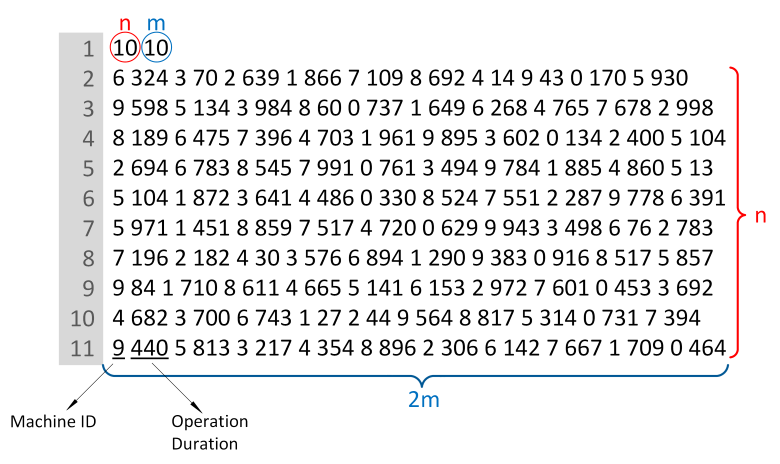
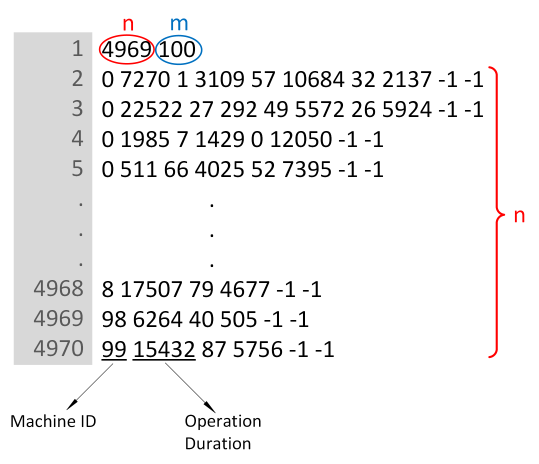
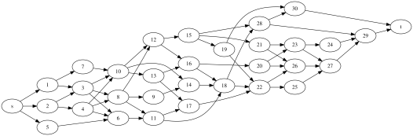

<script id="MathJax-script" async src="https://cdn.jsdelivr.net/npm/mathjax@3/es5/tex-mml-chtml.js"></script>

## The jobshop benchmark library

The JSPLib is an informal group of instances (`ft`, `la`, `abz`, `orb`, `swv`, `yn`, `ta`, `dmu` to which we added `tai`, `long` and `short`) that have been used to investigate solution methods for the jobshop problem. On this page we keep track of the best known solutions (BKS) and classify the instances based on difficulty.

The data and source code can be found in the [Github repository](https://github.com/ScheduleOpt/benchmarks)
This document is visible as a README.md in the Github folder [jobshop](https://github.com/ScheduleOpt/benchmarks/tree/main/jobshop) or as a [webpage](https://scheduleopt.github.io/benchmarks/jsplib/)

### Table of Contents

- [Jobshop instances](#jobshop-benchmark-instances)
    - [Overview of the jobshop benchmark](#overview-of-the-jobshop-benchmark)
    - [Classification of the jobshop instances](#classification-of-the-jobshop-instances)
    - [Formats](#formats)
    - [Publications](#publications-instances)
- [Jobshop and variants using the standard format](#jobshop-variants)
    - [Jobshop](#jobshop)
    - [No buffer jobshop (blocking)](#no-buffer-jobshop-blocking-jobshop)
    - [No wait jobshop](#no-wait-jobshop)
    - [Cumulative jobshop](#cumulative-jobshop)
    - [Jobshop with operators](#jobshop-with-operators---workers)
- [Jobshop variants that require extra data](#other-jobshop-variants)
    - [Jobshop with arbitrary precedences](#jobshop-with-arbitrary-precedences)
    - [Jobshop with setup times](#jobshop-with-sequence-dependent-setup-times)
    - [Flexible jobshop](#flexible-jobshop)
- [Jobshop benchmark - JSPLib](#jobshop-benchmark---jsplib)
    - [Similar work](#similar-work)
    - [Best known solutions](#best-known-solutions---jsplib)
    - [Publications](#publications-best-known-solutions)
- [Test instances for algorithms](#test-instances)

<br/>

### Overview of the jobshop benchmark

All instances in the benchmark follow the standard jobshop format. The DaColTeppan instances use a conservative extension of the existing jobshop format.

Jobshop instances (332)
- 3 instances `ft` from Fischer and Thompson 1963 
- 40 instances `la` from Lawrence 1984
- 5 instances `abz` from Adams, Balas and Zawack 1988
- 10 instances `orb` from Applegate and Cook 1991
- 20 instances `swv` from Storer, Wu and Vaccari 1992
- 4 instances `yn` from Yamada and Nakano 1992
- 80 instances `ta` from Taillard 1993
- 80 instances `dmu` from Demirkol, Mehta and Uzsoy 1998
- 90 instances `tai` from Da Col and Teppan 2022

Reentrant jobshop instances (24)
- 12 instances `long` from Da Col and Teppan 2022
- 12 instances `short` from Da Col and Teppan 2022


### Classification of the jobshop instances

We use the following engines as references for the benchmark
- [**IBM ILOG CP Optimizer**](https://www.ibm.com/products/ilog-cplex-optimization-studio/cplex-cp-optimizer) : representative of the CP-scheduling family of engines
- [**Google CP-SAT**](https://developers.google.com/optimization) : representative of the lazy clause generation family of engines
- [**OptalCP**](https://optalcp.com) : representative of the lazy clause generation family of engines

We have dropped Cplex from the jobshop tests due to poor performance of linear solvers as reported by multiple authors in the literature and confirmed by ourselves.


Instances are divided into
- **easy** : solved to optimality (with proof) in 1 minute by at least 1 reference engine
- **medium** : solved to optimality (with proof) in 1 hour by at least 1 reference engine
- **hard** : solved to optimality (with proof) in > 1h by at least 1 reference engine
- **closed** : allegedly solved to optimality. Most of the time the optimal solution is known because 2 different methods were used to find upper and lower bounds.
- **open** : no proof of optimality

Currently the instances divide as follows
- `ft` : 3 easy
- `la` : 39 easy, 1 medium
- `abz` : 2 easy, 2 medium, 1 hard
- `orb` : 10 easy
- `swv` : 7 easy, 4 medium, 6 hard, 3 open
- `yn` : 4 hard
- `ta` : 40 easy, 21 medium, 7 hard, 12 open
- `dmu` : 17 easy, 13 medium, 5 hard, 45 open
- `tai` : 50 easy, 40 open
- `long` : 11 easy, 1 medium
- `short` : 5 easy, 6 medium, 1 open

Previous versions of these results had some `closed` instances which we proceed to solve with OptalCP running for longer times to confirm their status of solved

### Formats

There are three main formats, the ***standard***, the ***DaColTeppan*** and the ***taillard***


#### Standard format

```
#n #m
((machine duration ){m}\n){n}
```



<small>Image from Da Col & Teppan</small>


For instance `l01` on standard format is
```
10	5	
1	21	0	53	4	95	3	55	2	34
0	21	3	52	4	16	2	26	1	71
3	39	4	98	1	42	2	31	0	12
1	77	0	55	4	79	2	66	3	77
0	83	3	34	2	64	1	19	4	37
1	54	2	43	4	79	0	92	3	62
3	69	4	77	1	87	2	87	0	93
2	38	0	60	1	41	3	24	4	83
3	17	1	49	4	25	0	44	2	98
4	77	3	79	2	43	1	75	0	96
```

<br/>


#### Da Col Teppan format

```
#n #m
((machine duration )+ -1 -1\n){n}
```


<small>Image from Da Col & Teppan</small>


In the DaColTeppan format
- there can be any number of tasks per job
- there can be various tasks in a job running on the same machine (reentrance)
- the jobs end in a -1 -1


The DaColTeppan format is actually a format for the reentrant jobshop problem which
is a generalization of the jobshop, common in some industrial environments like semiconductors


For instance
```
10	5	
1	21	0	53	-1  -1
0	21	3	52	 4	16	2	26	1	71   4	95	3	55	 2	34 -1 -1
3	39	4	98	 1	42	2	31	0	12  79	 2	66	3	77  -1 -1
1	77	0	55	 4  -1 -1
0	83	-1 -1
1	54	2	43	4	79	0	92	3	62   3	34	 2	64	 1	19	4	37 -1 -1
3	69	4	77	1	87	2	87	0	93  41	 3	24	 4	83  -1 -1
2	38	0	60	1	-1 -1
3	17	1	49	4	25	0	44	2	98 -1 -1
4	77	3	79	2	43	1	75	0	96 -1 -1
```

To be totally conservative, the format should remove the last two -1 -1 and consider
the end of line is the separator between jobs. It is not hard to do a parser that 
accepts both.

<br/>


#### Taillard format

The taillard format first lists the machines, then the durations

```
#n #m
((machine ){m}\n){n}
((duration ){m}\n){n}
```

For instance `l01` in taillard format is
```
10	5	
1	0	4	3	2
0	3	4	2	1
3	4	1	2	0
1	0	4	2	3
0	3	2	1	4
1	2	4	0	3
3	4	1	2	0
2	0	1	3	4
3	1	4	0	2
4	3	2	1	0
21	53	95	55	34
21	52	16	26	71
39	98	42	31	12
77	55	79	66	77
83	34	64	19	37
54	43	79	92	62
69	77	87	87	93
38	60	41	24	83
17	49	25	44	98
77	79	43	75	96
```


<br/>

### Publications (instances)

The instances come from the following publications

- **H. Fisher, G.L. Thompson** (1963), Probabilistic learning combinations of local job-shop scheduling rules, J.F. Muth, G.L. Thompson (eds.), Industrial Scheduling,  Prentice Hall, Englewood Cliffs, New Jersey, 225-251.

- **Lawrence, S.** (1984). Resource constrained project scheduling: An experimental investigation of heuristic scheduling techniques (Supplement). Graduate School of Industrial Administration, Carnegie-Mellon University.

- **Adams, J., Balas, E., & Zawack, D.** (1988). The shifting bottleneck procedure for job shop scheduling. Management science, 34(3), 391-401.

- **Applagate, D., & Cook, W.** (1991). A computational study of the job-shop scheduling instance. ORSA J. Comput, 3, 49-51.

- **Storer, R. H., Wu, S. D., & Vaccari, R.** (1992). New search spaces for sequencing instances with application to job shop 38 (1992) 1495–1509 Manage. Sci, 38, 1495-1509.

- **T. Yamada, R. Nakano** (1992), A genetic algorithm applicable to large-scale job-shop instances, R. Manner, B. Manderick (eds.),Parallel instance solving from nature 2,    North-Holland, Amsterdam,  281-290

- **Taillard, E.** (1993). Benchmarks for basic scheduling problems. european journal of operational research, 64(2), 278-285.

- **Demirkol, E., Mehta, S., & Uzsoy, R.** (1998). Benchmarks for shop scheduling problems. European Journal of Operational Research, 109(1), 137-141.

- **Da Col, G., & Teppan, E. C.** (2022). Industrial-size job shop scheduling with constraint programming. Operations Research Perspectives, 9, 100249.

<br/>


## Jobshop variants

Many variants of the jobshop problem can be solved with the same data
or simple addition of parameters

### Jobshop

The classical jobshop problem has 2 constraints

- intrajob precedences 

$$\forall j \in \mathrm{jobs}, \forall r \in \mathrm{ranks} \quad \mathrm{start}_j^r + \mathrm{Duration}_j^r \leq \mathrm{start}_j^{r+1}$$

- no overlap per machine 

$$
\forall m \in \mathrm{machines}, \forall j_1,j_2 \in \mathrm{jobs} \quad
\left( \mathrm{start}\_{j_1}^m + \mathrm{Duration}\_{j_1}^m \leq \mathrm{start}\_{j_2}^m \right) \vee \left( \mathrm{start}\_{j_2}^m + \mathrm{Duration}\_{j_2}^m \leq \mathrm{start}\_{j_1}^m \right )
$$

For commodity the later constraint can be written

$$\forall m \in \mathrm{machines} \quad \mathrm{noOverlap} \ \lbrace \ [ \mathrm{start}_j^m \dots \ \mathrm{start}_j^m + \mathrm{Duration}_j^m ] \mid j \in \mathrm{jobs} \ \rbrace$$

<br/>

### No buffer jobshop (blocking jobshop)

In the classic jobshop there is implicitly a buffer area in front of each machine where tasks can wait to be processed. In the non-buffer jobshop, also called blocking jobshop this area doesn't exist, as a result a job `(j,r)`processed on machine `m` blocks this machine until `(j,r+1)` starts being processed on the next machine.


From this problem we introduce a new variable $\mathrm{end}_j^m$

- the tasks are variable length with a minimum length of $\mathrm{Duration}_j^m$

$$\forall j \in \mathrm{jobs}, \forall r \in \mathrm{machines} \quad \mathrm{start}_j^m + \mathrm{Duration}_j^m \leq \mathrm{end}_j^m$$

- for each job, the task of rank $r+1$ starts as soon as the task of rank $r$ ends

$$\forall j \in \mathrm{jobs}, \forall r \in \mathrm{ranks} \quad \mathrm{end}_j^r = \mathrm{start}_j^{r+1}$$

- no overlap per machine 

$$
\forall m \in \mathrm{machines}, \forall j_1,j_2 \in \mathrm{jobs}\quad \left( \mathrm{end}\_{j_1}^m \leq \mathrm{start}\_{j_2}^m \right) \vee \left( \mathrm{end}\_{j_2}^m \leq \mathrm{start}\_{j_1}^m \right )
$$

or

$$\forall m \in \mathrm{machines} \quad \mathrm{noOverlap} \ \lbrace \ [ \mathrm{start}_j^m \dots \ \mathrm{end}_j^m ] \mid j \in \mathrm{jobs} \ \rbrace$$

<br/>

The extra variables $\mathrm{end}$ can be pre-processed out of the equations

<br/>

### No-wait jobshop

In the no-wait jobshop variant, once the processing of a job has started, it has to go through all machines without interruption.


The equations are reminiscent of the blocking jobshop but without the variable length activities

- for each job, the task of rank $r+1$ starts as soon as the task of rank $r$ ends

$$\forall j \in \mathrm{jobs}, \forall r \in \mathrm{ranks} \quad \mathrm{end}_j^r = \mathrm{start}_j^{r+1}$$

- no overlap per machine 

$$
\forall m \in \mathrm{machines}, \forall j_1,j_2 \in \mathrm{jobs}\quad \left( \mathrm{end}\_{j_1}^m \leq \mathrm{start}\_{j_2}^m \right) \vee \left( \mathrm{end}\_{j_2}^m \leq \mathrm{start}\_{j_1}^m \right )
$$

or

$$\forall m \in \mathrm{machines} \quad \mathrm{noOverlap} \ \lbrace \ [ \mathrm{start}_j^m \dots \ \mathrm{end}_j^m ] \mid j \in \mathrm{jobs} \ \rbrace$$

<br/>

### Cumulative jobshop

In the cumulative jobshop, the capacity of the capacity of the machines is not unitary anymore. In other words there is a limit $C_m$ on the number of tasks that can be simultaneously processed by machine $m$

The constraints of the problem are

- intrajob precedences 

$$\forall j \in \mathrm{jobs}, \forall r \in \mathrm{ranks} \quad \mathrm{start}_j^r + \mathrm{Duration}_j^r \leq \mathrm{start}_j^{r+1}$$

- capacity per machine 

$$\forall m \in \mathrm{machines}, \forall t \in \mathrm{time} \quad \sum_j \left( \mathrm{start}^m_j \leq t \lt \mathrm{start}^m_j + \mathrm{Duration}^m_j \right) \leq C_m$$

It is advisable to avoid having an unlimited number of equations, in this case
because of the explicit dependency on time, even if it just for notation. We therefore introduce the functional notation for cumulative constraints

$$
\forall m \in \mathrm{machines}\quad \mathrm{cumul}_m(t) = \sum_j \mathrm{step}(\mathrm{start}_j^m) - \mathrm{step}(\mathrm{start}_j^m + \mathrm{Duration}_j^m)
$$

Here $\mathrm{step}(t)$ is the function that has value 1 at time $t$ and 0 otherwise, as a result $\mathrm{cumul}$ is a function of time. Each configuration of $\mathrm{start}_j^m$ values defines a different cumulative function.


The constraints of the problem become

- intrajob precedences 

$$\forall j \in \mathrm{jobs}, \forall r \in \mathrm{ranks} \quad \mathrm{start}_j^r + \mathrm{Duration}_j^r \leq \mathrm{start}_j^{r+1}$$

- capacity per machine 

$$
\forall m \in \mathrm{machines}\quad \sum_j \mathrm{step}(\mathrm{start}_j^m) - \mathrm{step}(\mathrm{start}_j^m + \mathrm{Duration}_j^m) \leq C_m
$$

<br/>

### Jobshop with operators - workers

In the jobshop with operators, workers have to be assigned to the machines while the tasks are being performed. 
- when the operator assignment can be interrupted (preemptive operators) the problem becomes a jobshop with maximum number of simultaneous jobs.
- when the operator assignment cannot be interrupted (non-preemptive operators) the operators need to be assigned to jobs individually and they cannot be assigned to simultaneous jobs


#### Jobshop with preemptive operators 

The constraints of the problem become

- intrajob precedences 

$$\forall j \in \mathrm{jobs}, \forall r \in \mathrm{ranks} \quad \mathrm{start}_j^r + \mathrm{Duration}_j^r \leq \mathrm{start}_j^{r+1}$$

- no overlap per machine 

$$\forall m \in \mathrm{machines} \quad \mathrm{noOverlap} \ \lbrace \ [ \mathrm{start}_j^m \dots \ \mathrm{start}_j^m + \mathrm{Duration}_j^m ] \mid j \in \mathrm{jobs} \ \rbrace$$

- maximum number of simultaneous tasks

$$\sum_m \sum_j \mathrm{step}(\mathrm{start}_j^m) - \mathrm{step}(\mathrm{start}_j^m + \mathrm{Duration}_j^m) \leq \mathrm{Op}$$

## Other jobshop variants

Because these jobshop variants require extra data, we cannot run them
over the standard benchmark

### Jobshop with arbitrary precedences

Instead of having precedences only within the tasks of a job, there is a more general precedence graph



### Jobshop with sequence dependent setup times

There are setup times in the machines to switch from one job to another

Notice that this variant is only interesting if the setup times are sequence-dependent. Otherwise it is equivalent to increase each task by the length of the setup time and to solve an usual jobshop

### Flexible jobshop

The tasks of a job can be processed by any machine in a predefined group of similar machines.

***Please refer to the [flexible-jobshop section](https://scheduleopt.github.io/benchmarks/fjsplib/) of this benchmark for more information***

<br/>

## Jobshop benchmark - JSPLib

The JSPLib is an informal group of instances (`ft`, `la`, `abz`, `orb`, `swv`, `yn`, `ta`, `dmu` to which we added `tai`, `short` and `long`) that have been used to investigate solution methods for the jobshop problem. On this page we keep track of the best known solutions (BKS) and classify the instances based on difficulty.

An instance is considered
- `easy` if it is solved to optimality by a reference engine in < 1 minute
- `medium` if it is solved to optimality by a reference engine in < 1h
- `hard` if it is solved to optimality by a reference engine in > 1h
- `closed` if the combination of upper and lower bounds found in the literature allows concluding the value of the optimal solution is known
- `open` otherwise

<br/>

For each instance we indicate the publication or engine that reaches that bound (lower or upper). When reporting the results:
- we give priority to engines over publications because of reproductibility of the results
- we give priority to the fastest engine to attain the bound
- when an engine attains a bound previously reported in the literature, we attribute the bound to the engine and remove the correponding paper from the list of relevant references

Other databases keep instead the ***first*** publication or method to have achieved that bound for historical reference. This work instead is meant for engine and algorithm developers to have means of reproducing the claimed results for comparison.

### Similar work

Our work was inspired by the ***outstanding*** work of Naderi, Ruiz and Roshanaei *Mixed-Integer Programming versus Constraint Programming for shop scheduling problems : New Results and Outlook* [**NRR2022**] which compares CPO, Cplex, Gurobi and OR-tools on a benchmark of 6623 instances over 17 benchmarks with a timeout of 1h. They have made all the [raw results available](http://soa.iti.es/problem-instances)

We borrowed references for existing best known bounds from
- [http://mistic.heig-vd.ch/taillard/problemes.dir/ordonnancement.dir/ordonnancement.html](http://mistic.heig-vd.ch/taillard/problemes.dir/ordonnancement.dir/ordonnancement.html)
- [https://github.com/thomasWeise/jsspInstancesAndResults](https://github.com/thomasWeise/jsspInstancesAndResults)
- [http://jobshop.jjvh.nl/](http://jobshop.jjvh.nl/)
- [https://optimizizer.com/jobshop.php](https://optimizizer.com/jobshop.php)

<br/>

The upper bounds available in optimizizer are verified before publication (which we don't do directly - our verification is the fact that an engine achieves the same value). We encourage you to also visit his site.

We also think [https://www.jobshoppuzzle.com/](https://www.jobshoppuzzle.com/) is a very cool site with interactive visualizations of jobshop heuristics and solutions.


### Best known solutions - JSPLib

If you visualize the markdown in Visual Studio Code you will have colors !

#### Fisher and Thompson (1963)

*FT instances are also known as MT because the 1963 paper of Fisher and Thompson was published in the book "Industrial scheduling" by Muth and Thompson.*

<table>
<tr><th>Instance</th><th>Size</th><th>Problem</th><th>LB</th><th>UB</th><th>Type</th><th>Solved by</th></tr>
<tr><td>ft06</td><td>6 x 6</td><td>jobshop</td><td>55</td><td>55</td><td style="background-color:green;color:white;font-weight:bold">easy</td><td>CPO in < 1 min</td></tr>
<tr><td>ft10</td><td>10 x 10</td><td>jobshop</td><td>930</td><td>930</td><td style="background-color:green;color:white;font-weight:bold">easy</td><td>CPO in < 1 min</td></tr>
<tr><td>ft20</td><td>20 x 5</td><td>jobshop</td><td>1165</td><td>1165</td><td style="background-color:green;color:white;font-weight:bold">easy</td><td>CPO in < 1 min</td></tr>
</table>

#### Lawrence (1984)

<table>
<tr><th>Instance</th><th>Size</th><th>Problem</th><th>LB</th><th>UB</th><th>Type</th><th>Solved by</th></tr>
<tr><td>la01</td><td>10 x 5</td><td>jobshop</td><td>666</td><td>666</td><td style="background-color:green;color:white;font-weight:bold">easy</td><td>CPO in < 1 min</td></tr>
<tr><td>la02</td><td>10 x 5</td><td>jobshop</td><td>655</td><td>655</td><td style="background-color:green;color:white;font-weight:bold">easy</td><td>CPO in < 1 min</td></tr>
<tr><td>la03</td><td>10 x 5</td><td>jobshop</td><td>597</td><td>597</td><td style="background-color:green;color:white;font-weight:bold">easy</td><td>CPO in < 1 min</td></tr>
<tr><td>la04</td><td>10 x 5</td><td>jobshop</td><td>590</td><td>590</td><td style="background-color:green;color:white;font-weight:bold">easy</td><td>CPO in < 1 min</td></tr>
<tr><td>la05</td><td>10 x 5</td><td>jobshop</td><td>593</td><td>593</td><td style="background-color:green;color:white;font-weight:bold">easy</td><td>CPO in < 1 min</td></tr>
<tr><td>la06</td><td>15 x 5</td><td>jobshop</td><td>926</td><td>926</td><td style="background-color:green;color:white;font-weight:bold">easy</td><td>CPO in < 1 min</td></tr>
<tr><td>la07</td><td>15 x 5</td><td>jobshop</td><td>890</td><td>890</td><td style="background-color:green;color:white;font-weight:bold">easy</td><td>CPO in < 1 min</td></tr>
<tr><td>la08</td><td>15 x 5</td><td>jobshop</td><td>863</td><td>863</td><td style="background-color:green;color:white;font-weight:bold">easy</td><td>CPO in < 1 min</td></tr>
<tr><td>la09</td><td>15 x 5</td><td>jobshop</td><td>951</td><td>951</td><td style="background-color:green;color:white;font-weight:bold">easy</td><td>CPO in < 1 min</td></tr>
<tr><td>la10</td><td>15 x 5</td><td>jobshop</td><td>958</td><td>958</td><td style="background-color:green;color:white;font-weight:bold">easy</td><td>CPO in < 1 min</td></tr>
<tr><td>la11</td><td>20 x 5</td><td>jobshop</td><td>1222</td><td>1222</td><td style="background-color:green;color:white;font-weight:bold">easy</td><td>CPO in < 1 min</td></tr>
<tr><td>la12</td><td>20 x 5</td><td>jobshop</td><td>1039</td><td>1039</td><td style="background-color:green;color:white;font-weight:bold">easy</td><td>CPO in < 1 min</td></tr>
<tr><td>la13</td><td>20 x 5</td><td>jobshop</td><td>1150</td><td>1150</td><td style="background-color:green;color:white;font-weight:bold">easy</td><td>CPO in < 1 min</td></tr>
<tr><td>la14</td><td>20 x 5</td><td>jobshop</td><td>1292</td><td>1292</td><td style="background-color:green;color:white;font-weight:bold">easy</td><td>CPO in < 1 min</td></tr>
<tr><td>la15</td><td>20 x 5</td><td>jobshop</td><td>1207</td><td>1207</td><td style="background-color:green;color:white;font-weight:bold">easy</td><td>CPO in < 1 min</td></tr>
<tr><td>la16</td><td>10 x 10</td><td>jobshop</td><td>945</td><td>945</td><td style="background-color:green;color:white;font-weight:bold">easy</td><td>CPO in < 1 min</td></tr>
<tr><td>la17</td><td>10 x 10</td><td>jobshop</td><td>784</td><td>784</td><td style="background-color:green;color:white;font-weight:bold">easy</td><td>CPO in < 1 min</td></tr>
<tr><td>la18</td><td>10 x 10</td><td>jobshop</td><td>848</td><td>848</td><td style="background-color:green;color:white;font-weight:bold">easy</td><td>CPO in < 1 min</td></tr>
<tr><td>la19</td><td>10 x 10</td><td>jobshop</td><td>842</td><td>842</td><td style="background-color:green;color:white;font-weight:bold">easy</td><td>CPO in < 1 min</td></tr>
<tr><td>la20</td><td>10 x 10</td><td>jobshop</td><td>902</td><td>902</td><td style="background-color:green;color:white;font-weight:bold">easy</td><td>CPO in < 1 min</td></tr>
<tr><td>la21</td><td>15 x 10</td><td>jobshop</td><td>1046</td><td>1046</td><td style="background-color:green;color:white;font-weight:bold">easy</td><td>OptalCP in < 1 min</td></tr>
<tr><td>la22</td><td>15 x 10</td><td>jobshop</td><td>927</td><td>927</td><td style="background-color:green;color:white;font-weight:bold">easy</td><td>CPO in < 1 min</td></tr>
<tr><td>la23</td><td>15 x 10</td><td>jobshop</td><td>1032</td><td>1032</td><td style="background-color:green;color:white;font-weight:bold">easy</td><td>CPO in < 1 min</td></tr>
<tr><td>la24</td><td>15 x 10</td><td>jobshop</td><td>935</td><td>935</td><td style="background-color:green;color:white;font-weight:bold">easy</td><td>CPO in < 1 min</td></tr>
<tr><td>la25</td><td>15 x 10</td><td>jobshop</td><td>977</td><td>977</td><td style="background-color:green;color:white;font-weight:bold">easy</td><td>CPO in < 1 min</td></tr>
<tr><td>la26</td><td>20 x 10</td><td>jobshop</td><td>1218</td><td>1218</td><td style="background-color:green;color:white;font-weight:bold">easy</td><td>CPO in < 1 min</td></tr>
<tr><td>la27</td><td>20 x 10</td><td>jobshop</td><td>1235</td><td>1235</td><td style="background-color:green;color:white;font-weight:bold">easy</td><td>OptalCP in < 1 min</td></tr>
<tr><td>la28</td><td>20 x 10</td><td>jobshop</td><td>1216</td><td>1216</td><td style="background-color:green;color:white;font-weight:bold">easy</td><td>CPO in < 1 min</td></tr>
<tr><td>la29</td><td>20 x 10</td><td>jobshop</td><td>1152</td><td>1152</td><td style="background-color:orange;color:white;font-weight:bold">medium</td><td>OptalCP in 5 min</td></tr>
<tr><td>la30</td><td>20 x 10</td><td>jobshop</td><td>1355</td><td>1355</td><td style="background-color:green;color:white;font-weight:bold">easy</td><td>CPO in < 1 min</td></tr>
<tr><td>la31</td><td>30 x 10</td><td>jobshop</td><td>1784</td><td>1784</td><td style="background-color:green;color:white;font-weight:bold">easy</td><td>CPO in < 1 min</td></tr>
<tr><td>la32</td><td>30 x 10</td><td>jobshop</td><td>1850</td><td>1850</td><td style="background-color:green;color:white;font-weight:bold">easy</td><td>CPO in < 1 min</td></tr>
<tr><td>la33</td><td>30 x 10</td><td>jobshop</td><td>1719</td><td>1719</td><td style="background-color:green;color:white;font-weight:bold">easy</td><td>CPO in < 1 min</td></tr>
<tr><td>la34</td><td>30 x 10</td><td>jobshop</td><td>1721</td><td>1721</td><td style="background-color:green;color:white;font-weight:bold">easy</td><td>CPO in < 1 min</td></tr>
<tr><td>la35</td><td>30 x 10</td><td>jobshop</td><td>1888</td><td>1888</td><td style="background-color:green;color:white;font-weight:bold">easy</td><td>CPO in < 1 min</td></tr>
<tr><td>la36</td><td>15 x 15</td><td>jobshop</td><td>1268</td><td>1268</td><td style="background-color:green;color:white;font-weight:bold">easy</td><td>CPO in < 1 min</td></tr>
<tr><td>la37</td><td>15 x 15</td><td>jobshop</td><td>1397</td><td>1397</td><td style="background-color:green;color:white;font-weight:bold">easy</td><td>CPO in < 1 min</td></tr>
<tr><td>la38</td><td>15 x 15</td><td>jobshop</td><td>1196</td><td>1196</td><td style="background-color:green;color:white;font-weight:bold">easy</td><td>OptalCP in < 1 min</td></tr>
<tr><td>la39</td><td>15 x 15</td><td>jobshop</td><td>1233</td><td>1233</td><td style="background-color:green;color:white;font-weight:bold">easy</td><td>CPO in < 1 min</td></tr>
<tr><td>la40</td><td>15 x 15</td><td>jobshop</td><td>1222</td><td>1222</td><td style="background-color:green;color:white;font-weight:bold">easy</td><td>OptalCP in < 1 min</td></tr>
</table>

#### Adams, Balas and Zawack (1988)

<table>
<tr><th>Instance</th><th>Size</th><th>Problem</th><th>LB</th><th>UB</th><th>Type</th><th>Solved by</th></tr>
<tr><td>abz5</td><td>10 x 10</td><td>jobshop</td><td>1234</td><td>1234</td><td style="background-color:green;color:white;font-weight:bold">easy</td><td>CPO in < 1 min</td></tr>
<tr><td>abz6</td><td>10 x 10</td><td>jobshop</td><td>943</td><td>943</td><td style="background-color:green;color:white;font-weight:bold">easy</td><td>CPO in < 1 min</td></tr>
<tr><td>abz7</td><td>20 x 15</td><td>jobshop</td><td>656</td><td>656</td><td style="background-color:orange;color:white;font-weight:bold">medium</td><td>OptalCP in < 1h</td></tr>
<tr><td>abz8</td><td>20 x 15</td><td>jobshop</td><td>667</td><td>667</td><td style="background-color:red;color:white;font-weight:bold">hard</td><td>OptalCP in 10h</td></tr>
<tr><td>abz9</td><td>20 x 15</td><td>jobshop</td><td>678</td><td>678</td><td style="background-color:orange;color:white;font-weight:bold">medium</td><td>OptalCP in < 1h</td></tr>
</table>

*Various places report that "Henning A (2002). Praktische Job-Shop Scheduling-Probleme. Ph.D. thesis, Friedrich-Schiller-Universität Jena, Jena, Germany" as having found a solution of 665 for abz8, but the original document says their solution is 667 and 665 is a "solution from the literature". We believe it is just a typing mistake in the sources they used. In any case OptalCP proves a lower bound of 667.*

#### Applegate and Cook (1991)

<table>
<tr><th>Instance</th><th>Size</th><th>Problem</th><th>LB</th><th>UB</th><th>Type</th><th>Solved by</th></tr>
<tr><td>orb01</td><td>10 x 10</td><td>jobshop</td><td>1059</td><td>1059</td><td style="background-color:green;color:white;font-weight:bold">easy</td><td>CPO in < 1 min</td></tr>
<tr><td>orb02</td><td>10 x 10</td><td>jobshop</td><td>888</td><td>888</td><td style="background-color:green;color:white;font-weight:bold">easy</td><td>CPO in < 1 min</td></tr>
<tr><td>orb03</td><td>10 x 10</td><td>jobshop</td><td>1005</td><td>1005</td><td style="background-color:green;color:white;font-weight:bold">easy</td><td>CPO in < 1 min</td></tr>
<tr><td>orb04</td><td>10 x 10</td><td>jobshop</td><td>1005</td><td>1005</td><td style="background-color:green;color:white;font-weight:bold">easy</td><td>CPO in < 1 min</td></tr>
<tr><td>orb05</td><td>10 x 10</td><td>jobshop</td><td>887</td><td>887</td><td style="background-color:green;color:white;font-weight:bold">easy</td><td>CPO in < 1 min</td></tr>
<tr><td>orb06</td><td>10 x 10</td><td>jobshop</td><td>1010</td><td>1010</td><td style="background-color:green;color:white;font-weight:bold">easy</td><td>CPO in < 1 min</td></tr>
<tr><td>orb07</td><td>10 x 10</td><td>jobshop</td><td>397</td><td>397</td><td style="background-color:green;color:white;font-weight:bold">easy</td><td>CPO in < 1 min</td></tr>
<tr><td>orb08</td><td>10 x 10</td><td>jobshop</td><td>899</td><td>899</td><td style="background-color:green;color:white;font-weight:bold">easy</td><td>CPO in < 1 min</td></tr>
<tr><td>orb09</td><td>10 x 10</td><td>jobshop</td><td>934</td><td>934</td><td style="background-color:green;color:white;font-weight:bold">easy</td><td>CPO in < 1 min</td></tr>
<tr><td>orb10</td><td>10 x 10</td><td>jobshop</td><td>944</td><td>944</td><td style="background-color:green;color:white;font-weight:bold">easy</td><td>CPO in < 1 min</td></tr>
</table>

#### Storer, Wu and Vaccari (1992)

<table>
<tr><th>Instance</th><th>Size</th><th>Problem</th><th>LB</th><th>UB</th><th>Type</th><th>Solved by</th></tr>
<tr><td>swv01</td><td>20 x 10</td><td>jobshop</td><td>1407</td><td>1407</td><td style="background-color:green;color:white;font-weight:bold">easy</td><td>OptalCP in < 1 min</td></tr>
<tr><td>swv02</td><td>20 x 10</td><td>jobshop</td><td>1475</td><td>1475</td><td style="background-color:green;color:white;font-weight:bold">easy</td><td>OptalCP in < 1 min</td></tr>
<tr><td>swv03</td><td>20 x 10</td><td>jobshop</td><td>1398</td><td>1398</td><td style="background-color:orange;color:white;font-weight:bold">medium</td><td>CPO in < 1h</td></tr>
<tr><td>swv04</td><td>20 x 10</td><td>jobshop</td><td>1464</td><td>1464</td><td style="background-color:orange;color:white;font-weight:bold">medium</td><td>OptalCP in < 1h</td></tr>
<tr><td>swv05</td><td>20 x 10</td><td>jobshop</td><td>1424</td><td>1424</td><td style="background-color:orange;color:white;font-weight:bold">medium</td><td>OptalCP in < 1h</td></tr>
<tr><td>swv06</td><td>20 x 15</td><td>jobshop</td><td>1667</td><td>1667</td><td style="background-color:red;color:white;font-weight:bold">hard</td><td>OptalCP in 40h</td></tr>
<tr><td>swv07</td><td>20 x 15</td><td>jobshop</td><td>1541</td><td>1594</td><td style="background-color:grey;color:white;font-weight:bold">open</td><td>lb OptalCP / ub GR2014</td></tr>
<tr><td>swv08</td><td>20 x 15</td><td>jobshop</td><td>1694</td><td>1751</td><td style="background-color:grey;color:white;font-weight:bold">open</td><td>lb OptalCP / ub Mu2015</td></tr>
<tr><td>swv09</td><td>20 x 15</td><td>jobshop</td><td>1655</td><td>1655</td><td style="background-color:red;color:white;font-weight:bold">hard</td><td>OptalCP in 15h</td></tr>
<tr><td>swv10</td><td>20 x 15</td><td>jobshop</td><td>1692</td><td>1743</td><td style="background-color:grey;color:white;font-weight:bold">open</td><td>lb OptalCP / ub SS2018</td></tr>
<tr><td>swv11</td><td>50 x 10</td><td>jobshop</td><td>2983</td><td>2983</td><td style="background-color:orange;color:white;font-weight:bold">medium</td><td>OptalCP in < 1h</td></tr>
<tr><td>swv12</td><td>50 x 10</td><td>jobshop</td><td>2972</td><td>2972</td><td style="background-color:orange;color:white;font-weight:bold">medium</td><td>OptalCP in < 1h</td></tr>
<tr><td>swv13</td><td>50 x 10</td><td>jobshop</td><td>3104</td><td>3104</td><td style="background-color:orange;color:white;font-weight:bold">medium</td><td>OptalCP in < 1h</td></tr>
<tr><td>swv14</td><td>50 x 10</td><td>jobshop</td><td>2968</td><td>2968</td><td style="background-color:orange;color:white;font-weight:bold">medium</td><td>CPO in < 1h</td></tr>
<tr><td>swv15</td><td>50 x 10</td><td>jobshop</td><td>2885</td><td>2885</td><td style="background-color:red;color:white;font-weight:bold">hard</td><td>OptalCP in 9h</td></tr>
<tr><td>swv16</td><td>50 x 10</td><td>jobshop</td><td>2924</td><td>2924</td><td style="background-color:green;color:white;font-weight:bold">easy</td><td>CPO in < 1 min</td></tr>
<tr><td>swv17</td><td>50 x 10</td><td>jobshop</td><td>2794</td><td>2794</td><td style="background-color:green;color:white;font-weight:bold">easy</td><td>CPO in < 1 min</td></tr>
<tr><td>swv18</td><td>50 x 10</td><td>jobshop</td><td>2852</td><td>2852</td><td style="background-color:green;color:white;font-weight:bold">easy</td><td>CPO in < 1 min</td></tr>
<tr><td>swv19</td><td>50 x 10</td><td>jobshop</td><td>2843</td><td>2843</td><td style="background-color:green;color:white;font-weight:bold">easy</td><td>CPO in < 1 min</td></tr>
<tr><td>swv20</td><td>50 x 10</td><td>jobshop</td><td>2823</td><td>2823</td><td style="background-color:green;color:white;font-weight:bold">easy</td><td>CPO in < 1 min</td></tr>
</table>

#### Yamada Nakano (1992)

<table>
<tr><th>Instance</th><th>Size</th><th>Problem</th><th>LB</th><th>UB</th><th>Type</th><th>Solved by</th></tr>
<tr><td>yn1</td><td>20 x 20</td><td>jobshop</td><td>884</td><td>884</td><td style="background-color:red;color:white;font-weight:bold">hard</td><td>OptalCP in 6h</td></tr>
<tr><td>yn2</td><td>20 x 20</td><td>jobshop</td><td>904</td><td>904</td><td style="background-color:red;color:white;font-weight:bold">hard</td><td>OptalCP in 40h</td></tr>
<tr><td>yn3</td><td>20 x 20</td><td>jobshop</td><td>892</td><td>892</td><td style="background-color:red;color:white;font-weight:bold">hard</td><td>OptalCP in 40h</td></tr>
<tr><td>yn4</td><td>20 x 20</td><td>jobshop</td><td>967</td><td>967</td><td style="background-color:red;color:white;font-weight:bold">hard</td><td>OptalCP in 16h</td></tr>
</table>

#### Taillard (1993)

<table>
<tr><th>Instance</th><th>Size</th><th>Problem</th><th>LB</th><th>UB</th><th>Type</th><th>Solved by</th></tr>
<tr><td>ta01js</td><td>15 x 15</td><td>jobshop</td><td>1231</td><td>1231</td><td style="background-color:green;color:white;font-weight:bold">easy</td><td>CPO in < 1 min</td></tr>
<tr><td>ta02js</td><td>15 x 15</td><td>jobshop</td><td>1244</td><td>1244</td><td style="background-color:green;color:white;font-weight:bold">easy</td><td>OptalCP in < 1 min</td></tr>
<tr><td>ta03js</td><td>15 x 15</td><td>jobshop</td><td>1218</td><td>1218</td><td style="background-color:green;color:white;font-weight:bold">easy</td><td>OptalCP in < 1 min</td></tr>
<tr><td>ta04js</td><td>15 x 15</td><td>jobshop</td><td>1175</td><td>1175</td><td style="background-color:green;color:white;font-weight:bold">easy</td><td>OptalCP in < 1 min</td></tr>
<tr><td>ta05js</td><td>15 x 15</td><td>jobshop</td><td>1224</td><td>1224</td><td style="background-color:green;color:white;font-weight:bold">easy</td><td>OptalCP in < 1 min</td></tr>
<tr><td>ta06js</td><td>15 x 15</td><td>jobshop</td><td>1238</td><td>1238</td><td style="background-color:green;color:white;font-weight:bold">easy</td><td>OptalCP in < 1 min</td></tr>
<tr><td>ta07js</td><td>15 x 15</td><td>jobshop</td><td>1227</td><td>1227</td><td style="background-color:green;color:white;font-weight:bold">easy</td><td>OptalCP in < 1 min</td></tr>
<tr><td>ta08js</td><td>15 x 15</td><td>jobshop</td><td>1217</td><td>1217</td><td style="background-color:green;color:white;font-weight:bold">easy</td><td>OptalCP in < 1 min</td></tr>
<tr><td>ta09js</td><td>15 x 15</td><td>jobshop</td><td>1274</td><td>1274</td><td style="background-color:green;color:white;font-weight:bold">easy</td><td>OptalCP in < 1 min</td></tr>
<tr><td>ta10js</td><td>15 x 15</td><td>jobshop</td><td>1241</td><td>1241</td><td style="background-color:green;color:white;font-weight:bold">easy</td><td>OptalCP in < 1 min</td></tr>
<tr><td>ta11js</td><td>20 x 15</td><td>jobshop</td><td>1357</td><td>1357</td><td style="background-color:orange;color:white;font-weight:bold">medium</td><td>OptalCP in < 1h</td></tr>
<tr><td>ta12js</td><td>20 x 15</td><td>jobshop</td><td>1367</td><td>1367</td><td style="background-color:orange;color:white;font-weight:bold">medium</td><td>OptalCP in < 1h</td></tr>
<tr><td>ta13js</td><td>20 x 15</td><td>jobshop</td><td>1342</td><td>1342</td><td style="background-color:orange;color:white;font-weight:bold">medium</td><td>OptalCP in < 1h</td></tr>
<tr><td>ta14js</td><td>20 x 15</td><td>jobshop</td><td>1345</td><td>1345</td><td style="background-color:green;color:white;font-weight:bold">easy</td><td>CPO in < 1 min</td></tr>
<tr><td>ta15js</td><td>20 x 15</td><td>jobshop</td><td>1339</td><td>1339</td><td style="background-color:orange;color:white;font-weight:bold">medium</td><td>OptalCP in < 1h</td></tr>
<tr><td>ta16js</td><td>20 x 15</td><td>jobshop</td><td>1360</td><td>1360</td><td style="background-color:orange;color:white;font-weight:bold">medium</td><td>OptalCP in < 1h</td></tr>
<tr><td>ta17js</td><td>20 x 15</td><td>jobshop</td><td>1462</td><td>1462</td><td style="background-color:green;color:white;font-weight:bold">easy</td><td>OptalCP in < 1 min</td></tr>
<tr><td>ta18js</td><td>20 x 15</td><td>jobshop</td><td>1396</td><td>1396</td><td style="background-color:orange;color:white;font-weight:bold">medium</td><td>OptalCP in < 1h</td></tr>
<tr><td>ta19js</td><td>20 x 15</td><td>jobshop</td><td>1332</td><td>1332</td><td style="background-color:orange;color:white;font-weight:bold">medium</td><td>OptalCP in < 1h</td></tr>
<tr><td>ta20js</td><td>20 x 15</td><td>jobshop</td><td>1348</td><td>1348</td><td style="background-color:orange;color:white;font-weight:bold">medium</td><td>OptalCP in < 1h</td></tr>
<tr><td>ta21js</td><td>20 x 20</td><td>jobshop</td><td>1642</td><td>1642</td><td style="background-color:orange;color:white;font-weight:bold">medium</td><td>OptalCP < 1h</td></tr>
<tr><td>ta22js</td><td>20 x 20</td><td>jobshop</td><td>1600</td><td>1600</td><td style="background-color:red;color:white;font-weight:bold">hard</td><td>OptalCP in 2h</td></tr>
<tr><td>ta23js</td><td>20 x 20</td><td>jobshop</td><td>1557</td><td>1557</td><td style="background-color:red;color:white;font-weight:bold">hard</td><td>OptalCP in 2h</td></tr>
<tr><td>ta24js</td><td>20 x 20</td><td>jobshop</td><td>1644</td><td>1644</td><td style="background-color:orange;color:white;font-weight:bold">medium</td><td>OptalCP in < 1h</td></tr>
<tr><td>ta25js</td><td>20 x 20</td><td>jobshop</td><td>1595</td><td>1595</td><td style="background-color:orange;color:white;font-weight:bold">medium</td><td>OptalCP in < 1h</td></tr>
<tr><td>ta26js</td><td>20 x 20</td><td>jobshop</td><td>1643</td><td>1643</td><td style="background-color:orange;color:white;font-weight:bold">medium</td><td>OptalCP in 7h</td></tr>
<tr><td>ta27js</td><td>20 x 20</td><td>jobshop</td><td>1680</td><td>1680</td><td style="background-color:orange;color:white;font-weight:bold">medium</td><td>OptalCP in < 1h</td></tr>
<tr><td>ta28js</td><td>20 x 20</td><td>jobshop</td><td>1603</td><td>1603</td><td style="background-color:orange;color:white;font-weight:bold">medium</td><td>OptalCP in < 1h</td></tr>
<tr><td>ta29js</td><td>20 x 20</td><td>jobshop</td><td>1625</td><td>1625</td><td style="background-color:red;color:white;font-weight:bold">hard</td><td>OptalCP in 2h</td></tr>
<tr><td>ta30js</td><td>20 x 20</td><td>jobshop</td><td>1562</td><td>1584</td><td style="background-color:grey;color:white;font-weight:bold">open</td><td>lb OptalCP / ub NS2002</td></tr>
<tr><td>ta31js</td><td>30 x 15</td><td>jobshop</td><td>1764</td><td>1764</td><td style="background-color:orange;color:white;font-weight:bold">medium</td><td>CPO in < 1h</td></tr>
<tr><td>ta32js</td><td>30 x 15</td><td>jobshop</td><td>1774</td><td>1784</td><td style="background-color:grey;color:white;font-weight:bold">open</td><td>lb CPO2015 / ub PSV2010</td></tr>
<tr><td>ta33js</td><td>30 x 15</td><td>jobshop</td><td>1791</td><td>1791</td><td style="background-color:red;color:white;font-weight:bold">hard</td><td>OptalCP in 10h</td></tr>
<tr><td>ta34js</td><td>30 x 15</td><td>jobshop</td><td>1828</td><td>1828</td><td style="background-color:orange;color:white;font-weight:bold">medium</td><td>OptalCP in < 1h</td></tr>
<tr><td>ta35js</td><td>30 x 15</td><td>jobshop</td><td>2007</td><td>2007</td><td style="background-color:green;color:white;font-weight:bold">easy</td><td>OptalCP in < 1 min</td></tr>
<tr><td>ta36js</td><td>30 x 15</td><td>jobshop</td><td>1819</td><td>1819</td><td style="background-color:orange;color:white;font-weight:bold">medium</td><td>OptalCP in < 1h</td></tr>
<tr><td>ta37js</td><td>30 x 15</td><td>jobshop</td><td>1771</td><td>1771</td><td style="background-color:red;color:white;font-weight:bold">hard</td><td>OptalCP in 2h</td></tr>
<tr><td>ta38js</td><td>30 x 15</td><td>jobshop</td><td>1673</td><td>1673</td><td style="background-color:red;color:white;font-weight:bold">hard</td><td>OptalCP in 7h</td></tr>
<tr><td>ta39js</td><td>30 x 15</td><td>jobshop</td><td>1795</td><td>1795</td><td style="background-color:green;color:white;font-weight:bold">easy</td><td>OptalCP in < 1 min</td></tr>
<tr><td>ta40js</td><td>30 x 15</td><td>jobshop</td><td>1658</td><td>1669</td><td style="background-color:grey;color:white;font-weight:bold">open</td><td>lb OptalCP / ub GR2014</td></tr>
<tr><td>ta41js</td><td>30 x 20</td><td>jobshop</td><td>1926</td><td>2005</td><td style="background-color:grey;color:white;font-weight:bold">open</td><td>lb OptalCP / ub CPO2015</td></tr>
<tr><td>ta42js</td><td>30 x 20</td><td>jobshop</td><td>1900</td><td>1937</td><td style="background-color:grey;color:white;font-weight:bold">open</td><td>lb OptalCP / ub GR2014</td></tr>
<tr><td>ta43js</td><td>30 x 20</td><td>jobshop</td><td>1809</td><td>1846</td><td style="background-color:grey;color:white;font-weight:bold">open</td><td>lb CPO2015 / ub PLC2015</td></tr>
<tr><td>ta44js</td><td>30 x 20</td><td>jobshop</td><td>1961</td><td>1979</td><td style="background-color:grey;color:white;font-weight:bold">open</td><td>lb OptalCP / ub CS2022</td></tr>
<tr><td>ta45js</td><td>30 x 20</td><td>jobshop</td><td>1997</td><td>1997</td><td style="background-color:orange;color:white;font-weight:bold">medium</td><td>OptalCP in < 1h</td></tr>
<tr><td>ta46js</td><td>30 x 20</td><td>jobshop</td><td>1976</td><td>2004</td><td style="background-color:grey;color:white;font-weight:bold">open</td><td>lb OptalCP / ub GR2014</td></tr>
<tr><td>ta47js</td><td>30 x 20</td><td>jobshop</td><td>1827</td><td>1889</td><td style="background-color:grey;color:white;font-weight:bold">open</td><td>lb OptalCP / ub PLC2015</td></tr>
<tr><td>ta48js</td><td>30 x 20</td><td>jobshop</td><td>1921</td><td>1937</td><td style="background-color:grey;color:white;font-weight:bold">open</td><td>lb OptalCP / ub SS2018</td></tr>
<tr><td>ta49js</td><td>30 x 20</td><td>jobshop</td><td>1938</td><td>1960</td><td style="background-color:grey;color:white;font-weight:bold">open</td><td>lb OptalCP / ub LHW2024</td></tr>
<tr><td>ta50js</td><td>30 x 20</td><td>jobshop</td><td>1848</td><td>1923</td><td style="background-color:grey;color:white;font-weight:bold">open</td><td>lb OptalCP / ub PLC2015</td></tr>
<tr><td>ta51js</td><td>50 x 15</td><td>jobshop</td><td>2760</td><td>2760</td><td style="background-color:green;color:white;font-weight:bold">easy</td><td>CPO in < 1 min</td></tr>
<tr><td>ta52js</td><td>50 x 15</td><td>jobshop</td><td>2756</td><td>2756</td><td style="background-color:green;color:white;font-weight:bold">easy</td><td>OptalCP in < 1 min</td></tr>
<tr><td>ta53js</td><td>50 x 15</td><td>jobshop</td><td>2717</td><td>2717</td><td style="background-color:green;color:white;font-weight:bold">easy</td><td>OptalCP in < 1 min</td></tr>
<tr><td>ta54js</td><td>50 x 15</td><td>jobshop</td><td>2839</td><td>2839</td><td style="background-color:green;color:white;font-weight:bold">easy</td><td>CPO in < 1 min</td></tr>
<tr><td>ta55js</td><td>50 x 15</td><td>jobshop</td><td>2679</td><td>2679</td><td style="background-color:green;color:white;font-weight:bold">easy</td><td>OptalCP in < 1 min</td></tr>
<tr><td>ta56js</td><td>50 x 15</td><td>jobshop</td><td>2781</td><td>2781</td><td style="background-color:green;color:white;font-weight:bold">easy</td><td>OptalCP in < 1 min</td></tr>
<tr><td>ta57js</td><td>50 x 15</td><td>jobshop</td><td>2943</td><td>2943</td><td style="background-color:green;color:white;font-weight:bold">easy</td><td>CPO in < 1 min</td></tr>
<tr><td>ta58js</td><td>50 x 15</td><td>jobshop</td><td>2885</td><td>2885</td><td style="background-color:green;color:white;font-weight:bold">easy</td><td>CPO in < 1 min</td></tr>
<tr><td>ta59js</td><td>50 x 15</td><td>jobshop</td><td>2655</td><td>2655</td><td style="background-color:green;color:white;font-weight:bold">easy</td><td>OptalCP in < 1 min</td></tr>
<tr><td>ta60js</td><td>50 x 15</td><td>jobshop</td><td>2723</td><td>2723</td><td style="background-color:green;color:white;font-weight:bold">easy</td><td>OptalCP in < 1 min</td></tr>
<tr><td>ta61js</td><td>50 x 20</td><td>jobshop</td><td>2868</td><td>2868</td><td style="background-color:green;color:white;font-weight:bold">easy</td><td>OptalCP in < 1 min</td></tr>
<tr><td>ta62js</td><td>50 x 20</td><td>jobshop</td><td>2869</td><td>2869</td><td style="background-color:orange;color:white;font-weight:bold">medium</td><td>OptalCP in < 1h</td></tr>
<tr><td>ta63js</td><td>50 x 20</td><td>jobshop</td><td>2755</td><td>2755</td><td style="background-color:green;color:white;font-weight:bold">easy</td><td>OptalCP in < 1 min</td></tr>
<tr><td>ta64js</td><td>50 x 20</td><td>jobshop</td><td>2702</td><td>2702</td><td style="background-color:green;color:white;font-weight:bold">easy</td><td>OptalCP in < 1 min</td></tr>
<tr><td>ta65js</td><td>50 x 20</td><td>jobshop</td><td>2725</td><td>2725</td><td style="background-color:green;color:white;font-weight:bold">easy</td><td>OptalCP in < 1 min</td></tr>
<tr><td>ta66js</td><td>50 x 20</td><td>jobshop</td><td>2845</td><td>2845</td><td style="background-color:green;color:white;font-weight:bold">easy</td><td>OptalCP in < 1 min</td></tr>
<tr><td>ta67js</td><td>50 x 20</td><td>jobshop</td><td>2825</td><td>2825</td><td style="background-color:red;color:white;font-weight:bold">hard</td><td>OptalCP in 4h</td></tr>
<tr><td>ta68js</td><td>50 x 20</td><td>jobshop</td><td>2784</td><td>2784</td><td style="background-color:green;color:white;font-weight:bold">easy</td><td>OptalCP in < 1 min</td></tr>
<tr><td>ta69js</td><td>50 x 20</td><td>jobshop</td><td>3071</td><td>3071</td><td style="background-color:green;color:white;font-weight:bold">easy</td><td>OptalCP in < 1 min</td></tr>
<tr><td>ta70js</td><td>50 x 20</td><td>jobshop</td><td>2995</td><td>2995</td><td style="background-color:orange;color:white;font-weight:bold">medium</td><td>CPO in < 1h</td></tr>
<tr><td>ta71js</td><td>100 x 20</td><td>jobshop</td><td>5464</td><td>5464</td><td style="background-color:green;color:white;font-weight:bold">easy</td><td>OptalCP in < 1 min</td></tr>
<tr><td>ta72js</td><td>100 x 20</td><td>jobshop</td><td>5181</td><td>5181</td><td style="background-color:green;color:white;font-weight:bold">easy</td><td>OptalCP in < 1 min</td></tr>
<tr><td>ta73js</td><td>100 x 20</td><td>jobshop</td><td>5568</td><td>5568</td><td style="background-color:green;color:white;font-weight:bold">easy</td><td>OptalCP in < 1 min</td></tr>
<tr><td>ta74js</td><td>100 x 20</td><td>jobshop</td><td>5339</td><td>5339</td><td style="background-color:green;color:white;font-weight:bold">easy</td><td>OptalCP in < 1 min</td></tr>
<tr><td>ta75js</td><td>100 x 20</td><td>jobshop</td><td>5392</td><td>5392</td><td style="background-color:orange;color:white;font-weight:bold">medium</td><td>CPO in < 1h</td></tr>
<tr><td>ta76js</td><td>100 x 20</td><td>jobshop</td><td>5342</td><td>5342</td><td style="background-color:green;color:white;font-weight:bold">easy</td><td>OptalCP in < 1 min</td></tr>
<tr><td>ta77js</td><td>100 x 20</td><td>jobshop</td><td>5436</td><td>5436</td><td style="background-color:green;color:white;font-weight:bold">easy</td><td>OptalCP in < 1 min</td></tr>
<tr><td>ta78js</td><td>100 x 20</td><td>jobshop</td><td>5394</td><td>5394</td><td style="background-color:green;color:white;font-weight:bold">easy</td><td>OptalCP in < 1 min</td></tr>
<tr><td>ta79js</td><td>100 x 20</td><td>jobshop</td><td>5358</td><td>5358</td><td style="background-color:green;color:white;font-weight:bold">easy</td><td>OptalCP in < 1 min</td></tr>
<tr><td>ta80js</td><td>100 x 20</td><td>jobshop</td><td>5183</td><td>5183</td><td style="background-color:green;color:white;font-weight:bold">easy</td><td>OptalCP in < 1 min</td></tr>
</table>

#### Demikol, Mehta and Uzsoy (1998)

<table>
<tr><th>Instance</th><th>Size</th><th>Problem</th><th>LB</th><th>UB</th><th>Type</th><th>Solved by</th></tr>
<tr><td>dmu01</td><td>20 x 15</td><td>jobshop</td><td>2563</td><td>2563</td><td style="background-color:orange;color:white;font-weight:bold">medium</td><td>OptalCP in < 1h</td></tr>
<tr><td>dmu02</td><td>20 x 15</td><td>jobshop</td><td>2706</td><td>2706</td><td style="background-color:orange;color:white;font-weight:bold">medium</td><td>OptalCP in < 1h</td></tr>
<tr><td>dmu03</td><td>20 x 15</td><td>jobshop</td><td>2731</td><td>2731</td><td style="background-color:orange;color:white;font-weight:bold">medium</td><td>CPO in < 1h</td></tr>
<tr><td>dmu04</td><td>20 x 15</td><td>jobshop</td><td>2669</td><td>2669</td><td style="background-color:orange;color:white;font-weight:bold">medium</td><td>OptalCP in < 1h</td></tr>
<tr><td>dmu05</td><td>20 x 15</td><td>jobshop</td><td>2749</td><td>2749</td><td style="background-color:orange;color:white;font-weight:bold">medium</td><td>OptalCP in < 1h</td></tr>
<tr><td>dmu06</td><td>20 x 20</td><td>jobshop</td><td>3244</td><td>3244</td><td style="background-color:red;color:white;font-weight:bold">hard</td><td>OptalCP in 2h</td></tr>
<tr><td>dmu07</td><td>20 x 20</td><td>jobshop</td><td>3046</td><td>3046</td><td style="background-color:red;color:white;font-weight:bold">hard</td><td>OptalCP in 3h</td></tr>
<tr><td>dmu08</td><td>20 x 20</td><td>jobshop</td><td>3188</td><td>3188</td><td style="background-color:orange;color:white;font-weight:bold">medium</td><td>OptalCP in < 1h</td></tr>
<tr><td>dmu09</td><td>20 x 20</td><td>jobshop</td><td>3092</td><td>3092</td><td style="background-color:orange;color:white;font-weight:bold">medium</td><td>OptalCP in < 1h</td></tr>
<tr><td>dmu10</td><td>20 x 20</td><td>jobshop</td><td>2984</td><td>2984</td><td style="background-color:orange;color:white;font-weight:bold">medium</td><td>OptalCP in < 1h</td></tr>
<tr><td>dmu11</td><td>30 x 15</td><td>jobshop</td><td>3402</td><td>3430</td><td style="background-color:grey;color:white;font-weight:bold">open</td><td>lb OptalCP / ub PLC2015</td></tr>
<tr><td>dmu12</td><td>30 x 15</td><td>jobshop</td><td>3481</td><td>3492</td><td style="background-color:grey;color:white;font-weight:bold">open</td><td>lb OptalCP / ub SS2018</td></tr>
<tr><td>dmu13</td><td>30 x 15</td><td>jobshop</td><td>3681</td><td>3681</td><td style="background-color:red;color:white;font-weight:bold">hard</td><td>OptalCP in 3h</td></tr>
<tr><td>dmu14</td><td>30 x 15</td><td>jobshop</td><td>3394</td><td>3394</td><td style="background-color:green;color:white;font-weight:bold">easy</td><td>OptalCP in < 1 min</td></tr>
<tr><td>dmu15</td><td>30 x 15</td><td>jobshop</td><td>3343</td><td>3343</td><td style="background-color:green;color:white;font-weight:bold">easy</td><td>OptalCP in < 1 min</td></tr>
<tr><td>dmu16</td><td>30 x 20</td><td>jobshop</td><td>3734</td><td>3750</td><td style="background-color:grey;color:white;font-weight:bold">open</td><td>lb CPO2015 / ub LHW2024</td></tr>
<tr><td>dmu17</td><td>30 x 20</td><td>jobshop</td><td>3733</td><td>3812</td><td style="background-color:grey;color:white;font-weight:bold">open</td><td>lb OptalCP / ub LHW2024</td></tr>
<tr><td>dmu18</td><td>30 x 20</td><td>jobshop</td><td>3844</td><td>3844</td><td style="background-color:red;color:white;font-weight:bold">hard</td><td>OptalCP in 10h</td></tr>
<tr><td>dmu19</td><td>30 x 20</td><td>jobshop</td><td>3707</td><td>3764</td><td style="background-color:grey;color:white;font-weight:bold">open</td><td>lb OptalCP / ub CS2022</td></tr>
<tr><td>dmu20</td><td>30 x 20</td><td>jobshop</td><td>3632</td><td>3699</td><td style="background-color:grey;color:white;font-weight:bold">open</td><td>lb OptalCP / ub LHW2024</td></tr>
<tr><td>dmu21</td><td>40 x 15</td><td>jobshop</td><td>4380</td><td>4380</td><td style="background-color:green;color:white;font-weight:bold">easy</td><td>OptalCP in < 1 min</td></tr>
<tr><td>dmu22</td><td>40 x 15</td><td>jobshop</td><td>4725</td><td>4725</td><td style="background-color:green;color:white;font-weight:bold">easy</td><td>CPO in < 1 min</td></tr>
<tr><td>dmu23</td><td>40 x 15</td><td>jobshop</td><td>4668</td><td>4668</td><td style="background-color:green;color:white;font-weight:bold">easy</td><td>CPO in < 1 min</td></tr>
<tr><td>dmu24</td><td>40 x 15</td><td>jobshop</td><td>4648</td><td>4648</td><td style="background-color:green;color:white;font-weight:bold">easy</td><td>CPO in < 1 min</td></tr>
<tr><td>dmu25</td><td>40 x 15</td><td>jobshop</td><td>4164</td><td>4164</td><td style="background-color:green;color:white;font-weight:bold">easy</td><td>CPO in < 1 min</td></tr>
<tr><td>dmu26</td><td>40 x 20</td><td>jobshop</td><td>4647</td><td>4647</td><td style="background-color:orange;color:white;font-weight:bold">medium</td><td>OptalCP < 1h</td></tr>
<tr><td>dmu27</td><td>40 x 20</td><td>jobshop</td><td>4848</td><td>4848</td><td style="background-color:orange;color:white;font-weight:bold">medium</td><td>OptalCP in < 1h</td></tr>
<tr><td>dmu28</td><td>40 x 20</td><td>jobshop</td><td>4692</td><td>4692</td><td style="background-color:green;color:white;font-weight:bold">easy</td><td>OptalCP in < 1 min</td></tr>
<tr><td>dmu29</td><td>40 x 20</td><td>jobshop</td><td>4691</td><td>4691</td><td style="background-color:green;color:white;font-weight:bold">easy</td><td>OptalCP in < 1 min</td></tr>
<tr><td>dmu30</td><td>40 x 20</td><td>jobshop</td><td>4732</td><td>4732</td><td style="background-color:orange;color:white;font-weight:bold">medium</td><td>OptalCP < 1h</td></tr>
<tr><td>dmu31</td><td>50 x 15</td><td>jobshop</td><td>5640</td><td>5640</td><td style="background-color:green;color:white;font-weight:bold">easy</td><td>CPO in < 1 min</td></tr>
<tr><td>dmu32</td><td>50 x 15</td><td>jobshop</td><td>5927</td><td>5927</td><td style="background-color:green;color:white;font-weight:bold">easy</td><td>CPO in < 1 min</td></tr>
<tr><td>dmu33</td><td>50 x 15</td><td>jobshop</td><td>5728</td><td>5728</td><td style="background-color:green;color:white;font-weight:bold">easy</td><td>CPO in < 1 min</td></tr>
<tr><td>dmu34</td><td>50 x 15</td><td>jobshop</td><td>5385</td><td>5385</td><td style="background-color:green;color:white;font-weight:bold">easy</td><td>CPO in < 1 min</td></tr>
<tr><td>dmu35</td><td>50 x 15</td><td>jobshop</td><td>5635</td><td>5635</td><td style="background-color:green;color:white;font-weight:bold">easy</td><td>CPO in < 1 min</td></tr>
<tr><td>dmu36</td><td>50 x 20</td><td>jobshop</td><td>5621</td><td>5621</td><td style="background-color:green;color:white;font-weight:bold">easy</td><td>OptalCP in < 1 min</td></tr>
<tr><td>dmu37</td><td>50 x 20</td><td>jobshop</td><td>5851</td><td>5851</td><td style="background-color:orange;color:white;font-weight:bold">medium</td><td>CPO in < 1h</td></tr>
<tr><td>dmu38</td><td>50 x 20</td><td>jobshop</td><td>5713</td><td>5713</td><td style="background-color:orange;color:white;font-weight:bold">medium</td><td>OptalCP in < 1h</td></tr>
<tr><td>dmu39</td><td>50 x 20</td><td>jobshop</td><td>5747</td><td>5747</td><td style="background-color:green;color:white;font-weight:bold">easy</td><td>OptalCP in < 1 min</td></tr>
<tr><td>dmu40</td><td>50 x 20</td><td>jobshop</td><td>5577</td><td>5577</td><td style="background-color:green;color:white;font-weight:bold">easy</td><td>OptalCP in < 1 min</td></tr>
<tr><td>dmu41</td><td>20 x 15</td><td>jobshop</td><td>3176</td><td>3248</td><td style="background-color:grey;color:white;font-weight:bold">open</td><td>lb OptalCP / ub PLC2015</td></tr>
<tr><td>dmu42</td><td>20 x 15</td><td>jobshop</td><td>3339</td><td>3390</td><td style="background-color:grey;color:white;font-weight:bold">open</td><td>lb OptalCP / ub SS2018</td></tr>
<tr><td>dmu43</td><td>20 x 15</td><td>jobshop</td><td>3441</td><td>3441</td><td style="background-color:red;color:white;font-weight:bold">hard</td><td>OptalCP in 8h</td></tr>
<tr><td>dmu44</td><td>20 x 15</td><td>jobshop</td><td>3414</td><td>3475</td><td style="background-color:grey;color:white;font-weight:bold">open</td><td>lb OptalCP / ub SS2018</td></tr>
<tr><td>dmu45</td><td>20 x 15</td><td>jobshop</td><td>3217</td><td>3266</td><td style="background-color:grey;color:white;font-weight:bold">open</td><td>lb OptalCP / ub CS2022</td></tr>
<tr><td>dmu46</td><td>20 x 20</td><td>jobshop</td><td>3780</td><td>4035</td><td style="background-color:grey;color:white;font-weight:bold">open</td><td>lb OptalCP / ub GR2014</td></tr>
<tr><td>dmu47</td><td>20 x 20</td><td>jobshop</td><td>3714</td><td>3939</td><td style="background-color:grey;color:white;font-weight:bold">open</td><td>lb OptalCP / ub GR2014</td></tr>
<tr><td>dmu48</td><td>20 x 20</td><td>jobshop</td><td>3628</td><td>3763</td><td style="background-color:grey;color:white;font-weight:bold">open</td><td>lb OptalCP / ub SS2018</td></tr>
<tr><td>dmu49</td><td>20 x 20</td><td>jobshop</td><td>3543</td><td>3706</td><td style="background-color:grey;color:white;font-weight:bold">open</td><td>lb OptalCP / ub LHW2024</td></tr>
<tr><td>dmu50</td><td>20 x 20</td><td>jobshop</td><td>3618</td><td>3729</td><td style="background-color:grey;color:white;font-weight:bold">open</td><td>lb OptalCP / ub PLC2015</td></tr>
<tr><td>dmu51</td><td>30 x 15</td><td>jobshop</td><td>4070</td><td>4156</td><td style="background-color:grey;color:white;font-weight:bold">open</td><td>lb OptalCP / ub SS2018</td></tr>
<tr><td>dmu52</td><td>30 x 15</td><td>jobshop</td><td>4203</td><td>4297</td><td style="background-color:grey;color:white;font-weight:bold">open</td><td>lb OptalCP / ub LHW2024</td></tr>
<tr><td>dmu53</td><td>30 x 15</td><td>jobshop</td><td>4248</td><td>4378</td><td style="background-color:grey;color:white;font-weight:bold">open</td><td>lb OptalCP / ub CS2022</td></tr>
<tr><td>dmu54</td><td>30 x 15</td><td>jobshop</td><td>4277</td><td>4361</td><td style="background-color:grey;color:white;font-weight:bold">open</td><td>lb OptalCP / ub CS2022</td></tr>
<tr><td>dmu55</td><td>30 x 15</td><td>jobshop</td><td>4191</td><td>4258</td><td style="background-color:grey;color:white;font-weight:bold">open</td><td>lb OptalCP / ub LHW2024</td></tr>
<tr><td>dmu56</td><td>30 x 20</td><td>jobshop</td><td>4755</td><td>4939</td><td style="background-color:grey;color:white;font-weight:bold">open</td><td>lb OptalCP / ub XLGG2022</td></tr>
<tr><td>dmu57</td><td>30 x 20</td><td>jobshop</td><td>4462</td><td>4647</td><td style="background-color:grey;color:white;font-weight:bold">open</td><td>lb OptalCP / ub XLGG2022</td></tr>
<tr><td>dmu58</td><td>30 x 20</td><td>jobshop</td><td>4484</td><td>4701</td><td style="background-color:grey;color:white;font-weight:bold">open</td><td>lb OptalCP / ub CS2022</td></tr>
<tr><td>dmu59</td><td>30 x 20</td><td>jobshop</td><td>4366</td><td>4607</td><td style="background-color:grey;color:white;font-weight:bold">open</td><td>lb OptalCP / ub LHW2024</td></tr>
<tr><td>dmu60</td><td>30 x 20</td><td>jobshop</td><td>4468</td><td>4721</td><td style="background-color:grey;color:white;font-weight:bold">open</td><td>lb OptalCP / ub CS2022</td></tr>
<tr><td>dmu61</td><td>40 x 15</td><td>jobshop</td><td>5038</td><td>5169</td><td style="background-color:grey;color:white;font-weight:bold">open</td><td>lb OptalCP / ub LHW2024</td></tr>
<tr><td>dmu62</td><td>40 x 15</td><td>jobshop</td><td>5176</td><td>5247</td><td style="background-color:grey;color:white;font-weight:bold">open</td><td>lb OptalCP / ub LHW2024</td></tr>
<tr><td>dmu63</td><td>40 x 15</td><td>jobshop</td><td>5245</td><td>5312</td><td style="background-color:grey;color:white;font-weight:bold">open</td><td>lb OptalCP / ub LHW2024</td></tr>
<tr><td>dmu64</td><td>40 x 15</td><td>jobshop</td><td>5155</td><td>5226</td><td style="background-color:grey;color:white;font-weight:bold">open</td><td>lb OptalCP / ub CS2022</td></tr>
<tr><td>dmu65</td><td>40 x 15</td><td>jobshop</td><td>5122</td><td>5173</td><td style="background-color:grey;color:white;font-weight:bold">open</td><td>lb OptalCP / ub LHW2024</td></tr>
<tr><td>dmu66</td><td>40 x 20</td><td>jobshop</td><td>5526</td><td>5701</td><td style="background-color:grey;color:white;font-weight:bold">open</td><td>lb OptalCP / ub CS2022</td></tr>
<tr><td>dmu67</td><td>40 x 20</td><td>jobshop</td><td>5661</td><td>5779</td><td style="background-color:grey;color:white;font-weight:bold">open</td><td>lb OptalCP / ub SS2018</td></tr>
<tr><td>dmu68</td><td>40 x 20</td><td>jobshop</td><td>5513</td><td>5763</td><td style="background-color:grey;color:white;font-weight:bold">open</td><td>lb OptalCP / ub CS2022</td></tr>
<tr><td>dmu69</td><td>40 x 20</td><td>jobshop</td><td>5511</td><td>5688</td><td style="background-color:grey;color:white;font-weight:bold">open</td><td>lb OptalCP / ub CS2022</td></tr>
<tr><td>dmu70</td><td>40 x 20</td><td>jobshop</td><td>5633</td><td>5868</td><td style="background-color:grey;color:white;font-weight:bold">open</td><td>lb OptalCP / ub CS2022</td></tr>
<tr><td>dmu71</td><td>50 x 15</td><td>jobshop</td><td>6129</td><td>6207</td><td style="background-color:grey;color:white;font-weight:bold">open</td><td>lb OptalCP / ub CS2022</td></tr>
<tr><td>dmu72</td><td>50 x 15</td><td>jobshop</td><td>6434</td><td>6463</td><td style="background-color:grey;color:white;font-weight:bold">open</td><td>lb CdGKGC2025 / ub SS2018</td></tr>
<tr><td>dmu73</td><td>50 x 15</td><td>jobshop</td><td>6107</td><td>6136</td><td style="background-color:grey;color:white;font-weight:bold">open</td><td>lb OptalCP / ub CS2022</td></tr>
<tr><td>dmu74</td><td>50 x 15</td><td>jobshop</td><td>6168</td><td>6196</td><td style="background-color:grey;color:white;font-weight:bold">open</td><td>lb OptalCP / ub SS2018</td></tr>
<tr><td>dmu75</td><td>50 x 15</td><td>jobshop</td><td>6123</td><td>6189</td><td style="background-color:grey;color:white;font-weight:bold">open</td><td>lb OptalCP / ub SS2018</td></tr>
<tr><td>dmu76</td><td>50 x 20</td><td>jobshop</td><td>6479</td><td>6718</td><td style="background-color:grey;color:white;font-weight:bold">open</td><td>lb OptalCP / ub CS2022</td></tr>
<tr><td>dmu77</td><td>50 x 20</td><td>jobshop</td><td>6520</td><td>6747</td><td style="background-color:grey;color:white;font-weight:bold">open</td><td>lb OptalCP / ub CS2022</td></tr>
<tr><td>dmu78</td><td>50 x 20</td><td>jobshop</td><td>6643</td><td>6755</td><td style="background-color:grey;color:white;font-weight:bold">open</td><td>lb OptalCP / ub CS2022</td></tr>
<tr><td>dmu79</td><td>50 x 20</td><td>jobshop</td><td>6720</td><td>6910</td><td style="background-color:grey;color:white;font-weight:bold">open</td><td>lb OptalCP / ub CS2022</td></tr>
<tr><td>dmu80</td><td>50 x 20</td><td>jobshop</td><td>6460</td><td>6634</td><td style="background-color:grey;color:white;font-weight:bold">open</td><td>lb OptalCP / ub CS2022</td></tr>
</table>

#### Da Col and Teppan (2022)

<table>
<tr><th>Instance</th><th>Size</th><th>Problem</th><th>LB</th><th>UB</th><th>Type</th><th>Solved by</th></tr>
<tr><td>tai_j10_m10_1</td><td>10 x 10</td><td>jobshop</td><td>8219</td><td>8219</td><td style="background-color:green;color:white;font-weight:bold">easy</td><td>OptalCP in < 1 min</td></tr>
<tr><td>tai_j10_m10_2</td><td>10 x 10</td><td>jobshop</td><td>7416</td><td>7416</td><td style="background-color:green;color:white;font-weight:bold">easy</td><td>OptalCP in < 1 min</td></tr>
<tr><td>tai_j10_m10_3</td><td>10 x 10</td><td>jobshop</td><td>8094</td><td>8094</td><td style="background-color:green;color:white;font-weight:bold">easy</td><td>OptalCP in < 1 min</td></tr>
<tr><td>tai_j10_m10_4</td><td>10 x 10</td><td>jobshop</td><td>8657</td><td>8657</td><td style="background-color:green;color:white;font-weight:bold">easy</td><td>OptalCP in < 1 min</td></tr>
<tr><td>tai_j10_m10_5</td><td>10 x 10</td><td>jobshop</td><td>7936</td><td>7936</td><td style="background-color:green;color:white;font-weight:bold">easy</td><td>OptalCP in < 1 min</td></tr>
<tr><td>tai_j10_m10_6</td><td>10 x 10</td><td>jobshop</td><td>8509</td><td>8509</td><td style="background-color:green;color:white;font-weight:bold">easy</td><td>OptalCP in < 1 min</td></tr>
<tr><td>tai_j10_m10_7</td><td>10 x 10</td><td>jobshop</td><td>8299</td><td>8299</td><td style="background-color:green;color:white;font-weight:bold">easy</td><td>OptalCP in < 1 min</td></tr>
<tr><td>tai_j10_m10_8</td><td>10 x 10</td><td>jobshop</td><td>7788</td><td>7788</td><td style="background-color:green;color:white;font-weight:bold">easy</td><td>OptalCP in < 1 min</td></tr>
<tr><td>tai_j10_m10_9</td><td>10 x 10</td><td>jobshop</td><td>8300</td><td>8300</td><td style="background-color:green;color:white;font-weight:bold">easy</td><td>OptalCP in < 1 min</td></tr>
<tr><td>tai_j10_m10_10</td><td>10 x 10</td><td>jobshop</td><td>8481</td><td>8481</td><td style="background-color:green;color:white;font-weight:bold">easy</td><td>OptalCP in < 1 min</td></tr>

<tr><td>tai_j10_m100_1</td><td>10 x 100</td><td>jobshop</td><td>56609</td><td>56609</td><td style="background-color:green;color:white;font-weight:bold">easy</td><td>OptalCP in < 1 min</td></tr>
<tr><td>tai_j10_m100_2</td><td>10 x 100</td><td>jobshop</td><td>52330</td><td>52330</td><td style="background-color:green;color:white;font-weight:bold">easy</td><td>OptalCP in < 1 min</td></tr>
<tr><td>tai_j10_m100_3</td><td>10 x 100</td><td>jobshop</td><td>56412</td><td>56412</td><td style="background-color:green;color:white;font-weight:bold">easy</td><td>OptalCP in < 1 min</td></tr>
<tr><td>tai_j10_m100_4</td><td>10 x 100</td><td>jobshop</td><td>54889</td><td>54889</td><td style="background-color:green;color:white;font-weight:bold">easy</td><td>OptalCP in < 1 min</td></tr>
<tr><td>tai_j10_m100_5</td><td>10 x 100</td><td>jobshop</td><td>54603</td><td>54603</td><td style="background-color:green;color:white;font-weight:bold">easy</td><td>OptalCP in < 1 min</td></tr>
<tr><td>tai_j10_m100_6</td><td>10 x 100</td><td>jobshop</td><td>53723</td><td>53723</td><td style="background-color:green;color:white;font-weight:bold">easy</td><td>OptalCP in < 1 min</td></tr>
<tr><td>tai_j10_m100_7</td><td>10 x 100</td><td>jobshop</td><td>55456</td><td>55456</td><td style="background-color:green;color:white;font-weight:bold">easy</td><td>OptalCP in < 1 min</td></tr>
<tr><td>tai_j10_m100_8</td><td>10 x 100</td><td>jobshop</td><td>56466</td><td>56466</td><td style="background-color:green;color:white;font-weight:bold">easy</td><td>OptalCP in < 1 min</td></tr>
<tr><td>tai_j10_m100_9</td><td>10 x 100</td><td>jobshop</td><td>55096</td><td>55096</td><td style="background-color:green;color:white;font-weight:bold">easy</td><td>OptalCP in < 1 min</td></tr>
<tr><td>tai_j10_m100_10</td><td>10 x 100</td><td>jobshop</td><td>56661</td><td>56661</td><td style="background-color:green;color:white;font-weight:bold">easy</td><td>OptalCP in < 1 min</td></tr>

<tr><td>tai_j10_m1000_1</td><td>10 x 1000</td><td>jobshop</td><td>515370</td><td>515370</td><td style="background-color:green;color:white;font-weight:bold">easy</td><td>OptalCP in < 1 min</td></tr>
<tr><td>tai_j10_m1000_2</td><td>10 x 1000</td><td>jobshop</td><td>513525</td><td>513525</td><td style="background-color:green;color:white;font-weight:bold">easy</td><td>OptalCP in < 1 min</td></tr>
<tr><td>tai_j10_m1000_3</td><td>10 x 1000</td><td>jobshop</td><td>508161</td><td>508161</td><td style="background-color:green;color:white;font-weight:bold">easy</td><td>OptalCP in < 1 min</td></tr>
<tr><td>tai_j10_m1000_4</td><td>10 x 1000</td><td>jobshop</td><td>513814</td><td>513814</td><td style="background-color:green;color:white;font-weight:bold">easy</td><td>OptalCP in < 1 min</td></tr>
<tr><td>tai_j10_m1000_5</td><td>10 x 1000</td><td>jobshop</td><td>517020</td><td>517020</td><td style="background-color:green;color:white;font-weight:bold">easy</td><td>OptalCP in < 1 min</td></tr>
<tr><td>tai_j10_m1000_6</td><td>10 x 1000</td><td>jobshop</td><td>517777</td><td>517777</td><td style="background-color:green;color:white;font-weight:bold">easy</td><td>OptalCP in < 1 min</td></tr>
<tr><td>tai_j10_m1000_7</td><td>10 x 1000</td><td>jobshop</td><td>514921</td><td>514921</td><td style="background-color:green;color:white;font-weight:bold">easy</td><td>OptalCP in < 1 min</td></tr>
<tr><td>tai_j10_m1000_8</td><td>10 x 1000</td><td>jobshop</td><td>522277</td><td>522277</td><td style="background-color:green;color:white;font-weight:bold">easy</td><td>OptalCP in < 1 min</td></tr>
<tr><td>tai_j10_m1000_9</td><td>10 x 1000</td><td>jobshop</td><td>511213</td><td>511213</td><td style="background-color:green;color:white;font-weight:bold">easy</td><td>OptalCP in < 1 min</td></tr>
<tr><td>tai_j10_m1000_10</td><td>10 x 1000</td><td>jobshop</td><td>509855</td><td>509855</td><td style="background-color:green;color:white;font-weight:bold">easy</td><td>OptalCP in < 1 min</td></tr>

<tr><td>tai_j100_m10_1</td><td>100 x 10</td><td>jobshop</td><td>54951</td><td>54951</td><td style="background-color:green;color:white;font-weight:bold">easy</td><td>OptalCP in < 1 min</td></tr>
<tr><td>tai_j100_m10_2</td><td>100 x 10</td><td>jobshop</td><td>57160</td><td>57160</td><td style="background-color:green;color:white;font-weight:bold">easy</td><td>OptalCP in < 1 min</td></tr>
<tr><td>tai_j100_m10_3</td><td>100 x 10</td><td>jobshop</td><td>54166</td><td>54166</td><td style="background-color:green;color:white;font-weight:bold">easy</td><td>OptalCP in < 1 min</td></tr>
<tr><td>tai_j100_m10_4</td><td>100 x 10</td><td>jobshop</td><td>54371</td><td>54371</td><td style="background-color:green;color:white;font-weight:bold">easy</td><td>OptalCP in < 1 min</td></tr>
<tr><td>tai_j100_m10_5</td><td>100 x 10</td><td>jobshop</td><td>56142</td><td>56142</td><td style="background-color:green;color:white;font-weight:bold">easy</td><td>OptalCP in < 1 min</td></tr>
<tr><td>tai_j100_m10_6</td><td>100 x 10</td><td>jobshop</td><td>52447</td><td>52447</td><td style="background-color:green;color:white;font-weight:bold">easy</td><td>OptalCP in < 1 min</td></tr>
<tr><td>tai_j100_m10_7</td><td>100 x 10</td><td>jobshop</td><td>54051</td><td>54051</td><td style="background-color:green;color:white;font-weight:bold">easy</td><td>OptalCP in < 1 min</td></tr>
<tr><td>tai_j100_m10_8</td><td>100 x 10</td><td>jobshop</td><td>55624</td><td>55624</td><td style="background-color:green;color:white;font-weight:bold">easy</td><td>OptalCP in < 1 min</td></tr>
<tr><td>tai_j100_m10_9</td><td>100 x 10</td><td>jobshop</td><td>54210</td><td>54210</td><td style="background-color:green;color:white;font-weight:bold">easy</td><td>OptalCP in < 1 min</td></tr>
<tr><td>tai_j100_m10_10</td><td>100 x 10</td><td>jobshop</td><td>55464</td><td>55464</td><td style="background-color:green;color:white;font-weight:bold">easy</td><td>OptalCP in < 1 min</td></tr>

<tr><td>tai_j100_m100_1</td><td>100 x 100</td><td>jobshop</td><td>62703</td><td>79253</td><td style="background-color:grey;color:white;font-weight:bold">open</td><td>lb OptalCP / ub OptalCP</td></tr>
<tr><td>tai_j100_m100_2</td><td>100 x 100</td><td>jobshop</td><td>62814</td><td>78714</td><td style="background-color:grey;color:white;font-weight:bold">open</td><td>lb OptalCP / ub OptalCP</td></tr>
<tr><td>tai_j100_m100_3</td><td>100 x 100</td><td>jobshop</td><td>61533</td><td>77770</td><td style="background-color:grey;color:white;font-weight:bold">open</td><td>lb OptalCP / ub OptalCP</td></tr>
<tr><td>tai_j100_m100_4</td><td>100 x 100</td><td>jobshop</td><td>64742</td><td>80167</td><td style="background-color:grey;color:white;font-weight:bold">open</td><td>lb OptalCP / ub OptalCP</td></tr>
<tr><td>tai_j100_m100_5</td><td>100 x 100</td><td>jobshop</td><td>61766</td><td>79583</td><td style="background-color:grey;color:white;font-weight:bold">open</td><td>lb OptalCP / ub OptalCP</td></tr>
<tr><td>tai_j100_m100_6</td><td>100 x 100</td><td>jobshop</td><td>61360</td><td>79522</td><td style="background-color:grey;color:white;font-weight:bold">open</td><td>lb OptalCP / ub OptalCP</td></tr>
<tr><td>tai_j100_m100_7</td><td>100 x 100</td><td>jobshop</td><td>64040</td><td>79477</td><td style="background-color:grey;color:white;font-weight:bold">open</td><td>lb OptalCP / ub OptalCP</td></tr>
<tr><td>tai_j100_m100_8</td><td>100 x 100</td><td>jobshop</td><td>63224</td><td>79303</td><td style="background-color:grey;color:white;font-weight:bold">open</td><td>lb OptalCP / ub OptalCP</td></tr>
<tr><td>tai_j100_m100_9</td><td>100 x 100</td><td>jobshop</td><td>62631</td><td>80608</td><td style="background-color:grey;color:white;font-weight:bold">open</td><td>lb OptalCP / ub OptalCP</td></tr>
<tr><td>tai_j100_m100_10</td><td>100 x 100</td><td>jobshop</td><td>64866</td><td>79018</td><td style="background-color:grey;color:white;font-weight:bold">open</td><td>lb OptalCP / ub OptalCP</td></tr>

<tr><td>tai_j100_m1000_1</td><td>100 x 1000</td><td>jobshop</td><td>522298</td><td>544732</td><td style="background-color:grey;color:white;font-weight:bold">open</td><td>lb OptalCP / ub OptalCP</td></tr>
<tr><td>tai_j100_m1000_2</td><td>100 x 1000</td><td>jobshop</td><td>530375</td><td>546598</td><td style="background-color:grey;color:white;font-weight:bold">open</td><td>lb OptalCP / ub OptalCP</td></tr>
<tr><td>tai_j100_m1000_3</td><td>100 x 1000</td><td>jobshop</td><td>530560</td><td>549372</td><td style="background-color:grey;color:white;font-weight:bold">open</td><td>lb OptalCP / ub OptalCP</td></tr>
<tr><td>tai_j100_m1000_4</td><td>100 x 1000</td><td>jobshop</td><td>527101</td><td>545138</td><td style="background-color:grey;color:white;font-weight:bold">open</td><td>lb OptalCP / ub OptalCP</td></tr>
<tr><td>tai_j100_m1000_5</td><td>100 x 1000</td><td>jobshop</td><td>517728</td><td>545535</td><td style="background-color:grey;color:white;font-weight:bold">open</td><td>lb OptalCP / ub OptalCP</td></tr>
<tr><td>tai_j100_m1000_6</td><td>100 x 1000</td><td>jobshop</td><td>522907</td><td>545730</td><td style="background-color:grey;color:white;font-weight:bold">open</td><td>lb OptalCP / ub OptalCP</td></tr>
<tr><td>tai_j100_m1000_7</td><td>100 x 1000</td><td>jobshop</td><td>522537</td><td>546899</td><td style="background-color:grey;color:white;font-weight:bold">open</td><td>lb OptalCP / ub OptalCP</td></tr>
<tr><td>tai_j100_m1000_8</td><td>100 x 1000</td><td>jobshop</td><td>526428</td><td>549337</td><td style="background-color:grey;color:white;font-weight:bold">open</td><td>lb OptalCP / ub OptalCP</td></tr>
<tr><td>tai_j100_m1000_9</td><td>100 x 1000</td><td>jobshop</td><td>528097</td><td>550693</td><td style="background-color:grey;color:white;font-weight:bold">open</td><td>lb OptalCP / ub OptalCP</td></tr>
<tr><td>tai_j100_m1000_10</td><td>100 x 1000</td><td>jobshop</td><td>521766</td><td>543797</td><td style="background-color:grey;color:white;font-weight:bold">open</td><td>lb OptalCP / ub OptalCP</td></tr>

<tr><td>tai_j1000_m10_1</td><td>1000 x 10</td><td>jobshop</td><td>515334</td><td>515334</td><td style="background-color:green;color:white;font-weight:bold">easy</td><td>OptalCP in < 1 min</td></tr>
<tr><td>tai_j1000_m10_2</td><td>1000 x 10</td><td>jobshop</td><td>509226</td><td>509226</td><td style="background-color:green;color:white;font-weight:bold">easy</td><td>OptalCP in < 1 min</td></tr>
<tr><td>tai_j1000_m10_3</td><td>1000 x 10</td><td>jobshop</td><td>517493</td><td>517493</td><td style="background-color:green;color:white;font-weight:bold">easy</td><td>OptalCP in < 1 min</td></tr>
<tr><td>tai_j1000_m10_4</td><td>1000 x 10</td><td>jobshop</td><td>519369</td><td>519369</td><td style="background-color:green;color:white;font-weight:bold">easy</td><td>OptalCP in < 1 min</td></tr>
<tr><td>tai_j1000_m10_5</td><td>1000 x 10</td><td>jobshop</td><td>513881</td><td>513881</td><td style="background-color:green;color:white;font-weight:bold">easy</td><td>OptalCP in < 1 min</td></tr>
<tr><td>tai_j1000_m10_6</td><td>1000 x 10</td><td>jobshop</td><td>511932</td><td>511932</td><td style="background-color:green;color:white;font-weight:bold">easy</td><td>OptalCP in < 1 min</td></tr>
<tr><td>tai_j1000_m10_7</td><td>1000 x 10</td><td>jobshop</td><td>523900</td><td>523900</td><td style="background-color:green;color:white;font-weight:bold">easy</td><td>OptalCP in < 1 min</td></tr>
<tr><td>tai_j1000_m10_8</td><td>1000 x 10</td><td>jobshop</td><td>513101</td><td>513101</td><td style="background-color:green;color:white;font-weight:bold">easy</td><td>OptalCP in < 1 min</td></tr>
<tr><td>tai_j1000_m10_9</td><td>1000 x 10</td><td>jobshop</td><td>508701</td><td>508701</td><td style="background-color:green;color:white;font-weight:bold">easy</td><td>OptalCP in < 1 min</td></tr>
<tr><td>tai_j1000_m10_10</td><td>1000 x 10</td><td>jobshop</td><td>521360</td><td>521360</td><td style="background-color:green;color:white;font-weight:bold">easy</td><td>OptalCP in < 1 min</td></tr>

<tr><td>tai_j1000_m100_1</td><td>1000 x 100</td><td>jobshop</td><td>525343</td><td>539120</td><td style="background-color:grey;color:white;font-weight:bold">open</td><td>lb OptalCP / ub OptalCP</td></tr>
<tr><td>tai_j1000_m100_2</td><td>1000 x 100</td><td>jobshop</td><td>528088</td><td>540895</td><td style="background-color:grey;color:white;font-weight:bold">open</td><td>lb OptalCP / ub OptalCP</td></tr>
<tr><td>tai_j1000_m100_3</td><td>1000 x 100</td><td>jobshop</td><td>522793</td><td>534794</td><td style="background-color:grey;color:white;font-weight:bold">open</td><td>lb OptalCP / ub OptalCP</td></tr>
<tr><td>tai_j1000_m100_4</td><td>1000 x 100</td><td>jobshop</td><td>524271</td><td>536317</td><td style="background-color:grey;color:white;font-weight:bold">open</td><td>lb OptalCP / ub OptalCP</td></tr>
<tr><td>tai_j1000_m100_5</td><td>1000 x 100</td><td>jobshop</td><td>531216</td><td>532016</td><td style="background-color:grey;color:white;font-weight:bold">open</td><td>lb OptalCP / ub OptalCP</td></tr>
<tr><td>tai_j1000_m100_6</td><td>1000 x 100</td><td>jobshop</td><td>518763</td><td>535189</td><td style="background-color:grey;color:white;font-weight:bold">open</td><td>lb OptalCP / ub OptalCP</td></tr>
<tr><td>tai_j1000_m100_7</td><td>1000 x 100</td><td>jobshop</td><td>527093</td><td>535894</td><td style="background-color:grey;color:white;font-weight:bold">open</td><td>lb OptalCP / ub OptalCP</td></tr>
<tr><td>tai_j1000_m100_8</td><td>1000 x 100</td><td>jobshop</td><td>519524</td><td>533985</td><td style="background-color:grey;color:white;font-weight:bold">open</td><td>lb OptalCP / ub OptalCP</td></tr>
<tr><td>tai_j1000_m100_9</td><td>1000 x 100</td><td>jobshop</td><td>520889</td><td>539511</td><td style="background-color:grey;color:white;font-weight:bold">open</td><td>lb OptalCP / ub OptalCP</td></tr>
<tr><td>tai_j1000_m100_10</td><td>1000 x 100</td><td>jobshop</td><td>529112</td><td>540884</td><td style="background-color:grey;color:white;font-weight:bold">open</td><td>lb OptalCP / ub OptalCP</td></tr>

<tr><td>tai_j1000_m1000_1</td><td>1000 x 1000</td><td>jobshop</td><td>549392</td><td>877062</td><td style="background-color:grey;color:white;font-weight:bold">open</td><td>lb OptalCP / ub Hexaly2024</td></tr>
<tr><td>tai_j1000_m1000_2</td><td>1000 x 1000</td><td>jobshop</td><td>549043</td><td>877115</td><td style="background-color:grey;color:white;font-weight:bold">open</td><td>lb OptalCP / ub Hexaly2024</td></tr>
<tr><td>tai_j1000_m1000_3</td><td>1000 x 1000</td><td>jobshop</td><td>552580</td><td>878805</td><td style="background-color:grey;color:white;font-weight:bold">open</td><td>lb OptalCP / ub Hexaly2024</td></tr>
<tr><td>tai_j1000_m1000_4</td><td>1000 x 1000</td><td>jobshop</td><td>547670</td><td>876363</td><td style="background-color:grey;color:white;font-weight:bold">open</td><td>lb OptalCP / ub Hexaly2024</td></tr>
<tr><td>tai_j1000_m1000_5</td><td>1000 x 1000</td><td>jobshop</td><td>545193</td><td>877562</td><td style="background-color:grey;color:white;font-weight:bold">open</td><td>lb OptalCP / ub Hexaly2024</td></tr>
<tr><td>tai_j1000_m1000_6</td><td>1000 x 1000</td><td>jobshop</td><td>547286</td><td>876067</td><td style="background-color:grey;color:white;font-weight:bold">open</td><td>lb OptalCP / ub Hexaly2024</td></tr>
<tr><td>tai_j1000_m1000_7</td><td>1000 x 1000</td><td>jobshop</td><td>545877</td><td>875891</td><td style="background-color:grey;color:white;font-weight:bold">open</td><td>lb OptalCP / ub Hexaly2024</td></tr>
<tr><td>tai_j1000_m1000_8</td><td>1000 x 1000</td><td>jobshop</td><td>549220</td><td>876456</td><td style="background-color:grey;color:white;font-weight:bold">open</td><td>lb OptalCP / ub Hexaly2024</td></tr>
<tr><td>tai_j1000_m1000_9</td><td>1000 x 1000</td><td>jobshop</td><td>543559</td><td>875914</td><td style="background-color:grey;color:white;font-weight:bold">open</td><td>lb OptalCP / ub Hexaly2024</td></tr>
<tr><td>tai_j1000_m1000_10</td><td>1000 x 1000</td><td>jobshop</td><td>541530</td><td>874820</td><td style="background-color:grey;color:white;font-weight:bold">open</td><td>lb OptalCP / ub Hexaly2024</td></tr>
</table>

#### DaCol and Teppan - reentrant jobshop (2022)

<table>
<tr><th>Instance</th><th>Size</th><th>Problem</th><th>LB</th><th>UB</th><th>Type</th><th>Solved by</th></tr>
<tr><td>long-100-10000-1</td><td>103 x 100</td><td>reentrant jobshop</td><td>600000</td><td>600000</td><td style="background-color:green;color:white;font-weight:bold">easy</td><td>OptalCP in < 1 min</td></tr>
<tr><td>long-100-10000-2</td><td>103 x 100</td><td>reentrant jobshop</td><td>600000</td><td>600000</td><td style="background-color:green;color:white;font-weight:bold">easy</td><td>OptalCP in < 1 min</td></tr>
<tr><td>long-100-10000-3</td><td>103 x 100</td><td>reentrant jobshop</td><td>600000</td><td>600000</td><td style="background-color:green;color:white;font-weight:bold">easy</td><td>OptalCP in < 1 min</td></tr>

<tr><td>long-1000-10000-1</td><td>1002 x 1000</td><td>reentrant jobshop</td><td>600000</td><td>600000</td><td style="background-color:green;color:white;font-weight:bold">easy</td><td>OptalCP in < 1 min</td></tr>
<tr><td>long-1000-10000-2</td><td>1002 x 1000</td><td>reentrant jobshop</td><td>600000</td><td>600000</td><td style="background-color:green;color:white;font-weight:bold">easy</td><td>OptalCP in < 1 min</td></tr>
<tr><td>long-1000-10000-3</td><td>1002 x 1000</td><td>reentrant jobshop</td><td>600000</td><td>600000</td><td style="background-color:green;color:white;font-weight:bold">easy</td><td>OptalCP in < 1 min</td></tr>

<tr><td>long-100-100000-1</td><td>109 x 100</td><td>reentrant jobshop</td><td>600000</td><td>600000</td><td style="background-color:green;color:white;font-weight:bold">easy</td><td>OptalCP in < 1 min</td></tr>
<tr><td>long-100-100000-2</td><td>114 x 100</td><td>reentrant jobshop</td><td>600000</td><td>600000</td><td style="background-color:orange;color:white;font-weight:bold">medium</td><td>OptalCP in < 1h</td></tr>
<tr><td>long-100-100000-3</td><td>109 x 100</td><td>reentrant jobshop</td><td>600000</td><td>600000</td><td style="background-color:green;color:white;font-weight:bold">easy</td><td>OptalCP in < 1 min</td></tr>
<tr><td>long-1000-100000-1</td><td>1002 x 1000</td><td>reentrant jobshop</td><td>600000</td><td>600000</td><td style="background-color:green;color:white;font-weight:bold">easy</td><td>OptalCP in < 1 min</td></tr>
<tr><td>long-1000-100000-2</td><td>1002 x 1000</td><td>reentrant jobshop</td><td>600000</td><td>600000</td><td style="background-color:green;color:white;font-weight:bold">easy</td><td>OptalCP in < 1 min</td></tr>
<tr><td>long-1000-100000-3</td><td>1003 x 1000</td><td>reentrant jobshop</td><td>600000</td><td>600000</td><td style="background-color:green;color:white;font-weight:bold">easy</td><td>OptalCP in < 1 min</td></tr>

<tr><td>short-100-10000-1</td><td>2162 x 100</td><td>reentrant jobshop</td><td>600000</td><td>600000</td><td style="background-color:green;color:white;font-weight:bold">easy</td><td>OptalCP in < 1 min</td></tr>
<tr><td>short-100-10000-2</td><td>2192 x 100</td><td>reentrant jobshop</td><td>600000</td><td>600000</td><td style="background-color:green;color:white;font-weight:bold">easy</td><td>OptalCP in < 1 min</td></tr>
<tr><td>short-100-10000-3</td><td>2169 x 100</td><td>reentrant jobshop</td><td>600000</td><td>600000</td><td style="background-color:green;color:white;font-weight:bold">easy</td><td>OptalCP in < 1 min</td></tr>

<tr><td>short-1000-10000-1</td><td>2882 x 1000</td><td>reentrant jobshop</td><td>600000</td><td>600000</td><td style="background-color:green;color:white;font-weight:bold">easy</td><td>OptalCP in < 1 min</td></tr>
<tr><td>short-1000-10000-2</td><td>2863 x 1000</td><td>reentrant jobshop</td><td>600000</td><td>600000</td><td style="background-color:green;color:white;font-weight:bold">easy</td><td>OptalCP in < 1 min</td></tr>
<tr><td>short-1000-10000-3</td><td>2897 x 1000</td><td>reentrant jobshop</td><td>600000</td><td>600000</td><td style="background-color:orange;color:white;font-weight:bold">medium</td><td>OptalCP in < 1h</td></tr>

<tr><td>short-100-100000-1</td><td>20685 x 100</td><td>reentrant jobshop</td><td>600000</td><td>600000</td><td style="background-color:orange;color:white;font-weight:bold">medium</td><td>OptalCP in < 1h</td></tr>
<tr><td>short-100-100000-2</td><td>20870 x 100</td><td>reentrant jobshop</td><td>600000</td><td>600000</td><td style="background-color:orange;color:white;font-weight:bold">medium</td><td>OptalCP in < 1h</td></tr>
<tr><td>short-100-100000-3</td><td>20767 x 100</td><td>reentrant jobshop</td><td>600000</td><td>600000</td><td style="background-color:orange;color:white;font-weight:bold">medium</td><td>OptalCP in < 1h</td></tr>

<tr><td>short-1000-100000-1</td><td>21280 x 1000</td><td>reentrant jobshop</td><td>600000</td><td>600038</td><td style="background-color:grey;color:white;font-weight:bold">open</td><td>lb OptalCP / ub OptalCP</td></tr>
<tr><td>short-1000-100000-2</td><td>21349 x 1000</td><td>reentrant jobshop</td><td>600000</td><td>600000</td><td style="background-color:orange;color:white;font-weight:bold">medium</td><td>OptalCP in < 1h</td></tr>
<tr><td>short-1000-100000-3</td><td>21338 x 1000</td><td>reentrant jobshop</td><td>600000</td><td>600000</td><td style="background-color:orange;color:white;font-weight:bold">medium</td><td>OptalCP in < 1h</td></tr>

</table>

*DaCol and Tepan report instance short-1000-100000-1 was solved to optimality by CP Optimizer in 6h which we haven't been able to reproduce (with CPO any other solver). We are still investigating*


### Publications (best known solutions)

The upper and lower bounds come from

- NS2002 (1 bound - ta30js) : **Nowicki, E., & Smutnicki, C.** (2002). Some new tools to solve the job shop problem. Raport serii: Preprinty, 60.

- PSV2010 (1 bound - ta32js) : **Pardalos, P. M., Shylo, O. V., & Vazacopoulos, A.** (2010). Solving job shop scheduling problems utilizing the properties of backbone and “big valley”. Computational Optimization and Applications, 47, 61-76.

- GR2014 (6 bounds in dmu, tajs and swv) : **Gonçalves, J. F., & Resende, M. G.** (2014). An extended Akers graphical method with a biased random‐key genetic algorithm for job‐shop scheduling. International Transactions in Operational Research, 21(2), 215-246.

- CPO2015 (4 bounds in dmu and tajs): 

    - **Vilím, P., Laborie, P., & Shaw, P.** (2015). Failure-directed search for constraint-based scheduling. In Integration of AI and OR Techniques in Constraint Programming: 12th International Conference, CPAIOR 2015, Barcelona, Spain, May 18-22, 2015, Proceedings 12 (pp. 437-453). Springer International Publishing.

    - **Vilım, P., Laborie, P., & Shaw, P**. Failure-directed Search for Constraint-based Scheduling Detailed Experimental Results.

- Mu2015 (1 bound - swv08) : Personal communication to optimizizer, probably based on **Murovec, B.** (2015). Job-shop local-search move evaluation without direct consideration of the criterion’s value. European Journal of Operational Research, 241(2), 320-329.

- PLC2015 (6 bounds in dmu and tajs) : **Peng, B., Lü, Z., & Cheng, T. C. E.** (2015). A tabu search/path relinking algorithm to solve the job shop scheduling problem. Computers & Operations Research, 53, 154-164.

- SS2018 (11 bounds in dmu and swv) : **Shylo, O. V., & Shams, H.** (2018). Boosting binary optimization via binary classification: A case study of job shop scheduling. arXiv preprint arXiv:1808.10813.

- CS2022 (19 bounds in dmu and tajs) : **Constantino, O. H., & Segura, C.** (2022). A parallel memetic algorithm with explicit management of diversity for the job shop scheduling problem. Applied Intelligence, 52(1), 141-153.

- XLGG2022 (2 bounds in dmu) : **Xie, J., Li, X., Gao, L., & Gui, L.** (2022). A hybrid algorithm with a new neighborhood structure for job shop scheduling problems. Computers & Industrial Engineering, 169, 108205.

- Hexaly2024 (10 bounds - tai) : **Lea Blaise** (2014) [https://www.hexaly.com/benchmarks/hexaly-vs-cp-optimizer-vs-CP-SAT-on-the-job-shop-scheduling-problem-jssp](https://www.hexaly.com/benchmarks/hexaly-vs-cp-optimizer-vs-CP-SAT-on-the-job-shop-scheduling-problem-jssp)

- LHW2024 (12 bounds - dmu, tajs) : **Mingjie Li, Jin-Kao Hao & Qinghua Wu** (2024). Combining Hash-based Tabu Search and Frequent Pattern Mining for Job-Shop Scheduling. 

- CdGKGC2025 (1 bound dmu72) : **Marc-Emmanuel Coupvent des Graviers, Lotfi Kobrosly, Christophe Guettier, and Tristan Cazenave** (2025). Updating Lower and Upper Bounds for the Job-Shop Scheduling Problem Test Instances CoRR abs/2504.16106

All other bounds were found by OptalCP


## Test instances

### Reference tests

We provide these tests as a reference, you should get something ***similar*** on your hardware (multi-core engines are inherently non-deterministic hence each run returns slightly different results) or find an explanation of why the engines don't behave as expected. We ***strongly*** encourage you to run all engines you want to compare against on your own hardware. 


#### LA instances

On an Windows PC with an i7 4-core 3.3GHz 32GB ram in 600 seconds
- OptalCP Academic Version 2025.6.1 with 2 FDS, 1 FDSLB, 1 LNS (3 provers, 1 searcher)
- CP-SAT V9.14.6206 with default configuration (its log reports running 8 workers)

| Instance | OptalCP | CP-SAT |
|:---------|--------:|-------:|
| la01 |  666 in 0s |  666 in  0s |
| la02 |  655 in 0s |  655 in  0s |
| la03 |  597 in 0s |  597 in  0s |
| la04 |  590 in 0s |  590 in  0s |
| la05 |  593 in 0s |  593 in  0s |
| la06 |  926 in 0s |  926 in  0s |
| la07 |  890 in 0s |  890 in  0s |
| la08 |  863 in 0s |  863 in  0s |
| la09 |  951 in 0s |  951 in  0s |
| la10 |  958 in 0s |  958 in  0s |
| la11 | 1222 in 0s | 1222 in  0s |
| la12 | 1039 in 0s | 1039 in  0s |
| la13 | 1150 in 0s | 1150 in  0s |
| la14 | 1292 in 0s | 1292 in  0s |
| la15 | 1207 in 0s | 1207 in  0s |
| la16 |  945 in 0s |  945 in  0s |
| la17 |  784 in 0s |  784 in  0s |
| la18 |  848 in 0s |  848 in  0s |
| la19 |  842 in 0s |  842 in  1s |
| la20 |  902 in 0s |  902 in  0s |
| la21 | 1046 in 2s | 1046 in 49s |
| la22 |  927 in 0s |  927 in  3s |
| la23 | 1032 in 0s | 1032 in  0s |
| la24 |  935 in 1s |  935 in 12s |
| la25 |  977 in 1s |  977 in 11s |
| la26 | 1218 in 0s | 1218 in  2s |
| la27 | 1235 in 9s | 1235 in  9s |
| la28 | 1216 in 0s | 1216 in  3s |
| la29 | 1152 in 217s | 1130 .. 1162 in 600s |
| la30 | 1355 in 0s | 1355 in  1s |
| la31 | 1784 in 0s | 1784 in  1s |
| la32 | 1850 in 0s | 1850 in  0s |
| la33 | 1719 in 0s | 1719 in  1s |
| la34 | 1721 in 0s | 1721 in  1s |
| la35 | 1888 in 0s | 1888 in  0s |
| la36 | 1268 in 0s | 1268 in  6s |
| la37 | 1397 in 0s | 1397 in  1s |
| la38 | 1196 in 9s | 1196 in 148s |
| la39 | 1233 in 0s | 1233 in  2s |
| la40 | 1222 in 2s | 1222 in 23s |

#### TA instances

On an Windows PC with an i7 4-core 3.3GHz 32GB ram in 600 seconds
- OptalCP Academic Version 2025.6.1 with 2 FDS, 1 FDSLB, 1 LNS (3 provers, 1 searcher)
- CP-SAT V9.14.6206 with default configuration (its log reports running 8 workers)

| Instance | OptalCP | CP-SAT |
|:---------|--------:|-------:|
| ta01js | 1231 in   0s | 1231 in   6s |
| ta02js | 1244 in   2s | 1244 in  44s |
| ta03js | 1218 in   2s | 1218 in  19s |
| ta04js | 1175 in   2s | 1175 in  53s |
| ta05js | 1224 in  12s | 1224 in 352s |
| ta06js | 1238 in 163s | 1203 .. 1238 in 600s |
| ta07js | 1227 in  14s | 1227 in 200s |
| ta08js | 1217 in   8s | 1217 in 130s |
| ta09js | 1274 in   7s | 1274 in  84s |
| ta10js | 1241 in   2s | 1241 in  20s |
| ta11js | 1326 .. 1365 in 600s | 1310 .. 1373 in 600s |
| ta12js | 1367 in 231s | 1352 .. 1387 in 600s |
| ta13js | 1325 .. 1342 in 600s | 1279 .. 1348 in 600s |
| ta14js | 1345 in   0s | 1345 in   9s |
| ta15js | 1331 .. 1339 in 600s | 1304 .. 1351 in 600s |
| ta16js | 1343 .. 1363 in 600s | 1300 .. 1370 in 600s |
| ta17js | 1462 in   3s | 1462 in  88s |
| ta18js | 1389 .. 1398 in 600s | 1361 .. 1414 in 600s |
| ta19js | 1327 .. 1343 in 600s | 1299 .. 1368 in 600s |
| ta20js | 1338 .. 1351 in 600s | 1316 .. 1363 in 600s |
| ta21js | 1625 .. 1653 in 600s | 1583 .. 1655 in 600s |
| ta22js | 1544 .. 1616 in 600s | 1533 .. 1613 in 600s |
| ta23js | 1513 .. 1564 in 600s | 1496 .. 1586 in 600s |
| ta24js | 1644 in 282s | 1613 .. 1653 in 600s |
| ta25js | 1543 .. 1608 in 600s | 1531 .. 1619 in 600s |
| ta26js | 1577 .. 1659 in 600s | 1562 .. 1673 in 600s |
| ta27js | 1639 .. 1691 in 600s | 1627 .. 1702 in 600s |
| ta28js | 1603 in 183s | 1588 .. 1609 in 600s |
| ta29js | 1553 .. 1635 in 600s | 1537 .. 1644 in 600s |
| ta30js | 1513 .. 1605 in 600s | 1488 .. 1612 in 600s |
| ta31js | 1764 .. 1766 in 600s | 1764 .. 1768 in 600s |
| ta32js | 1774 .. 1817 in 600s | 1774 .. 1830 in 600s |
| ta33js | 1774 .. 1824 in 600s | 1783 .. 1857 in 600s |
| ta34js | 1828 .. 1849 in 600s | 1828 .. 1846 in 600s |
| ta35js | 2007 in   2s | 2007 in 11s |
| ta36js | 1819 .. 1826 in 600s | 1819 in 413s |
| ta37js | 1771 .. 1796 in 600s | 1771 .. 1812 in 600s |
| ta38js | 1673 .. 1688 in 600s | 1673 .. 1732 in 600s |
| ta39js | 1795 in  51s | 1795 in 506s |
| ta40js | 1632 .. 1709 in 600s | 1643 .. 1745 in 600s |
| ta41js | 1858 .. 2073 in 600s | 1890 .. 2100 in 600s |
| ta42js | 1867 .. 1969 in 600s | 1875 .. 1985 in 600s |
| ta43js | 1809 .. 1890 in 600s | 1809 .. 1941 in 600s |
| ta44js | 1923 .. 2022 in 600s | 1938 .. 2083 in 600s |
| ta45js | 1991 .. 2016 in 600s | 1997 .. 2042 in 600s |
| ta46js | 1940 .. 2060 in 600s | 1945 .. 2057 in 600s |
| ta47js | 1782 .. 1936 in 600s | 1800 .. 1986 in 600s |
| ta48js | 1905 .. 1983 in 600s | 1912 .. 2022 in 600s |
| ta49js | 1903 .. 2016 in 600s | 1927 .. 2051 in 600s |
| ta50js | 1806 .. 1982 in 600s | 1821 .. 2003 in 600s |
| ta51js | 2760 in   6s | 2760 in 329s |
| ta52js | 2756 in   6s | 2756 in 401s |
| ta53js | 2717 in   2s | 2717 in 104s |
| ta54js | 2839 in   2s | 2839 in  29s |
| ta55js | 2679 in  10s | 2679 .. 2693 in 600s |
| ta56js | 2781 in   4s | 2781 in 105s |
| ta57js | 2943 in   2s | 2943 in  60s |
| ta58js | 2885 in   2s | 2885 in 157s |
| ta59js | 2655 in   7s | 2655 .. 2682 in 600s |
| ta60js | 2723 in   5s | 2723 in 562s |
| ta61js | 2868 in   8s | 2868 .. 2916 in 600s |
| ta62js | 2869 .. 2877 in 600s |  2869 .. 3008 in 600s |
| ta63js | 2755 in  45s | 2755 .. 2825 in 600s |
| ta64js | 2702 in  12s | 2702 .. 2756 in 600s |
| ta65js | 2725 in  30s | 2725 .. 2842 in 600s |
| ta66js | 2845 in  16s | 2845 .. 2916 in 600s |
| ta67js | 2825 .. 2826 in 600s | 2825 .. 2869 in 600s |
| ta68js | 2784 in   6s | 2784 .. 2822 in 600s |
| ta69js | 3071 in   7s | 3071 in 286s |
| ta70js | 2995 in  28s | 2995 .. 3109 in 600s |
| ta71js | 5464 in  17s | 5464 .. 5648 in 600s |
| ta72js | 5181 in  15s | 5181 .. 5310 in 600s |
| ta73js | 5568 in  17s | 5568 .. 5648 in 600s |
| ta74js | 5339 in  13s | 5339 .. 5367 in 600s |
| ta75js | 5392 in  31s | 5392 .. 5693 in 600s |
| ta76js | 5342 in  19s | 5342 .. 5475 in 600s |
| ta77js | 5436 in  11s | 5436 .. 5488 in 600s |
| ta78js | 5394 in  15s | 5394 .. 5522 in 600s |
| ta79js | 5358 in  21s | 5358 .. 5463 in 600s |
| ta80js | 5183 in  15s | 5183 .. 5304 in 600s |

#### YN instances

On an Windows PC with an i7 4-core 3.3GHz 32GB ram in 600 seconds
- OptalCP Demo Version 2025.7.0 with 1 FDS, 1 FDSLB, 2 LNS (2 provers, 2 searchers)
- CP-SAT V9.14.6206 with default configuration (its log reports running 8 workers)

| Instance | OptalCP | CP-SAT |
|:---------|--------:|-------:|
| yn1 |  860 .. 884 in 600s | 837 .. 889 in 600s |
| yn2 |  871 .. 914 in 600s | 858 .. 917 in 600s |
| yn3 |  853 .. 903 in 600s | 842 .. 918 in 600s |
| yn4 |  932 .. 977 in 600s | 910 .. 985 in 600s |

#### TAI 100 x 100 instances

On an Windows PC with an i7 4-core 3.3GHz 32GB ram in 600 seconds
- OptalCP Demo Version 2025.7.0 with 1 FDS, 1 FDSLB, 2 LNS (2 provers, 2 searchers)
- CP-SAT V9.14.6206 with default configuration (its log reports running 8 workers)

| Instance | OptalCP | CP-SAT |
|:---------|--------:|-------:|
| tai_j100_m100_1  |  62521 .. 82081 in 600s | 62303 .. 89932 in 601s |
| tai_j100_m100_2  |  64866 .. 81838 in 600s | 62032 .. 89636 in 601s |
| tai_j100_m100_3  |  62741 .. 80842 in 600s | 60201 .. 89282 in 601s |
| tai_j100_m100_4  |  61197 .. 80957 in 600s | 60980 .. 92178 in 601s |
| tai_j100_m100_5  |  64449 .. 83466 in 600s | 61165 .. 90602 in 601s |
| tai_j100_m100_6  |  61340 .. 82824 in 600s | 59272 .. 92399 in 601s |
| tai_j100_m100_7  |  60932 .. 82099 in 600s | 62755 .. 90905 in 601s |
| tai_j100_m100_8  |  63641 .. 81830 in 600s | 61238 .. 90028 in 601s |
| tai_j100_m100_9  |  62989 .. 81859 in 600s | 60619 .. 92256 in 601s |
| tai_j100_m100_10 |  62370 .. 83961 in 600s | 61008 .. 90217 in 601s |


<!--
#### TAI 1000 x 1000 instances

On an Windows PC with an i7 4-core 3.3GHz 32GB ram in 600 seconds
- OptalCP Academic Version 2025.6.1 with 2 FDS, 1 FDSLB, 1 LNS
- CP-SAT V9.14.6206 with default configuration (its log reports running 8 workers)

| Instance | OptalCP | CP-SAT |
|:---------|--------:|-------:|
| tai_j1000_m1000_1  | - in 600s | - in 604s |
| tai_j1000_m1000_2  | - in 600s | - in 604s |
| tai_j1000_m1000_3  | - in 600s | - in 604s |
| tai_j1000_m1000_4  | - in 600s | - in 604s |
| tai_j1000_m1000_5  | - in 600s | - in 604s |
| tai_j1000_m0100_6  | - in 600s | - in 604s |
| tai_j1000_m1000_7  | - in 600s | - in 604s |
| tai_j1000_m1000_8  | - in 600s | - in 604s |
| tai_j1000_m1000_9  | - in 600s | - in 604s |
| tai_j1000_m1000_10 | - in 600s | - in 604s |
-->
