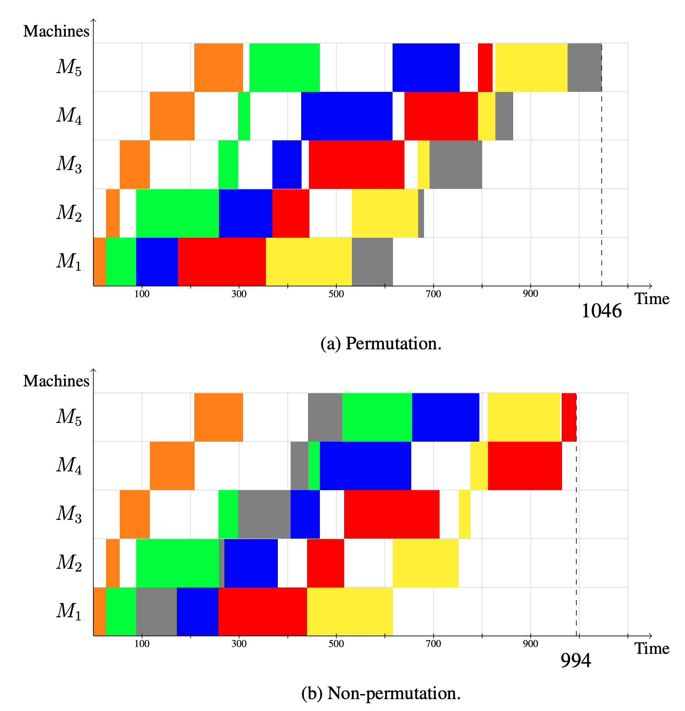

# The Flowshop problem and benchmark

## Table of Contents

- [Permutatation flowshop instances](#permutation-flowshop-benchmark-instances)
    - [Overview of the permutation flowshop benchmark](#overview-of-the-permutation-flowshop-benchmark)
    - [Classification of the permutation flowshop instances](#classification-of-the-permutation-flowshop-instances)
    - [Formats](#formats)
    - [Publications](#publications)
- [Permutation flowshop and variants](#permutation-flowshop-and-variants)
- [Permutation flowshop benchmark](#permutation-flowshop-benchmark)

<br/>

# Permutation flowshop benchmark instances

The flowshop lib is an informal group of instances used by different publications to investigate solution methods for the permutation flowshop problem. On this page we keep track of the best known solutions (BKS) and classify the instances based on difficulty.

## Overview of the permutation flowshop benchmark

All instances in the benchmark follow the standard jobshop format.

Permutation Flowshop instances (631)
- 2 instances `hel` from Heller 1960
- 8 instances `car` from Carlier 1978
- 120 instances `ta` from Taillard 1993
- 21 instances `rec` from Reeves 1995
- 480 instances `vrf` from Vallada, Ruiz and Framinan 2015

## Classification of the permutation flowshop instances

We use the following ***engines*** as reference engines the benchmark
- [**IBM ILOG CP Optimizer**](https://www.ibm.com/products/ilog-cplex-optimization-studio/cplex-cp-optimizer) : representative of the CP-scheduling family of engines
- [**Google CP-SAT**](https://developers.google.com/optimization) : representative of the lazy clause generation family of engines
- [**OptalCP**](https://optalcp.com) : representative of the CP-scheduling family of engines

We have dropped Cplex from the flowshop tests due to poor performance of linear solvers as reported by multiple authors in the literature and confirmed by ourselves.


Instances are divided into
- **easy** : solved to optimality (with proof) in 1 minute by at least 1 reference engine
- **medium** : solved to optimality (with proof) in 1 hour by at least 1 reference engine
- **hard** : solved to optimality (with proof) in > 1h by at least 1 reference engine
- **closed** : allegedly solved by someone in a paper. Most of the time the optimal solution is known because 2 different methods were used to find upper and lower bounds.
- **open** : no proof of optimality

Currently the instances divide as follows
- `hel` : 3 easy
- `car` : 39 easy, 1 medium
- `ta` : 2 easy, 2 medium, 1 hard
- `rec` : 10 easy
- `vrf` : 7 easy, 4 medium, 6 hard, 3 open

## Formats

The flowshop instances use the same "standard" format as the jobshop ones

### Standard format

```
#n #m
((machine duration ){m}\n){n}
```

For instance `car1` from Carlier 1978 is

```
11 5
 0 375 1  12 2 142 3 245 4 412
 0 632 1 452 2 758 3 278 4 398
 0  12 1 876 2 124 3 534 4 765
 0 460 1 542 2 523 3 120 4 499
 0 528 1 101 2 789 3 124 4 999
 0 796 1 245 2 632 3 375 4 123
 0 532 1 230 2 543 3 896 4 452
 0  14 1 124 2 214 3 543 4 785
 0 257 1 527 2 753 3 210 4 463
 0 896 1 896 2 214 3 258 4 259
 0 532 1 302 2 501 3 765 4 988
 ```


## Publications

The instances come from the following publications

- **Heller, J.** (1960). Some numerical experiments for an M× J flow shop and its decision-theoretical aspects. Operations Research, 8(2), 178-184.

- **Carlier, J.** (1978). Ordonnancements a contraintes disjonctives. RAIRO-Operations Research, 12(4), 333-350.


- **Taillard, E.** (1993). Benchmarks for basic scheduling problems. european journal of operational research, 64(2), 278-285.

- **Reeves, C. R.** (1995). A genetic algorithm for flowshop sequencing. Computers & operations research, 22(1), 5-13.

- **Vallada, E., Ruiz, R., & Framinan, J. M.** (2015). New hard benchmark for flowshop scheduling problems minimising makespan. European Journal of Operational Research, 240(3), 666-677.

- **Pan, Q. K., Ruiz, R., & Alfaro-Fernández, P.** (2017). Iterated search methods for earliness and tardiness minimization in hybrid flowshops with due windows. Computers & Operations Research, 80, 50-60.


<br/>


# Permutation flowshop and variants

Many variants of the flowshop problem can be solved with the same data
or simple addition of parameters

<br/>

## Permutation flowshop

In any jobshop-like problem
- the order in which a job goes through machines is **known**
- the order in which machines process the different jobs is **unknown**

Once the order of the jobs on each machine is fixed, the problem is fully solved : the minimum makespan can by pure propagation in polynomial time.

In the permutation flow shop
- the order in which a job goes through machines is **unknown** but needs to be the same for all jobs
- the order in which machines process the different jobs is **unknown** but needs to be the same for all machines


<small>Image from Artur Ferreira Brum, Automatic Algorithm Configuration for
Flow Shop Scheduling Problems (2020)</small>

To model the permutation flowshop we introduce the variable $\mathrm{rank}_j$ (common to all machines)

- the ranks are a permutation

$$\forall j_1, j_2 \in \mathrm{jobs} \quad \mathrm{rank}\_{j_1} \neq \mathrm{rank}\_{j_2}$$

- the jobs on the machines ordered according to their rank

$$\forall m \in \mathrm{machines}, \forall j_1, j_2 \in \mathrm{jobs} \quad \mathrm{rank}\_{j_1} < \mathrm{rank}\_{j_2} \Leftrightarrow \mathrm{start}\_{j_1}^m + \mathrm{Duration}\_{j_1}^m \leq \mathrm{start}\_{j_2}^m$$

These two constraints completely define the flowshop problem as the second constraint implies `noOverlap` on each machine (actually that constraint is the ***definition*** of noOverlap using ranks).

<br/>


# Permutation flowshop benchmark

## Best known solutions on the JSPLib

Find here the best reported results on the permutation flowshop instances. For the same result, we always prioritize results reported by engines than published documents (because of reproducibility of the results).

<br/>

> ***ONGOING-WORK, STAY TUNED***
